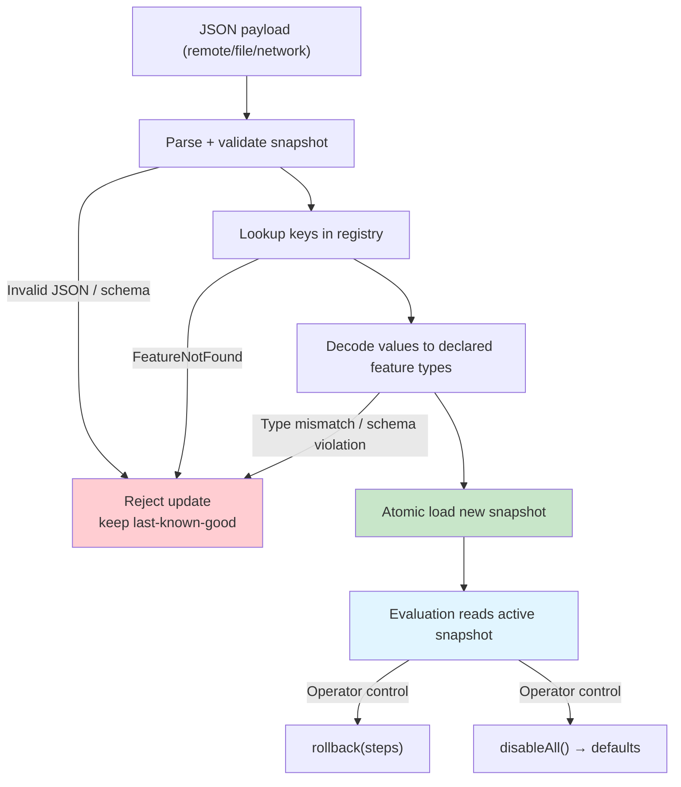

# Failure Modes

What can go wrong when using Konditional, how to prevent it, how to detect it, and what the worst-case outcome is.



---

## 1. Parse Errors (Invalid JSON)

### What Happens

JSON payload is malformed or doesn't match the expected schema:

```kotlin
val json = """{ "flags": [ { "invalid": true } ] }"""

when (val result = NamespaceSnapshotLoader(AppFeatures).load(json)) {
    is ParseResult.Failure -> {
        println(result.error.message)  // ParseError.InvalidJson / ParseError.InvalidSnapshot
    }
}
```

### How to Prevent

- Validate JSON payloads before shipping (CI/CD schema validation)
- Test deserialization in integration tests
- Use schema versioning for backward compatibility

### How to Detect

- `ParseResult.Failure` with `ParseError.InvalidJson` or `ParseError.InvalidSnapshot`
- Log all parse failures with full error context

### Worst-Case Outcome

Last-known-good configuration remains active. No impact on evaluation.

---

## 2. Missing Features (FeatureNotFound)

### What Happens

JSON references a feature that hasn't been registered:

```kotlin
val json = """
{
  "flags": [
    {
      "key": "feature::app::unknownFlag",
      ...
    }
  ]
}
"""

when (val result = NamespaceSnapshotLoader(AppFeatures).load(json)) {
    is ParseResult.Failure -> {
        println(result.error.message)  // "Feature not found: feature::app::unknownFlag"
    }
}
```

### How to Prevent

- Ensure namespaces are initialized **before** JSON deserialization (see [Definition vs Initialization](/fundamentals/definition-vs-initialization))
- Reference namespace objects at startup (t0)
- Use lenient deserialization with `SnapshotLoadOptions.skipUnknownKeys(...)` for forward compatibility

### How to Detect

- `ParseResult.Failure` with `ParseError.FeatureNotFound`
- Alert on unknown keys in production (could indicate config/code drift)

### Worst-Case Outcome

Parse fails, last-known-good configuration remains active.

---

## 3. Type Mismatches

### What Happens

JSON specifies a value type that doesn't match the declared feature type:

```kotlin
object Config : Namespace("config") {
    val timeout by double<Context>(default = 30.0)
}

val json = """
{
  "flags": [
    {
      "key": "feature::config::timeout",
      "defaultValue": { "type": "STRING", "value": "invalid" }
    }
  ]
}
"""

when (val result = ConfigurationSnapshotCodec.decode(json)) {
    is ParseResult.Failure -> {
        println(result.error.message)  // ParseError.InvalidSnapshot with details about the failed decode
    }
}
```

### How to Prevent

- Validate JSON schemas in CI/CD
- Use generated JSON from `ConfigurationSnapshotCodec.encode(namespace.configuration)` as the source of truth
- Test deserialization with actual payloads

### How to Detect

- `ParseResult.Failure` with type mismatch error
- Schema validation in CI/CD pipeline

### Worst-Case Outcome

Parse fails, last-known-good configuration remains active.

---

## 4. Schema Mismatches (Custom Data Classes)

### What Happens

JSON for a custom data class doesn't match the Kotlin schema:

```kotlin
data class RetryPolicy(
    val maxAttempts: Int,
    val backoffMs: Double
) : KotlinEncodeable<ObjectSchema> {
    override val schema = schemaRoot {
        ::maxAttempts of { minimum = 1 }
        ::backoffMs of { minimum = 0.0 }
    }
}

val json = """
{
  "flags": [
    {
      "key": "feature::config::retryPolicy",
      "defaultValue": {
        "type": "DATA_CLASS",
        "value": { "maxAttempts": -1, "backoffMs": 1000.0 }
      }
    }
  ]
}
"""
```

### How to Prevent

- Validate custom data class schemas in tests
- Use Kontracts validation (built-in)
- Keep constructor parameter names stable (avoid obfuscation issues)

### How to Detect

- `ParseResult.Failure` with schema validation error

### Worst-Case Outcome

Parse fails, last-known-good configuration remains active.

---

## 5. Uninitialized Namespace

### What Happens

Attempting to load JSON before namespace initialization:

```kotlin
// ✗ Incorrect order
val json = fetchRemoteConfig()
when (val result = ConfigurationSnapshotCodec.decode(json)) {
    is ParseResult.Failure -> {
        // Fails: features not registered yet
    }
}
```

### How to Prevent

- Initialize namespaces at startup (t0)
- Reference namespace objects explicitly before JSON deserialization

```kotlin
// ✓ Correct
val _ = AppFeatures  // Force initialization

val json = fetchRemoteConfig()
when (val result = NamespaceSnapshotLoader(AppFeatures).load(json)) {
    is ParseResult.Success -> Unit
    is ParseResult.Failure -> logError(result.error.message)
}
```

### How to Detect

- `ParseResult.Failure` with `ParseError.FeatureNotFound`
- Unit tests should verify initialization order

### Worst-Case Outcome

Parse fails, last-known-good configuration remains active (or initial defaults if no config loaded yet).

---

## 6. Configuration Rollback Fails

### What Happens

Attempting to rollback beyond available history:

```kotlin
val success = AppFeatures.rollback(steps = 100)  // Only 5 configs in history
println(success)  // false
```

### How to Prevent

- Understand rollback history limits (bounded by registry configuration)
- Check `historyMetadata` size before rollback

### How to Detect

- `rollback(...)` returns `false` if rollback isn't possible
- Log rollback attempts and outcomes

### Worst-Case Outcome

Rollback fails, current configuration remains active. No impact on evaluation.

---

## 7. Emergency Kill-Switch Active

### What Happens

Namespace is disabled via `disableAll()`:

```kotlin
AppFeatures.disableAll()

val enabled = AppFeatures.darkMode(context)  // Returns default (false)
```

### How to Prevent

- Only use `disableAll()` in genuine emergencies
- Avoid accidental calls in production code
- Monitor kill-switch state in observability hooks

### How to Detect

- All evaluations return defaults
- `EvaluationResult.decision` will indicate `DISABLED`

### Worst-Case Outcome

All flags in the namespace return their declared defaults. Other namespaces are unaffected.

---

## 8. Concurrent Configuration Updates

### What Happens

Multiple threads call `load(...)` concurrently:

```kotlin
// Thread 1
AppFeatures.load(config1)

// Thread 2
AppFeatures.load(config2)
```

### How to Prevent

- Coordinate configuration updates through a single source
- Use a dedicated config loader service

### How to Detect

- Last write wins (atomic reference swap is linearizable)
- Readers see one of the two configs

### Worst-Case Outcome

One configuration wins (last write). Readers see a consistent snapshot (either config1 or config2), never mixed.

---

## Summary: Failure Impact Matrix

| Failure Mode                  | Detection                           | Worst-Case Outcome                          | Recovery                           |
|-------------------------------|-------------------------------------|---------------------------------------------|------------------------------------|
| Parse errors (invalid JSON)   | `ParseResult.Failure`               | Last-known-good remains active              | Fix JSON, retry                    |
| Missing features              | `ParseError.FeatureNotFound`        | Last-known-good remains active              | Initialize namespace, retry        |
| Type mismatches               | `ParseResult.Failure`               | Last-known-good remains active              | Fix JSON schema, retry             |
| Schema mismatches             | `ParseResult.Failure`               | Last-known-good remains active              | Fix custom data class schema       |
| Uninitialized namespace       | `ParseError.FeatureNotFound`        | Parse fails (initial defaults active)       | Initialize namespace, retry        |
| Rollback beyond history       | `rollback(...)` returns `false`     | Current config remains active               | Use available history or re-load   |
| Kill-switch active            | All evals return defaults           | Defaults active for namespace               | Call `enableAll()`                 |
| Concurrent updates            | Last write wins                     | One config wins (consistent snapshot)       | Coordinate updates through single source |

---

## Next Steps

- [Configuration Lifecycle](/fundamentals/configuration-lifecycle) — JSON → ParseResult → load
- [Trust Boundaries](/fundamentals/trust-boundaries) — Compile-time vs runtime guarantees
- [Refresh Safety](/fundamentals/refresh-safety) — Why atomic updates are safe
- [Theory: Parse Don't Validate](/theory/parse-dont-validate) — Why ParseResult prevents invalid states
