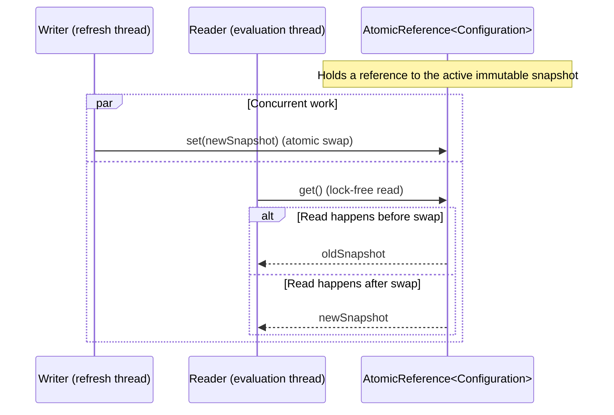

# Refresh Safety

Hot-reloading configuration is safe because Konditional uses atomic snapshot replacement with lock-free reads. Readers never see partial updates, and there's no risk of torn reads or race conditions.



---

## The Guarantee

When you call `Namespace.load(newConfiguration)`, the update is atomic:

```kotlin
// Thread 1: Update configuration
AppFeatures.load(newConfig)

// Thread 2: Concurrent evaluation
val value = AppFeatures.darkMode.evaluate(context)  // Sees old OR new, never mixed
```

**What's guaranteed:**

- Readers see either the **entire old** snapshot or the **entire new** snapshot
- Readers **never** see a partially-applied configuration
- No locks or synchronization required for reads

---

## How It Works: AtomicReference Swap

Internally, `NamespaceRegistry` stores the active configuration in an `AtomicReference`:

```kotlin
// Simplified: the default in-memory NamespaceRegistry implementation.
private val current: AtomicReference<Configuration> = AtomicReference(initialConfiguration)

override fun load(config: Configuration) {
    current.set(config)  // Single atomic write
}

override val configuration: Configuration
    get() = current.get()  // Lock-free atomic read
```

**Why this is safe:**

1. **AtomicReference guarantees atomicity** — `set(...)` is a single write operation
2. **Happens-before relationship** — JVM memory model guarantees that writes are visible to subsequent reads
3. **No torn reads** — Reference swap is atomic at the hardware level (no partial writes)

See [Theory: Atomicity Guarantees](/theory/atomicity-guarantees) for the formal proof.

---

## Lock-Free Reads

Evaluation reads the current snapshot without blocking writers:

```kotlin
fun <T : Any, C : Context, M : Namespace> Feature<T, C, M>.evaluate(
    context: C,
    registry: NamespaceRegistry,
): T {
    val config = registry.configuration  // Lock-free atomic read
    // ... evaluate using config ...
}
```

**Benefits:**

- **No contention** — Multiple threads can evaluate flags concurrently
- **No blocking** — Writers don't block readers, readers don't block writers
- **Predictable latency** — No lock acquisition overhead

---

## What Can Go Wrong (and What Can't)

### ✓ Safe: Concurrent Evaluation During Update

```kotlin
// Thread 1
AppFeatures.load(newConfig)

// Thread 2
val v1 = AppFeatures.darkMode.evaluate(ctx1)
val v2 = AppFeatures.apiEndpoint.evaluate(ctx2)
```

**Outcome:** Each evaluation sees either the old snapshot or the new snapshot; if a refresh happens between calls, `v1` and `v2` may observe different snapshots, but neither call can observe a partially-applied update.

### ✓ Safe: Multiple Concurrent Updates

```kotlin
// Thread 1
AppFeatures.load(config1)

// Thread 2
AppFeatures.load(config2)
```

**Outcome:** Last write wins (atomic reference swap is linearizable). Readers see one of the two configs.

### ✗ Unsafe: Mutating Configuration After Load

```kotlin
// DON'T DO THIS
val config = AppFeatures.configuration
val mutated = mutateSomehow(config)  // Hypothetical mutation
AppFeatures.load(mutated)
```

**Issue:** `Configuration` must be treated as an immutable snapshot. Mutating an existing snapshot breaks the mental
model (evaluations could observe changes that did not come from `load(...)`).

---

## Precondition: Use `load(...)` + snapshot decoding

The safety guarantee depends on using the public API:

```kotlin
// ✓ Correct
val _ = AppFeatures // ensure features are registered before parsing
when (val result = ConfigurationSnapshotCodec.decode(json)) {
    is ParseResult.Success -> AppFeatures.load(result.value)
    is ParseResult.Failure -> logError(result.error.message)
}

// ✓ Correct (side-effecting loader parses + loads on success)
when (val result = NamespaceSnapshotLoader(AppFeatures).load(json)) {
    is ParseResult.Success -> logger.info("Config refreshed")
    is ParseResult.Failure -> logError(result.error.message)
}
```

---

## Rollback Is Also Safe

Rollback uses the same atomic swap mechanism:

```kotlin
val success = AppFeatures.rollback(steps = 1)
```

**How it works:**

1. Registry keeps a bounded history of prior configurations
2. `rollback(...)` retrieves the prior snapshot
3. Atomically swaps it back as the active config

Same safety guarantees apply: readers see old OR new, never mixed.

---

## Integration Patterns

### Polling with Refresh

```kotlin
while (running) {
    val json = fetchFromServer()
    when (val result = NamespaceSnapshotLoader(AppFeatures).load(json)) {
        is ParseResult.Success -> {
            // Safe: atomic update, concurrent evaluations see consistent snapshot
            logger.info("Config refreshed")
        }
        is ParseResult.Failure -> {
            // Safe: last-known-good remains active
            logger.error("Refresh failed: ${result.error}")
        }
    }
    delay(pollInterval)
}
```

### Push-Based Refresh

```kotlin
configStream.collect { json ->
    when (val result = NamespaceSnapshotLoader(AppFeatures).load(json)) {
        is ParseResult.Success -> logger.info("Config updated")
        is ParseResult.Failure -> logger.error("Update failed: ${result.error}")
    }
}
```

---

## Why Refresh Can't Break Production

1. **Atomic updates** — Partial config updates are impossible
2. **Lock-free reads** — No deadlocks, no contention
3. **Fail-safe parsing** — Invalid JSON is rejected before affecting evaluation
4. **Last-known-good fallback** — Parse failures don't corrupt active config
5. **Rollback support** — Operational recovery if a bad config sneaks through

---

## Next Steps

- [Theory: Atomicity Guarantees](/theory/atomicity-guarantees) — Formal proof of atomic swap safety
- [Configuration Lifecycle](/fundamentals/configuration-lifecycle) — JSON → ParseResult → load
- [Failure Modes](/fundamentals/failure-modes) — What can go wrong and how to handle it
- [API Reference: Namespace Operations](/api-reference/namespace-operations) — Full API for load/rollback
