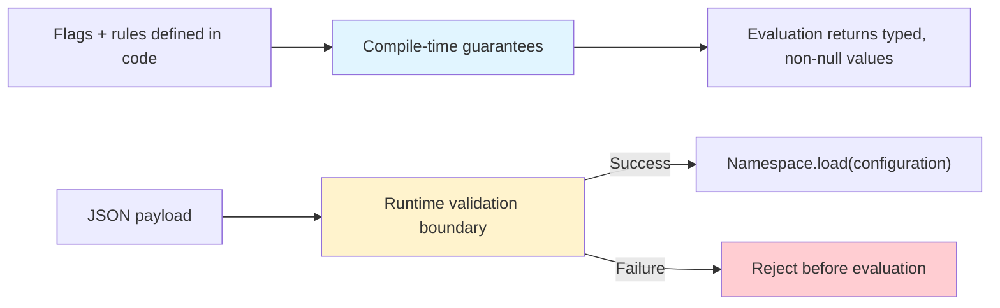

# Trust Boundaries

Konditional enforces correctness at **two distinct boundaries**: compile-time for statically-defined flags, and runtime validation for JSON-loaded configuration.



---

## Compile-Time Guarantees

When you define flags as delegated properties, the Kotlin compiler enforces type correctness:

```kotlin
object AppFeatures : Namespace("app") {
    val darkMode by boolean<Context>(default = false) {
        rule(true) { platforms(Platform.IOS) }
    }
}

val enabled: Boolean = AppFeatures.darkMode.evaluate(context)
```

**What the compiler guarantees:**

1. **Property name = feature key** — Typos become compile errors
2. **Type propagation** — Return type flows from definition (`boolean` → `Boolean`)
3. **Rule return types match** — `rule(true)` for a `boolean` flag is type-checked
4. **Required defaults** — Every feature must declare a default (non-null)

**Scope:** Statically-defined flags and rules in Kotlin source code.

---

## Runtime Validation Boundary

When configuration crosses the JSON boundary, compile-time guarantees necessarily end. Konditional establishes correctness via validation:

```kotlin
val json = File("flags.json").readText()

when (val result = AppFeatures.fromJson(json)) {
    is ParseResult.Success -> {
        // Valid configuration loaded
    }
    is ParseResult.Failure -> {
        // Invalid JSON rejected, last-known-good remains active
        logError("Parse failed: ${result.error.message}")
    }
}
```

**What the runtime validator guarantees:**

1. **JSON syntax validity** — Malformed JSON is rejected
2. **Schema correctness** — Structure must match expected shape
3. **Type checking** — Values must match declared feature types
4. **Feature existence** — Referenced features must be registered

**Scope:** JSON-loaded configuration from remote sources, files, or network.

---

## The Cutover Point: ParseResult

`ParseResult` is the explicit boundary type that separates valid from invalid configuration:

```kotlin
sealed interface ParseResult<out T> {
    data class Success<T>(val value: T) : ParseResult<T>
    data class Failure(val error: ParseError) : ParseResult<Nothing>
}
```

**Key properties:**

- **No exceptions** — Parse failures return `ParseResult.Failure`, they don't throw
- **Explicit handling** — You must pattern match on Success/Failure (exhaustive when-expression)
- **Fail-safe** — Invalid JSON cannot become active config (rejected before `load(...)`)

---

## What's Guaranteed vs What's Not

| Claim                             | Guarantee Level              | Mechanism                                    |
|-----------------------------------|------------------------------|----------------------------------------------|
| No typos in flag keys             | **Compile-time**             | Property access, not strings                 |
| Return type matches definition    | **Compile-time**             | Generic type propagation                     |
| Rule return types are correct     | **Compile-time**             | Constrained rule DSL                         |
| Evaluation is never null          | **Compile-time**             | Required defaults                            |
| Namespace isolation               | **Compile-time**             | Type-bound containers + separate registries  |
| Remote config type safety         | **Runtime (validated boundary)** | `ParseResult.Success` / `Failure`            |
| Semantic correctness of configs   | **Not guaranteed**           | Human/process responsibility                 |

---

## Example: The Boundary in Action

### Compile-Time (Safe)

```kotlin
object Config : Namespace("config") {
    val timeout by double<Context>(default = 30.0) {
        rule(45.0) { platforms(Platform.ANDROID) }
    }
}

// val timeout: Int = Config.timeout.evaluate(context)  // Compile error: type mismatch
val timeout: Double = Config.timeout.evaluate(context)  // ✓ Type-safe
```

### Runtime (Validated)

```json
{
  "flags": [
    {
      "key": "feature::config::timeout",
      "defaultValue": { "type": "DOUBLE", "value": 30.0 },
      "rules": [
        {
          "value": { "type": "STRING", "value": "invalid" },
          "platforms": ["ANDROID"]
        }
      ]
    }
  ]
}
```

```kotlin
when (val result = SnapshotSerializer.fromJson(json)) {
    is ParseResult.Success -> /* unreachable */
    is ParseResult.Failure -> {
        // Parse fails: rule value type (STRING) doesn't match feature type (DOUBLE)
        println(result.error.message)  // "Type mismatch for feature::config::timeout"
    }
}
```

---

## Precondition: Features Must Be Registered

Deserialization requires that features exist in the registry **before** JSON is parsed:

```kotlin
// ✓ Correct: Initialize namespace first
val _ = AppFeatures  // Forces class initialization (registers features)

when (val result = AppFeatures.fromJson(json)) {
    is ParseResult.Success -> Unit
    is ParseResult.Failure -> logError(result.error.message)
}
```

```kotlin
// ✗ Incorrect: Namespace not initialized
when (val result = SnapshotSerializer.fromJson(json)) {
    // Fails with ParseError.FeatureNotFound if AppFeatures hasn't been initialized
    is ParseResult.Failure -> println(result.error)
}
```

See [Definition vs Initialization](/fundamentals/definition-vs-initialization) for details on the two-phase lifecycle.

---

## Next Steps

- [Definition vs Initialization](/fundamentals/definition-vs-initialization) — The two-phase lifecycle
- [Configuration Lifecycle](/fundamentals/configuration-lifecycle) — JSON → ParseResult → load
- [Theory: Type Safety Boundaries](/theory/type-safety-boundaries) — Deep dive into the mechanisms
- [Theory: Parse Don't Validate](/theory/parse-dont-validate) — Why ParseResult prevents invalid states
