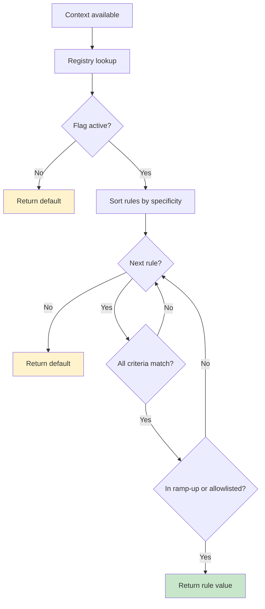

# Your First Flag

Define flags as delegated properties on a `Namespace`. The compiler enforces type safety, and evaluation is total (always returns a value, never null).

---

## Define a Namespace with Flags

```kotlin
import io.amichne.konditional.api.evaluate
import io.amichne.konditional.core.Namespace
import io.amichne.konditional.context.*
import io.amichne.konditional.core.id.StableId

object AppFeatures : Namespace("app") {
    val darkMode by boolean<Context>(default = false) {
        rule(true) {
            platforms(Platform.IOS)
            rampUp { 50.0 }
        }
    }

    val apiEndpoint by string<Context>(default = "https://api.example.com") {
        rule("https://api-ios.example.com") { platforms(Platform.IOS) }
        rule("https://api-android.example.com") { platforms(Platform.ANDROID) }
    }

    val maxRetries by integer<Context>(default = 3)
}
```

**What this does:**

- `boolean`, `string`, `integer` are type-safe delegates that create `Feature<Boolean>`, `Feature<String>`, `Feature<Int>`
- Property names become feature keys (no string keys at call sites)
- `default` is required — evaluation never returns null
- `rule(value) { ... }` defines conditional targeting

---

## Create an Evaluation Context

Context provides runtime inputs: locale, platform, version, and a stable user identifier.

```kotlin
val context = Context(
    locale = AppLocale.UNITED_STATES,
    platform = Platform.IOS,
    appVersion = Version.of(2, 1, 0),
    stableId = StableId.of("user-123"),
)
```

**Key fields:**

- `locale` — Geographic/language targeting (implements `LocaleTag`)
- `platform` — iOS, Android, Web, etc. (implements `PlatformTag`)
- `appVersion` — Semantic versioning for version-based rollouts
- `stableId` — Deterministic identifier for ramp-up bucketing

---

## Evaluate Flags

```kotlin
val enabled: Boolean = AppFeatures.darkMode.evaluate(context)
val endpoint: String = AppFeatures.apiEndpoint.evaluate(context)
val retries: Int = AppFeatures.maxRetries.evaluate(context)
```

**Guarantees:**

- Type safety: The return type matches the declared type (no casts)
- Non-null: Evaluation always returns a value (rule value or default)
- Deterministic: Same inputs → same outputs

---

## How Evaluation Works



1. **Specificity ordering** — Rules are sorted by targeting criteria count (most specific first)
2. **AND semantics** — All criteria in a rule must match for the rule to match
3. **First match wins** — The first matching rule (that passes ramp-up check) determines the value
4. **Default fallback** — If no rules match, the required default is returned

---

## Supported Value Types

| Type       | Namespace method | Kotlin type                          | Example default       |
|------------|------------------|--------------------------------------|-----------------------|
| Boolean    | `boolean(...)`   | `Boolean`                            | `false`               |
| String     | `string(...)`    | `String`                             | `"production"`        |
| Integer    | `integer(...)`   | `Int`                                | `42`                  |
| Decimal    | `double(...)`    | `Double`                             | `3.14`                |
| Enum       | `enum(...)`      | `E : Enum<E>`                        | `LogLevel.INFO`       |
| Data class | `custom(...)`    | `T : KotlinEncodeable<ObjectSchema>` | `MyConfig()`          |

---

## Common Patterns

### Gradual Ramp-Up

```kotlin
val newCheckout by boolean<Context>(default = false) {
    rule(true) {
        platforms(Platform.ANDROID)
        rampUp { 10.0 }  // 10% of users
    }
}
```

Ramp-ups are deterministic: the same `(stableId, flagKey, salt)` yields the same bucket assignment.

### Platform-Specific Configuration

```kotlin
val apiEndpoint by string<Context>(default = "https://api.example.com") {
    rule("https://api-ios.example.com") { platforms(Platform.IOS) }
    rule("https://api-android.example.com") { platforms(Platform.ANDROID) }
    rule("https://api-web.example.com") { platforms(Platform.WEB) }
}
```

### Variants via Enums (Not Strings)

```kotlin
enum class Theme { LIGHT, DARK, AUTO }

val theme by enum<Theme, Context>(default = Theme.LIGHT) {
    rule(Theme.DARK) { platforms(Platform.IOS) }
}
```

Because variants are enum values, invalid variants cannot compile.

---

## Next Steps

- [Loading from JSON](/getting-started/loading-from-json) — Add runtime configuration
- [Fundamentals: Core Primitives](/fundamentals/core-primitives) — Deep dive into Features, Context, and Namespaces
- [Rules & Targeting](/rules-and-targeting/rule-composition) — Master rollout strategies
