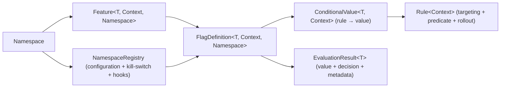

# Konditional Core (The Deterministic, Type-Safe Engine)

Konditional is a feature flag library for Kotlin/JVM that optimizes for two outcomes: **compile-time correctness** and
**runtime determinism**. The `:konditional-core` module is the heart of that promise: it provides the type-safe flag DSL
and the evaluation engine that turns a `Context` into a value (plus an explanation of why).
The rest of the project exists to operate that core safely in production: `:konditional-runtime` owns loading and
lifecycle, `:konditional-serialization` owns boundary codecs, and `:konditional-observability` + `:opentelemetry` own
operational signals.

Your mental model is intentionally small:

> Namespace → Feature → FlagDefinition → Rule → EvaluationResult

Mermaid overview (the “shape of the system” you should keep in your head):

**Why this is worth it (high-ROI reasons):**

- You ship changes behind flags without creating “boolean explosion” or untestable conditional sprawl.
- Rollouts are deterministic: the same user stays in/out unless you intentionally change inputs (like `salt`).
- Targeting is type-safe: you cannot accidentally target a platform/version/axis that your context cannot provide.
- Configuration is a boundary: invalid remote config is rejected during parsing rather than “kind of working” at runtime.

Next:

- Start with [Quick Start](quick-start).
- Then read [Core Concepts](core-concepts) to understand what each type exists to prevent.

