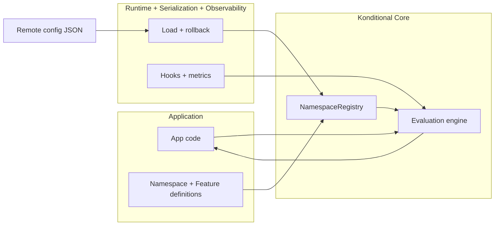
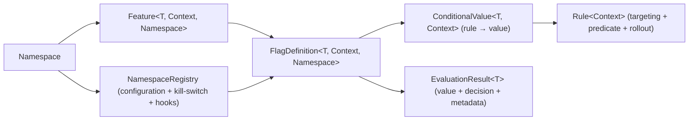

# Konditional Core (The Deterministic, Type-Safe Engine)

Konditional is a Kotlin/JVM feature flag library designed to deliver two outcomes that matter in production:
**compile-time correctness** and **runtime determinism**. The `:konditional-core` module provides the type-safe DSL and
the evaluation engine that turns a `Context` into a value (plus an explanation of why).
The rest of the project exists to operate that core safely: `:konditional-runtime` handles loading and lifecycle,
`:konditional-serialization` owns boundary codecs, and `:konditional-observability` + `:opentelemetry` capture signals.

:::danger Key argument
If you cannot trust your configuration and experimentation engine with absolute certainty, you do not have real control
in production. That is not a tolerable risk.
:::

## Value proposition

The “why” is centralized on a single page:

- [Value Proposition](/value-proposition)

## Architecture at a Glance

---

## Why this is high‑ROI

- You ship changes behind flags without creating boolean explosion or conditional sprawl.
- Rollouts are deterministic: the same user stays in/out unless you intentionally change inputs (like `salt`).
- Targeting is type-safe: you cannot target a platform/version/axis that your context cannot provide.
- Configuration is a boundary: invalid remote config is rejected during parsing instead of “kind of working”.

## When Konditional Fits

**Choose Konditional when:**

- You want compile‑time correctness for definitions and call sites.
- You need typed values beyond booleans (variants, thresholds, structured config).
- You run experiments and need deterministic, reproducible ramp‑ups.
- You want explicit validation boundaries for remote configuration.

**Konditional might not fit if:**

- You need vendor-hosted dashboards more than compile‑time safety.
- Your flags are fully dynamic with zero static definitions.
- You are comfortable relying on process/tooling to prevent string key drift.

---

Your mental model is intentionally small:

> Namespace → Feature → FlagDefinition → Rule → EvaluationResult

Next:

- Start with [Quick Start](/quick-start).
- Then read [Core Concepts](/core-concepts) to understand what each type exists to prevent.
