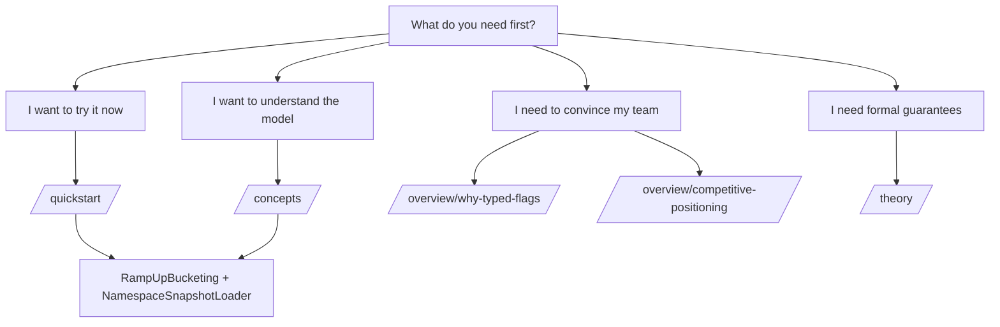

# First Success Map

Pick the shortest path to your first measurable outcome.

The first-success routes map to concrete runtime APIs for deterministic bucketing and namespace snapshot loading.

## Route Guide

1. Try it quickly: [Quickstart](/quickstart/).
2. Build shared mental model: [Concepts](/concepts/namespaces).
3. Build adoption case: [Why Typed Flags](/overview/why-typed-flags) and [Competitive Positioning](/overview/competitive-positioning).
4. Validate guarantees: [Theory](/theory/type-safety-boundaries).

## Claim Coverage

| Claim ID | Statement |
| --- | --- |
| CLM-PR01-04A | The first-success routes correspond to concrete runtime APIs for ramp-up and snapshot loading. |
