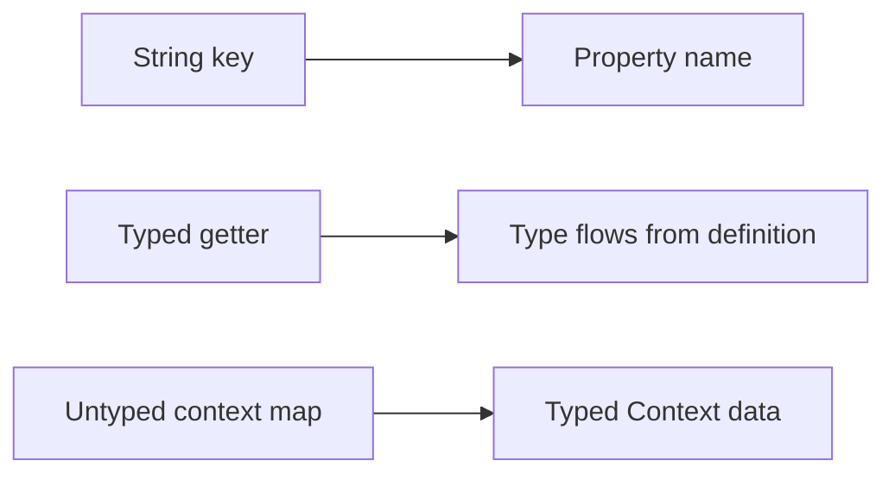

# Migration Guide

This guide maps the conceptual shift from string-based flags to Konditional’s typed, property-based model.
It focuses on what changes at the definition site, at the call site, and at the trust boundary (runtime JSON).

---

## If you are coming from a string-keyed SDK

Start here if your existing calls look like `getBoolean("some_flag")`.

1. Replace string-key lookups with typed feature properties
2. Move targeting data from untyped maps into a typed `Context`
3. Add remote JSON loading only after typed defaults are in place

Use this sequence to get value quickly:

- [Installation](/getting-started/installation)
- [Your First Feature](/getting-started/your-first-flag)
- [How-To: Load Configuration Safely from Remote](/how-to-guides/safe-remote-config)

---

## Migrating from the legacy monolith (`io.amichne:konditional`) to split artifacts

Konditional is now published as split modules.

- **Guarantee**: `konditional-core` is implementation-free; it contains the DSL + evaluation surface.
- **Mechanism**: runtime implementations are discovered via `ServiceLoader` (see `NamespaceRegistryFactory`).
- **Boundary**: if no runtime factory is present, namespace initialization fails fast with a clear error.

### Dependencies

```kotlin
dependencies {
    // Required for normal usage
    implementation("io.amichne:konditional-core:0.0.1")
    implementation("io.amichne:konditional-runtime:0.0.1")

    // Optional (JSON)
    implementation("io.amichne:konditional-serialization:0.0.1")

    // Optional (shadow evaluation + utilities)
    implementation("io.amichne:konditional-observability:0.0.1")
}
```

### Common API moves

| Topic                        | Before                                                                  | After                                                                            |
|------------------------------|-------------------------------------------------------------------------|----------------------------------------------------------------------------------|
| Load config into a namespace | `AppFeatures.load(configuration)`                                       | `AppFeatures.load(configuration)` + `import io.amichne.konditional.runtime.load` |
| Rollback/history             | `AppFeatures.rollback(...)` / `historyMetadata`                         | same calls + imports from `io.amichne.konditional.runtime.*`                     |
| Configuration model          | `io.amichne.konditional.core.instance.*`                                | `io.amichne.konditional.serialization.instance.*`                                |
| Snapshot codecs              | `io.amichne.konditional.serialization.snapshot.*`                       | same packages; add `konditional-serialization` dependency                        |
| Namespace snapshot loader    | `io.amichne.konditional.serialization.snapshot.NamespaceSnapshotLoader` | same package; add `konditional-runtime` dependency                               |

## Breaking API Symbol Map (Result Refactor)

| Removed / Changed | Replacement |
|---|---|
| `Result<T>` | Kotlin `Result<T>` |
| `Feature.evaluate(...)` | Removed. Use `Feature.evaluate(...)` |
| `Feature.explainSafely(...)` | Removed |
| `Feature.explain(...)` | Removed from public API |
| Public `internal EvaluationDiagnostics<T>` | Removed from public API |
| `Version.parse(raw): Result<Version>` | `Version.parse(raw): Result<Version>` |
| `SnapshotCodec.decode(...): Result<T>` | `SnapshotCodec.decode(...): Result<T>` |
| `SnapshotLoader.load(...): Result<T>` | `SnapshotLoader.load(...): Result<T>` |
| `ConfigurationSnapshotCodec.decode(...): Result<Configuration>` | `ConfigurationSnapshotCodec.decode(...): Result<MaterializedConfiguration>` |
| `Namespace.load(configuration: ConfigurationView)` extension | `Namespace.load(configuration: MaterializedConfiguration)` |

Failure introspection remains structured via `KonditionalBoundaryFailure(parseError)` and `parseErrorOrNull()`.

---

## The core mapping

String-based flag systems typically have:

- a **string key** (`"dark-mode"`)
- a **typed getter** chosen by the caller (`getBoolean`, `getString`, …)
- an **untyped context** (often string keys and `Any` values)

Konditional replaces those with:

- a **property** (the property name becomes the key)
- a **declared type** (from the delegate: `boolean`, `string`, `int`, `double`, `enum`)
- a **typed `Context`** (and optionally domain-specific context data classes)



---

## Step-by-step adoption (incremental)

### 0. Start with one namespace

```kotlin
object Features : Namespace("app") {
    val darkMode by boolean<Context>(default = false)
}
```

### 1. Replace call sites first (value safety)

```kotlin
val enabled: Boolean = Features.darkMode.evaluate(context)
```

What you gain immediately:

- key typos are eliminated at the call site (there is no string key)
- return type is concrete (no cast; `Boolean` is enforced)
- evaluation is non-null (default is required)

### 2. Introduce typed context (targeting + ramp-ups)

```kotlin
val context = Context(
    locale = AppLocale.UNITED_STATES,
    platform = Platform.IOS,
    appVersion = Version.of(2, 1, 0),
    stableId = StableId.of("a1b2c3d4e5f6a7b8c9d0e1f2a3b4c5d6")
)
```

`stableId` is the stable input used for deterministic ramp-up bucketing (
see ["Rollout Strategies"](/how-to-guides/rolling-out-gradually)).

### 3. Add rules after defaults exist (behavior safety)

```kotlin
val apiEndpoint by string<Context>(default = "https://api.example.com") {
    rule("https://api-ios.example.com") { platforms(Platform.IOS) }
}
```

---

## Migrating “context maps” to typed contexts

If your current system uses string keys (`"tier"`, `"role"`, …), move that information into a custom context:

```kotlin
data class EnterpriseContext(
    override val locale: AppLocale,
    override val platform: Platform,
    override val appVersion: Version,
    override val stableId: StableId,
    val subscriptionTier: SubscriptionTier,
    val employeeCount: Int
) : Context

enum class SubscriptionTier { FREE, PRO, ENTERPRISE }

object EnterpriseFeatures : Namespace("enterprise") {
    val advancedAnalytics by boolean<EnterpriseContext>(default = false) {
        rule(true) {
            extension {
                subscriptionTier == SubscriptionTier.ENTERPRISE && employeeCount > 100
            }
        }
    }
}
```

Result: business targeting logic becomes type-checked and refactor-safe.

---

## Namespaces replace prefixes

Instead of `"auth.dark-mode"` / `"payments.dark-mode"` style prefixes, use namespace isolation:

```kotlin
sealed class AppDomain(id: String) : Namespace(id) {
    data object Auth : AppDomain("auth") {
        val socialLogin by boolean<Context>(default = false)
    }

    data object Payments : AppDomain("payments") {
        val applePay by boolean<Context>(default = false)
    }
}
```

Each namespace has its own registry and independent configuration lifecycle.

---

## When you need runtime configuration (remote JSON)

Konditional supports JSON configuration as a validated boundary:

```kotlin
val json = File("flags.json").readText()
val result = NamespaceSnapshotLoader(AppDomain.Payments).load(json)
result.onSuccess { materialized -> AppDomain.Payments.load(materialized) }
result.onFailure { failure ->
    val parseError = result.parseErrorOrNull()
    logError("Parse failed: ${parseError?.message ?: failure.message}")
}
```

The guarantee is intentionally qualified: JSON is not “always safe”; instead, invalid JSON is rejected before it can
affect evaluation.

---

## Shadow evaluation (parallel migration)

For gradual migrations, you can evaluate against a baseline registry and shadow-evaluate against a candidate:

```kotlin
val value = Features.darkMode.evaluateWithShadow(
    context = context,
    candidateRegistry = candidateRegistry,
    onMismatch = { mismatch ->
        log.warn("Mismatch: ${mismatch.kinds} baseline=${mismatch.baseline.value} candidate=${mismatch.candidate.value}")
    }
)
```

This keeps behavior pinned to the baseline value while generating comparison telemetry for the candidate path.

---

## Axis handle factory migration

Axis descriptors are factory-only handles. Axis lookup is now scoped through an
`AxisCatalog`, not a process-global registry.

**Before**

```kotlin
object Axes {
    object Environment : Axis<Environment>("environment", Environment::class)
}
```

**After**

```kotlin
object AppFeatures : Namespace("app") {
    val environmentAxis = axis<Environment>("environment")
}
```

If you need an explicit factory call, bind it to a specific catalog:

```kotlin
val environmentAxis = Axis.of(
    id = "environment",
    valueClass = Environment::class,
    axisCatalog = AppFeatures.axisCatalog,
)
```

Axis inference (`axis(Environment.PROD)`) now requires that `Environment` is
already declared in the same namespace catalog. Implicit axis registration from
enum class names is removed.

---

## Targeting hierarchy migration

Rule internals now use a sealed targeting hierarchy instead of flat predicate
composition.

- **What changed**: rule criteria compile into `Targeting.All` with leaf nodes
  for locale, platform, version, axis, and custom extension criteria.
- **What stays the same**: your DSL usage (`platforms`, `locales`, `versions`,
  `axis`, `extension`, and `whenContext`) keeps the same behavior.
- **Compatibility**: legacy `Predicate<C>` implementations are supported as a
  deprecated bridge; new logic should use `extension { ... }` and
  `whenContext<R> { ... }`.

This model improves determinism and keeps capability-narrowed targeting
non-throwing: if a context does not implement the required capability, the
targeting leaf returns `false`.

---

## Next steps

- Learn the primitives: ["Core Primitives"](/learn/core-primitives)
- Understand evaluation + determinism: ["Evaluation Semantics"](/learn/evaluation-model)
- Operate remote config safely: [Configuration lifecycle](/learn/configuration-lifecycle)
