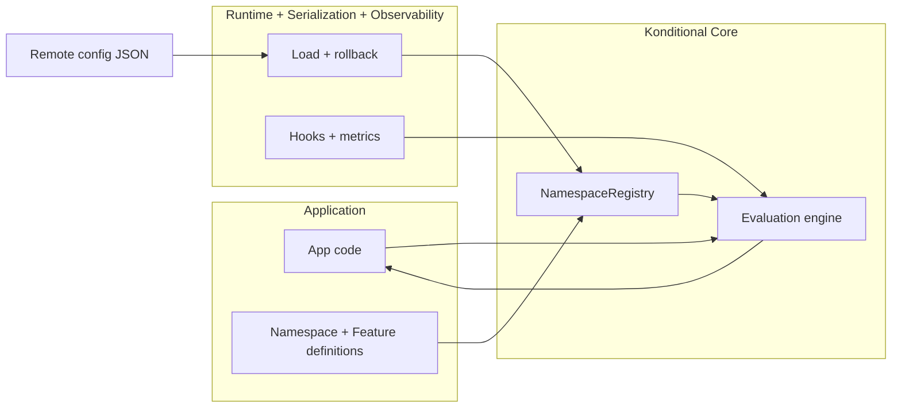
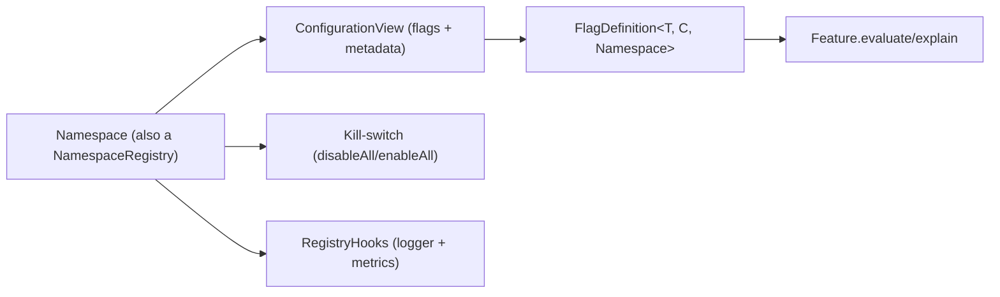

# Configuration & Registry Surface

Core separates two responsibilities:

- **Definition**: what your flags are (types, defaults, legal values).
- **Configuration**: what is currently loaded and operationally active.

The runtime surface you interact with is a `NamespaceRegistry`, which is reachable via the `Namespace` object itself.

:::note Boundary is explicit
Configuration parsing and validation live in `:konditional-serialization` and `:konditional-runtime`. Core assumes
configuration is already validated; invalid updates are rejected at the boundary and do not partially mutate state.
:::

## NamespaceRegistry

`NamespaceRegistry` exposes:

- `configuration`: a read-only `ConfigurationView` of currently loaded flag definitions
- `isAllDisabled`, `disableAll()`, `enableAll()`: an emergency kill-switch
- `hooks`: lightweight `RegistryHooks` for logging and metrics

Mermaid overview:

## Why “kill-switch returns defaults”

The kill-switch is designed to be safe under pressure:

- It does not mutate definitions.
- It does not depend on remote configuration.
- It makes all evaluations return the declared default values.

This gives you a single operational lever that cannot create “half disabled” states.

Next:

- [Observability & Debugging](observability-and-debugging)
