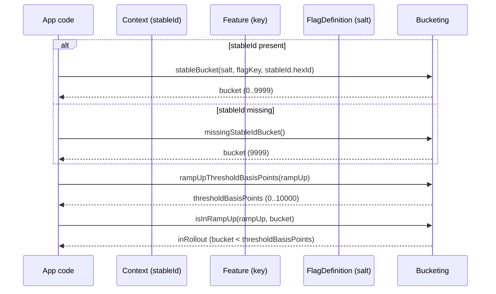
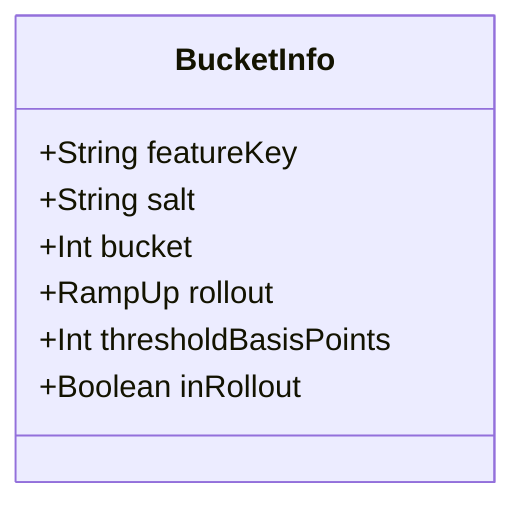

# Rollouts & Bucketing (Determinism You Can Debug)

Konditional’s rollouts are deterministic: if the inputs don’t change, a user’s bucket doesn’t change.
This makes “10% ramp-up” an engineering tool you can reason about (and reproduce) rather than a probabilistic guess.

## RampUp

`RampUp` is a value class representing a percentage from 0.0 to 100.0.

- **Compile-time:** you pass a `RampUp` (not a raw `Double`) at the boundary where the system cares.
- **Runtime:** bucketing uses an integer bucket plus a threshold derived from `RampUp`.

## StableId and allowlists

For deterministic rollouts you provide a stable identifier, typically via `Context.StableIdContext`.

If a stable ID is missing, the system falls back to a deterministic “missing stable id bucket”. That keeps behavior
consistent, but you should not expect “fair sampling” without stable IDs.

You can also allowlist specific IDs (globally for a flag or per-rule) to force inclusion regardless of ramp-up.

## Salt

Salt is an explicit input to bucketing. Changing `salt` intentionally re-samples your population without changing the
feature key or the stable ID.

## BucketInfo (debugging)

For “why is user X in/out?”, `RampUpBucketing.explain(...)` returns a `BucketInfo` describing the exact bucket decision.

Next:

- [Registry & Configuration](registry-and-configuration)
- [Recipes](recipes) for copy/paste patterns (including “resettable salt”)
