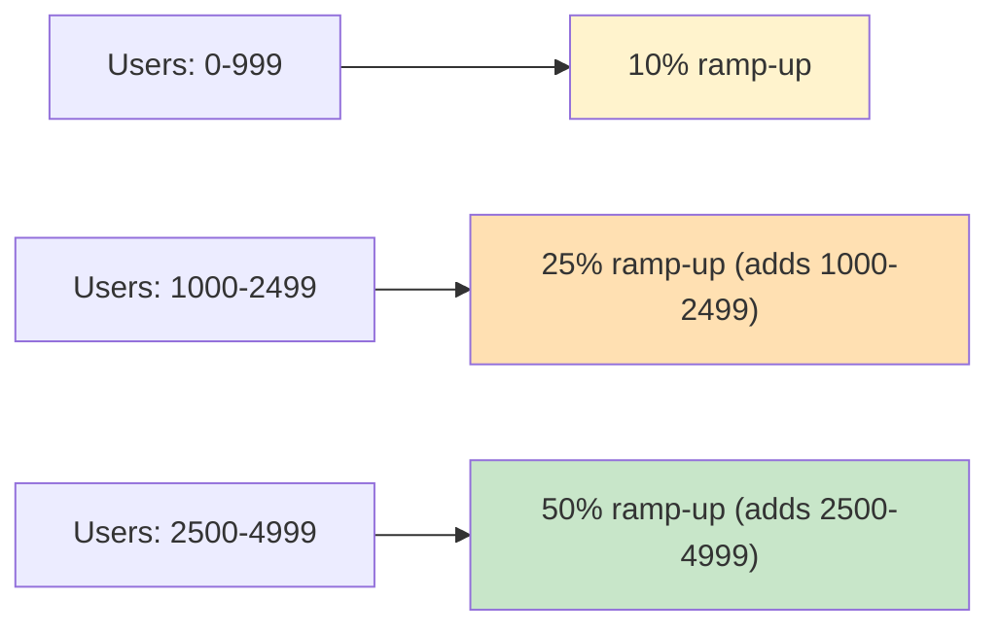

# Rollout Strategies

Konditional's ramp-ups are **deterministic**: the same `(stableId, flagKey, salt)` always produces the same bucket assignment. This enables reproducible rollouts and incremental percentage increases without reshuffling users.

---

## Deterministic Bucketing (SHA-256)

Ramp-ups are computed locally using SHA-256 hashing:

```
input = "$salt:$flagKey:${stableIdHex}"
hash = sha256(input)
bucket = uint32(hash[0..3]) % 10_000  // bucket ∈ [0, 10_000)
```

Ramp-up checks use basis points:

```
thresholdBasisPoints = round(rampUpPercent * 100)  // 0..10_000
inRampUp = bucket < thresholdBasisPoints
```

**Example:**
- `rampUp { 25.0 }` → threshold = 2500
- If `bucket < 2500`, user is in ramp-up (25%)

---

## Operational Properties

### 1. Deterministic

Same inputs → same bucket:

```kotlin
val ctx = Context(
    locale = AppLocale.UNITED_STATES,
    platform = Platform.IOS,
    appVersion = Version.of(2, 1, 0),
    stableId = StableId.of("user-123"),
)

val result1 = AppFeatures.newFeature.evaluate(ctx)
val result2 = AppFeatures.newFeature.evaluate(ctx)
// result1 == result2 (guaranteed)
```

### 2. Per-Flag Isolation

Changing one flag's ramp-up does not affect other flags:

```kotlin
val featureA by boolean<Context>(default = false) {
    rule(true) { rampUp { 50.0 } }
}

val featureB by boolean<Context>(default = false) {
    rule(true) { rampUp { 50.0 } }
}

// Same user may be in featureA ramp-up but NOT in featureB ramp-up
// (different flagKey in bucketing input)
```

### 3. Salt-Controlled Redistribution

Changing the salt intentionally redistributes buckets:

```kotlin
val newExperiment by boolean<Context>(default = false) {
    salt("v2")  // Change from "v1" to "v2"
    rule(true) { rampUp { 50.0 } }
}
```

**Use case:** Re-running an experiment with a fresh random sample.

---

## Incremental Rollout (No Reshuffle)

Increasing ramp-up percentage **only adds users** (for stable salt + stableId):



**Example:**
- 10% → 25%: Users 0-999 stay in, users 1000-2499 are added
- 25% → 50%: Users 0-2499 stay in, users 2500-4999 are added

**Property:** No user who was in the 10% ramp-up drops out when increasing to 25%.

---

## Debugging Ramp-Up Bucket Assignment

Use `RampUpBucketing.explain(...)` to inspect bucketing for a specific user:

```kotlin
val info = RampUpBucketing.explain(
    stableId = context.stableId,
    featureKey = AppFeatures.newFeature.key,
    salt = AppFeatures.flag(AppFeatures.newFeature).salt,
    rampUp = RampUp.of(25.0),
)

println(info)
// Output:
// RampUpBucketInfo(
//   bucket=1234,
//   thresholdBasisPoints=2500,
//   inRampUp=true,
//   stableIdHex="757365722d313233",
//   bucketing input="v1:feature::app::newFeature:757365722d313233"
// )
```

---

## StableId Best Practices

### Cross-Platform Consistency

Ensure all platforms pass the same canonical identifier to `StableId.of(...)`:

```kotlin
// ✓ Correct: Consistent across platforms
val id = StableId.of("user-123")

// ✗ Incorrect: Different inputs produce different buckets
val iosId = StableId.of("USER-123")      // Different casing
val androidId = StableId.of("user_123")  // Different separator
```

`StableId.of(...)` normalizes by lowercasing (via `Locale.ROOT`), but separators and prefixes matter.

### Pre-Computed Hex IDs

If you already have a canonical hex identifier, use `StableId.fromHex(...)`:

```kotlin
val hexId = "757365722d313233"  // Pre-computed hex representation
val id = StableId.fromHex(hexId)
```

---

## Common Rollout Patterns

### Gradual Rollout (10% → 25% → 50% → 100%)

```kotlin
val newFeature by boolean<Context>(default = false) {
    rule(true) { rampUp { 10.0 } }
}

// Later: increase to 25%
rule(true) { rampUp { 25.0 } }

// Later: increase to 50%
rule(true) { rampUp { 50.0 } }

// Finally: 100% (or remove rule and change default)
rule(true) { rampUp { 100.0 } }
```

### Platform-Specific Rollout

```kotlin
val newFeature by boolean<Context>(default = false) {
    rule(true) {
        platforms(Platform.IOS)
        rampUp { 50.0 }  // iOS: 50%
    }

    rule(true) {
        platforms(Platform.ANDROID)
        rampUp { 25.0 }  // Android: 25%
    }
}
```

### Locale-Specific Rollout

```kotlin
val newFeature by boolean<Context>(default = false) {
    rule(true) {
        locales(AppLocale.UNITED_STATES)
        rampUp { 100.0 }  // US: 100%
    }

    rule(true) {
        locales(AppLocale.CANADA)
        rampUp { 50.0 }  // Canada: 50%
    }

    rule(true) {
        rampUp { 10.0 }  // Rest of world: 10%
    }
}
```

---

## Allowlist Bypass

Allowlists bypass the ramp-up check **after** a rule matches by criteria:

```kotlin
val newFeature by boolean<Context>(default = false) {
    allowlist(StableId.of("tester-1"), StableId.of("tester-2"))
    rule(true) { rampUp { 5.0 } }
}
```

**Behavior:**
- `tester-1` and `tester-2` bypass the 5% ramp-up check (always in)
- Other users: deterministic bucketing (5% ramp-up)

**Important:** Allowlists don't force a rule to match; they only bypass the ramp-up gate if the rule already matches by criteria.

---

## Statistical Sanity Check (Testing)

Verify ramp-up distribution with large sample sizes:

```kotlin
@Test
fun `50 percent ramp-up distributes correctly`() {
    val sampleSize = 10_000
    val enabled = (0 until sampleSize).count { i ->
        val ctx = Context(
            locale = AppLocale.UNITED_STATES,
            platform = Platform.IOS,
            appVersion = Version.of(2, 1, 0),
            stableId = StableId.of(i.toString().padStart(32, '0'))
        )
        AppFeatures.rampUpFlag.evaluate(ctx)
    }

    val percentage = (enabled.toDouble() / sampleSize) * 100
    assertTrue(percentage in 48.0..52.0)  // ±2% tolerance
}
```

---

## Next Steps

- [Rule Composition](/rules-and-targeting/rule-composition) — Available criteria
- [Specificity System](/rules-and-targeting/specificity-system) — Rule ordering
- [Custom Extensions](/rules-and-targeting/custom-extensions) — Strongly-typed business logic
- [Theory: Determinism Proofs](/theory/determinism-proofs) — SHA-256 bucketing guarantees
