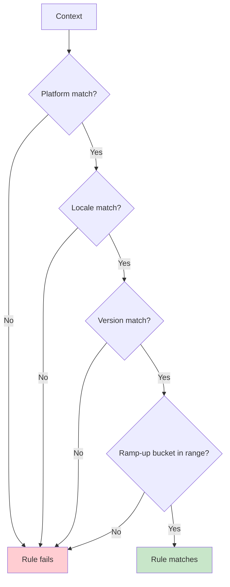

# Rule Composition

Rules are typed mappings from criteria to values. A rule matches when **all** specified criteria match the context (AND semantics).

```
criteria(context) → value
```

---

## Basic Structure

```kotlin
val apiEndpoint by string<Context>(default = "https://api.example.com") {
    rule("https://api-ios.example.com") { platforms(Platform.IOS) }
    rule("https://api-android.example.com") { platforms(Platform.ANDROID) }
}
```

Each `rule(value) { ... }` block defines:
- A **return value** (must match feature type)
- **Criteria** (platforms, locales, versions, axes, ramp-up, allowlist, extension)

---

## Available Criteria

### Platform Targeting

```kotlin
rule("mobile value") {
    platforms(Platform.IOS, Platform.ANDROID)  // OR semantics within platforms
}
```

Multiple platforms combine as **OR**: matches if context platform is iOS **OR** Android.

### Locale Targeting

```kotlin
rule("Welcome!") {
    locales(AppLocale.UNITED_STATES, AppLocale.CANADA)
}
```

Multiple locales combine as **OR**: matches if context locale is US **OR** Canada.

### Version Ranges

```kotlin
rule(true) {
    versions { min(2, 0, 0) }  // >= 2.0.0
}

rule(false) {
    versions { max(1, 9, 9) }  // <= 1.9.9
}

rule(true) {
    versions {
        min(2, 0, 0)
        max(3, 0, 0)  // [2.0.0, 3.0.0]
    }
}
```

### Axis Targeting (Custom Dimensions)

Define custom axes for environment, tenant, region, etc.:

```kotlin
enum class Environment(override val id: String) : AxisValue<Environment> {
    PROD("prod"),
    STAGE("stage"),
    DEV("dev"),
}

object Axes {
    object Environment : Axis<Environment>("environment", Environment::class)
}

val newUi by boolean<Context>(default = false) {
    rule(true) {
        axis(Axes.Environment, Environment.PROD)
    }
}
```

Axis ids are serialized into JSON. Keep them stable across builds (avoid relying on class name inference with obfuscation).

### Percentage Ramp-Up

```kotlin
rule(true) {
    rampUp { 25.0 }  // 25% of users
}
```

Ramp-ups are deterministic: same `(stableId, flagKey, salt)` → same bucket.

### Allowlist (Ramp-Up Bypass)

Allowlists bypass the ramp-up check **after** a rule matches by criteria:

```kotlin
// Flag-scope allowlist
val newUi by boolean<Context>(default = false) {
    allowlist(StableId.of("tester-1"))
    rule(true) { rampUp { 5.0 } }
}

// Rule-scope allowlist
rule(true) {
    rampUp { 5.0 }
    allowlist(StableId.of("tester-2"))
}
```

**Important:** Allowlists don't force a rule to match; they only bypass the ramp-up gate if the rule already matches by criteria.

### Extension Predicates (Custom Logic)

For domain-specific targeting, use `extension { ... }` with a custom `Context`:

```kotlin
data class EnterpriseContext(
    override val locale: AppLocale,
    override val platform: Platform,
    override val appVersion: Version,
    override val stableId: StableId,
    val subscriptionTier: SubscriptionTier,
    val employeeCount: Int
) : Context

val ADVANCED_ANALYTICS by boolean<EnterpriseContext>(default = false) {
    rule(true) {
        extension {
            subscriptionTier == SubscriptionTier.ENTERPRISE && employeeCount > 100
        }
    }
}
```

Because the feature is parameterized with `EnterpriseContext`, the receiver inside `extension { ... }` is strongly typed.

---

## AND Semantics (Within a Rule)

All criteria in a rule must match for the rule to apply:

```kotlin
rule(true) {
    platforms(Platform.IOS, Platform.ANDROID)  // Context platform must be iOS OR Android
    locales(AppLocale.UNITED_STATES)            // AND context locale must be US
    versions { min(2, 0, 0) }                   // AND context version must be >= 2.0.0
    rampUp { 50.0 }                             // AND context must be in 50% ramp-up bucket
}
```



---

## Combining Multiple Rules

Rules are evaluated by specificity (most specific first):

```kotlin
val apiEndpoint by string<Context>(default = "https://api.example.com") {
    // Specificity = 2 (platform + locale)
    rule("https://api-ios-us.example.com") {
        platforms(Platform.IOS)
        locales(AppLocale.UNITED_STATES)
    }

    // Specificity = 1 (platform only)
    rule("https://api-ios.example.com") {
        platforms(Platform.IOS)
    }

    // Specificity = 1 (locale only)
    rule("https://api-us.example.com") {
        locales(AppLocale.UNITED_STATES)
    }
}
```

**Evaluation order:**
1. iOS + US → first rule (most specific)
2. iOS + other → second rule
3. Other platform + US → third rule
4. Other platform + other → default

See [Specificity System](/rules-and-targeting/specificity-system) for details.

---

## Empty Criteria (Match Everything)

A rule with no criteria matches all contexts (subject to ramp-up):

```kotlin
rule(true) {
    rampUp { 10.0 }  // No platform/locale/version criteria → matches all contexts
}
```

---

## Next Steps

- [Specificity System](/rules-and-targeting/specificity-system) — How rule precedence works
- [Rollout Strategies](/rules-and-targeting/rollout-strategies) — Deterministic ramp-up bucketing
- [Custom Extensions](/rules-and-targeting/custom-extensions) — Strongly-typed business logic
