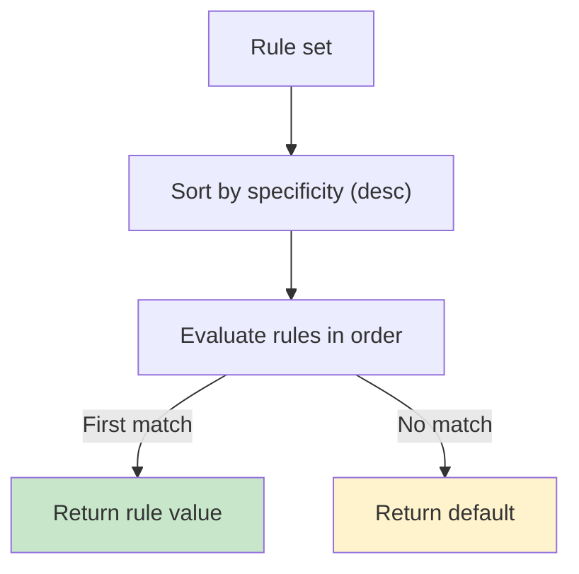

# Specificity System

Konditional evaluates rules in order of **specificity**: more specific rules (with more targeting criteria) are evaluated first.

---

## Specificity Definition

Specificity is the count of non-empty targeting criteria:

```
specificity(rule):
  +1 if platforms is set
  +1 if locales is set
  +1 if versions has bounds (min or max)
  +N for axis constraints (one per axis)
  +extensionSpecificity (defaults to 1 when `extension { ... }` is used)
```

**Ramp-up percentage does NOT affect specificity** — it gates whether a matching rule is applied, but doesn't change rule ordering.

---

## Example: Specificity Calculation

```kotlin
val apiEndpoint by string<Context>(default = "https://api.example.com") {
    // Specificity = 3 (platform + locale + version)
    rule("https://api-ios-us-v2.example.com") {
        platforms(Platform.IOS)
        locales(AppLocale.UNITED_STATES)
        versions { min(2, 0, 0) }
    }

    // Specificity = 2 (platform + locale)
    rule("https://api-ios-us.example.com") {
        platforms(Platform.IOS)
        locales(AppLocale.UNITED_STATES)
    }

    // Specificity = 1 (platform only)
    rule("https://api-ios.example.com") {
        platforms(Platform.IOS)
    }

    // Specificity = 0 (no criteria, always matches subject to ramp-up)
    rule("https://api-fallback.example.com") {
        rampUp { 100.0 }
    }
}
```

**Evaluation order:** Rules are evaluated in descending specificity (3 → 2 → 1 → 0).

---

## Why Specificity Matters

Most-specific-wins prevents surprising behavior when rules overlap:

```kotlin
val feature by boolean<Context>(default = false) {
    rule(true) { platforms(Platform.IOS) }
    rule(false) { platforms(Platform.IOS); locales(AppLocale.UNITED_STATES) }
}
```

**Without specificity ordering:**
- iOS + US users might match the first rule (true) or second rule (false) depending on definition order

**With specificity ordering:**
- iOS + US users **always** match the second rule (more specific: platform + locale)
- iOS + other locales match the first rule (less specific: platform only)

---

## Tie-Breaking (Same Specificity)

If multiple rules have the same specificity, **definition order** is used as tie-breaker:

```kotlin
rule("variant-a") {
    platforms(Platform.IOS)  // Specificity = 1
}

rule("variant-b") {
    locales(AppLocale.UNITED_STATES)  // Specificity = 1
}
```

- iOS + US contexts: both rules match by criteria
- First rule wins (iOS users get "variant-a" regardless of locale)

**Best practice:** Avoid same-specificity overlaps; make targeting criteria mutually exclusive or increase specificity to disambiguate.

---

## Extension Specificity

When using `extension { ... }`, you can optionally specify a specificity contribution:

```kotlin
rule(true) {
    extension(specificity = 5) {
        subscriptionTier == SubscriptionTier.ENTERPRISE && employeeCount > 100
    }
}
```

Default extension specificity is 1 if not specified.

---

## Evaluation Flow with Specificity



1. **Sort rules by specificity** (highest first, tie-break by definition order)
2. **Iterate rules in order**
3. **First rule that matches all criteria** (and passes ramp-up) determines the value
4. **If no rules match**, return default

---

## Common Patterns

### Layered Rollout (Increasing Specificity)

```kotlin
val newFeature by boolean<Context>(default = false) {
    // Specificity = 2: iOS + US only, 10% ramp-up
    rule(true) {
        platforms(Platform.IOS)
        locales(AppLocale.UNITED_STATES)
        rampUp { 10.0 }
    }

    // Specificity = 1: iOS globally, 5% ramp-up
    rule(true) {
        platforms(Platform.IOS)
        rampUp { 5.0 }
    }

    // Specificity = 0: All platforms, 2% ramp-up
    rule(true) {
        rampUp { 2.0 }
    }
}
```

**Evaluation:**
- iOS + US users: 10% ramp-up (most specific)
- iOS + other locales: 5% ramp-up
- Other platforms: 2% ramp-up

### Platform-Specific Overrides

```kotlin
val timeout by double<Context>(default = 30.0) {
    // Specificity = 1: Android-specific timeout
    rule(45.0) { platforms(Platform.ANDROID) }

    // All others: default (30.0)
}
```

---

## What Doesn't Contribute to Specificity

- **Ramp-up percentage** — `rampUp { 50.0 }` doesn't change ordering
- **Allowlist entries** — `allowlist(...)` doesn't change ordering
- **Rule note** — `note = "..."` is metadata, not a criterion

---

## Next Steps

- [Rule Composition](/rules-and-targeting/rule-composition) — Available criteria and AND semantics
- [Rollout Strategies](/rules-and-targeting/rollout-strategies) — Deterministic ramp-up bucketing
- [Fundamentals: Evaluation Semantics](/fundamentals/evaluation-semantics) — Evaluation flow
