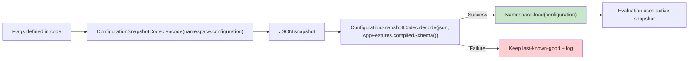

# Configuration Lifecycle

From JSON to evaluation: how configuration flows through the validated boundary and into the active snapshot.



---

## The lifecycle

### 1) JSON payload arrives

```kotlin
val json = fetchConfig()
```

### 2) Parse and validate

```kotlin
val result = ConfigurationSnapshotCodec.decode(json, AppFeatures.compiledSchema())
when {
    result.isSuccess -> AppFeatures.load(result.getOrNull()!!)
    result.isFailure -> logError(result.parseErrorOrNull()?.message)
}
```

- **Guarantee**: Invalid JSON never becomes a `Configuration`.

- **Mechanism**: `Result` makes success vs failure explicit at the boundary.

- **Boundary**: Semantic correctness is not validated.

### 3) Atomic load

`Namespace.load(...)` swaps the configuration snapshot atomically. Readers see either the old or new snapshot.

### 4) Evaluation reads the snapshot

Evaluations are lock-free and read a snapshot at a single point in time.

---

## Precondition: features must be registered

Ensure your `Namespace` objects are initialized before parsing JSON.

```kotlin
```

If JSON references a feature that is not registered, parsing fails with `ParseError.FeatureNotFound`.

---

## Rollback support

```kotlin
val success = AppFeatures.rollback(steps = 1)
```

---

## Next steps

- [Serialization module](/serialization/)
- [Runtime operations](/runtime/operations)
