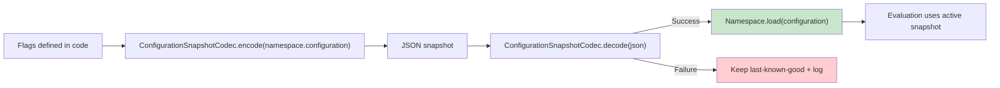

# Configuration Lifecycle
import GuaranteeBlock from '@site/src/components/GuaranteeBlock';


From JSON to evaluation: how configuration flows through the validated boundary and into the active snapshot.



---

## The lifecycle

### 1) JSON payload arrives

```kotlin
val json = fetchConfig()
```

### 2) Parse and validate

```kotlin
when (val result = ConfigurationSnapshotCodec.decode(json)) {
    is ParseResult.Success -> AppFeatures.load(result.value)
    is ParseResult.Failure -> logError(result.error.message)
}
```

<GuaranteeBlock
  label="Invalid JSON rejection"
  guarantee={`Invalid JSON never becomes a \`Configuration\`.`}
  mechanism={`\`ParseResult\` makes success vs failure explicit at the boundary.`}
  boundary={`Semantic correctness is not validated.`}
/>

### 3) Atomic load

`Namespace.load(...)` swaps the configuration snapshot atomically. Readers see either the old or new snapshot.

### 4) Evaluation reads the snapshot

Evaluations are lock-free and read a snapshot at a single point in time.

---

## Precondition: features must be registered

Ensure your `Namespace` objects are initialized before parsing JSON.

```kotlin
val _ = AppFeatures
```

If JSON references a feature that is not registered, parsing fails with `ParseError.FeatureNotFound`.

---

## Rollback support

```kotlin
val success = AppFeatures.rollback(steps = 1)
```

---

## Next steps

- [Serialization module](/serialization/)
- [Runtime operations](/runtime/operations)
