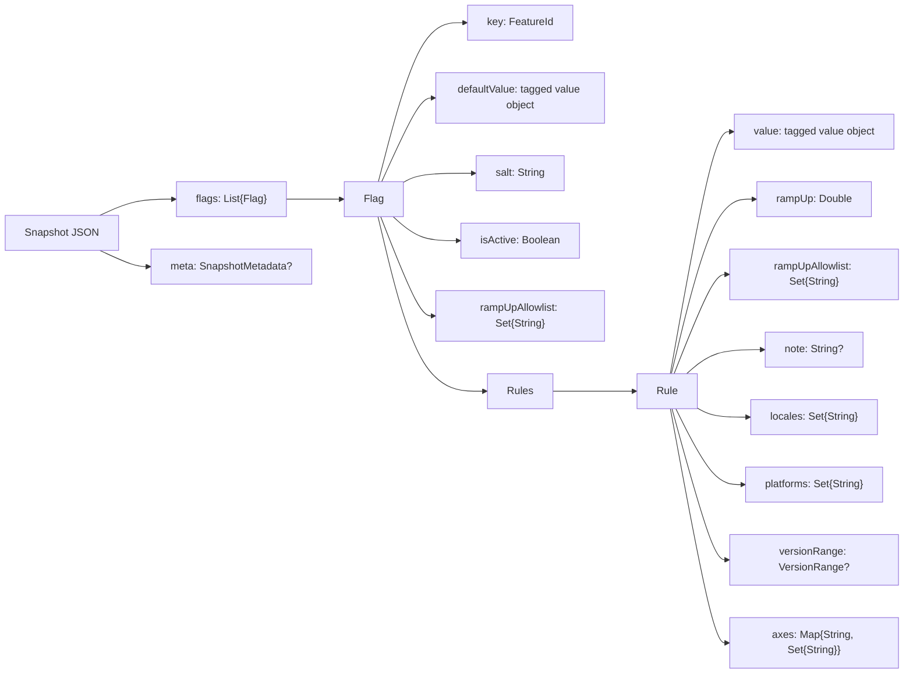

# Persistence Format

This page documents the JSON formats used to persist and transport Konditional configuration:

- Snapshot: full configuration payload (`ConfigurationSnapshotCodec.encode(...)`)
- Patch: incremental update payload (`ConfigurationSnapshotCodec.applyPatchJson(...)`)

These formats are storage-agnostic: you can store JSON in files, a database, or ship it over the network.

---

## Mental model

At persistence time, the library serializes a list of flag definitions:



---

## FeatureId format (`key`)

Each flag is stored under a stable FeatureId string:

```
feature::${namespaceIdentifierSeed}::${featureKey}
```

Where:

- `${namespaceIdentifierSeed}` is the namespace identifier seed (defaults to namespace `id`)
- `${featureKey}` is the feature key (typically the Kotlin property name)

Example:

```
feature::global::darkMode
```

Backward compatibility: older snapshots may contain `value::${namespaceIdentifierSeed}::${featureKey}`. These are
normalized on load.

---

## Value encoding (`defaultValue` / rule `value`)

Both `defaultValue` and each rule's `value` are encoded as a tagged object. The `type` field is the discriminator:

```json
{
  "type": "BOOLEAN",
  "value": true
}
```

Supported shapes:

| Kind       | JSON shape |
|------------|------------|
| Boolean    | `{ "type": "BOOLEAN", "value": ${boolean} }` |
| String     | `{ "type": "STRING", "value": "${string}" }` |
| Int        | `{ "type": "INT", "value": ${int} }` |
| Double     | `{ "type": "DOUBLE", "value": ${double} }` |
| Enum       | `{ "type": "ENUM", "value": "${enumName}", "enumClassName": "${fqcn}" }` |
| Data class | `{ "type": "DATA_CLASS", "dataClassName": "${fqcn}", "value": { ...primitive fields... } }` |

---

## Version range encoding (`versionRange`)

Rules may include a `versionRange` object. It uses a tagged object where `type` selects the variant:

```json
{
  "type": "MIN_AND_MAX_BOUND",
  "min": { "major": 2, "minor": 0, "patch": 0 },
  "max": { "major": 4, "minor": 0, "patch": 0 }
}
```

Valid `type` values:

- `UNBOUNDED`
- `MIN_BOUND` (requires `min`)
- `MAX_BOUND` (requires `max`)
- `MIN_AND_MAX_BOUND` (requires `min` and `max`)

Locale and platform values are serialized as stable ids (`LocaleTag.id` / `PlatformTag.id`).

---

## Ramp-up allowlists (`rampUpAllowlist`)

Both flags and individual rules may include a `rampUpAllowlist` field:

- It is a set of stable ID hex strings (the same representation returned by `StableId.id`).
- It does not force a rule to match; it only bypasses the ramp-up check after a rule matches by criteria.
- Flag-level and rule-level allowlists are treated as a union.
- It does not override `isActive` or the namespace kill-switch.

Example:

```kotlin
val stableIdHex = StableId.of("user-123").id
val stableIdFromHex = StableId.fromHex(stableIdHex)
```

---

## Snapshot template

```kotlin
val snapshotJson = """
{
  "meta": {
    "version": "${optionalVersionOrNull}",
    "generatedAtEpochMillis": ${optionalEpochMillisOrNull},
    "source": "${optionalSourceOrNull}"
  },
  "flags": [
    {
      "key": "feature::${namespaceSeed}::${featureKey}",
      "defaultValue": {
        "type": "${valueType}",
        "value": ${defaultValueJson},
        "...": "${typeSpecificFields}"
      },
      "salt": "${salt}",
      "isActive": ${isActive},
      "rampUpAllowlist": ["${stableIdHex}", "..."],
      "rules": [
        {
          "value": {
            "type": "${valueType}",
            "value": ${ruleValueJson},
            "...": "${typeSpecificFields}"
          },
          "rampUp": ${rampUpPercent},
          "rampUpAllowlist": ["${stableIdHex}", "..."],
          "note": "${optionalNoteOrNull}",
          "locales": ["${APP_LOCALE_ENUM_NAME}", "..."],
          "platforms": ["${PLATFORM_ENUM_NAME}", "..."],
          "axes": {
            "${axisId}": ["${axisValueId}", "..."]
          },
          "versionRange": {
            "type": "${UNBOUNDED|MIN_BOUND|MAX_BOUND|MIN_AND_MAX_BOUND}",
            "min": { "major": ${minMajor}, "minor": ${minMinor}, "patch": ${minPatch} },
            "max": { "major": ${maxMajor}, "minor": ${maxMinor}, "patch": ${maxPatch} }
          }
        }
      ]
    }
  ]
}
"""
```

---

## Patch template

```kotlin
val patchJson = """
{
  "meta": {
    "version": "${optionalVersionOrNull}",
    "generatedAtEpochMillis": ${optionalEpochMillisOrNull},
    "source": "${optionalSourceOrNull}"
  },
  "flags": [
    { "...": "flag objects (same shape as snapshot)" }
  ],
  "removeKeys": [
    "feature::${namespaceSeed}::${featureKeyToRemove}",
    "feature::${namespaceSeed}::${anotherKey}"
  ]
}
"""
```

---

## Parse boundary and failure modes

Deserialization reconstructs configurations by looking up each key in the registry of known features.

- Unknown keys fail with `ParseError.FeatureNotFound`.
- JSON syntax or shape errors fail with `ParseError.InvalidJson` / `ParseError.InvalidSnapshot`.

Operationally: treat parse failures as "reject update, keep last-known-good".

---

## Snapshot metadata (`meta`)

Snapshots and patches may include an optional `meta` object:

```json
{
  "meta": {
    "version": "rev-123",
    "generatedAtEpochMillis": 1700000000000,
    "source": "s3://configs/global.json"
  },
  "flags": []
}
```
