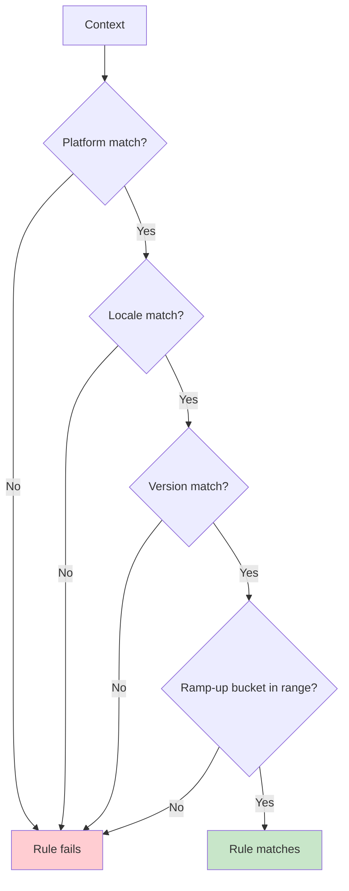
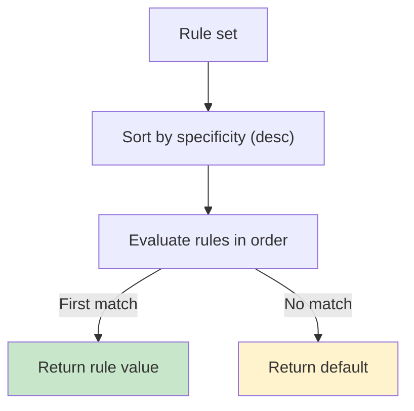
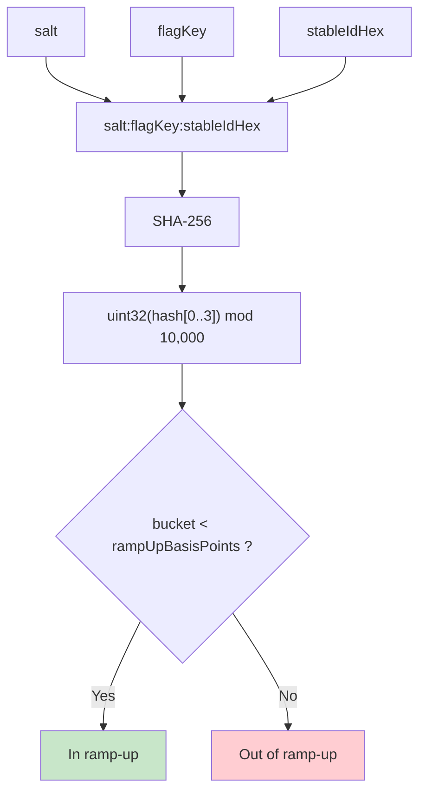

# Targeting & Ramp-ups

Rules let you target specific contexts and ramp up behavior safely. A rule is a typed mapping:

```
criteria(context) -> value
```

Two properties define how rules behave:

- **AND semantics within a rule**: all specified criteria must match.
- **Specificity ordering across rules**: the most specific matching rule wins.

---

## Criteria you can combine

### Platform

```kotlin
val apiEndpoint by string<Context>(default = "https://api.example.com") {
    rule("https://api-ios.example.com") { platforms(Platform.IOS) }
    rule("https://api-android.example.com") { platforms(Platform.ANDROID) }
    rule("https://api-web.example.com") { platforms(Platform.WEB) }
}
```

Multiple platforms combine as OR:

```kotlin
rule("mobile value") { platforms(Platform.IOS, Platform.ANDROID) }
```

### Locale

```kotlin
val welcomeMessage by string<Context>(default = "Hello!") {
    rule("Welcome!") { locales(AppLocale.UNITED_STATES, AppLocale.CANADA) }
    rule("Bienvenue!") { locales(AppLocale.FRANCE) }
    rule("ようこそ!") { locales(AppLocale.JAPAN) }
}
```

### Axis (custom dimensions)

Axis values let you target custom dimensions (environment, tenant, region, etc.):

```kotlin
enum class Environment(override val id: String) : AxisValue<Environment> {
    PROD("prod"),
    STAGE("stage"),
    DEV("dev"),
}

object Axes {
    object Environment : Axis<Environment>("environment", Environment::class)
}

val newUi by boolean<Context>(default = false) {
    rule(true) { axis(Environment.PROD) }
}
```

Axis ids are serialized into configuration snapshots. Keep them stable and explicit; avoid relying on implicit ids
derived from class names if you use code shrinking/obfuscation.

### Version ranges

```kotlin
val newUi by boolean<Context>(default = false) {
    rule(true) { versions { min(2, 0, 0) } }
}
```

```kotlin
val legacySupport by boolean<Context>(default = false) {
    rule(true) { versions { max(2, 0, 0) } }
}
```

### Percentage ramp-up

```kotlin
val newCheckout by boolean<Context>(default = false) {
    rule(true) { rampUp { 10.0 } }
}
```

Ramp-ups are deterministic: the same `(stableId, flagKey, salt)` produces the same bucket assignment.

### Ramp-up allowlisting (internal testers)

Allowlists bypass ramp-up *after* a rule matches by criteria:

```kotlin
val newUi by boolean<Context>(default = false) {
    allowlist(StableId.of("tester-1")) // flag-scope allowlist
    rule(true) { rampUp { 5.0 } }
}
```

Rule-scoped allowlists are also supported:

```kotlin
rule(true) {
    rampUp { 5.0 }
    allowlist(StableId.of("tester-1"))
}
```

### Custom predicates via `extension { }`

```kotlin
val ADVANCED_ANALYTICS by boolean<EnterpriseContext>(default = false) {
    rule(true) {
        extension { subscriptionTier == SubscriptionTier.ENTERPRISE && employeeCount > 100 }
    }
}
```

---

## AND semantics inside a rule

All criteria in a rule must match:

```kotlin
val premiumFeature by boolean<Context>(default = false) {
    rule(true) {
        platforms(Platform.IOS, Platform.ANDROID)
        locales(AppLocale.UNITED_STATES)
        versions { min(2, 0, 0) }
        rampUp { 50.0 }
    }
}
```



---

## Specificity: which rule wins

Konditional orders rules by **specificity** before evaluating them. Specificity is the count of criteria present on a
rule:

```
specificity(rule):
  +1 if platforms is set
  +1 if locales is set
  +1 if versions has bounds
  +N for axis constraints (one per axis)
  +extensionSpecificity (defaults to 1 when `extension { ... }` is used)
```

Rules are evaluated in descending specificity; the first rule whose criteria all match determines the value. If no rules
match, the default is returned.

If multiple rules have the same specificity, their original insertion order is used as the tie-breaker.



---

## Deterministic ramp-up bucketing (SHA-256)

Ramp-ups are computed locally. The bucketing input is stable and per-flag:

```kotlin
input = "$salt:$flagKey:${stableIdHex}"
hash = sha256(input)
bucket = uint32(hash[0..3]) % 10_000 // [0, 10_000)
```

This yields three operational properties:

- **Deterministic**: same inputs → same bucket
- **Per-flag isolation**: changing one flag does not affect other flags’ buckets
- **Salt-controlled redistribution**: changing `salt` re-buckets users for that flag

Ramp-up checks are performed in basis points:

```
thresholdBasisPoints = round(rampUpPercent * 100) // 0..10_000
inRampUp = bucket < thresholdBasisPoints
```



---

## Next steps

- Understand evaluation flow and performance: ["Evaluation"](evaluation)
- Understand the compile-time vs runtime boundary: ["Theory"](theory)
