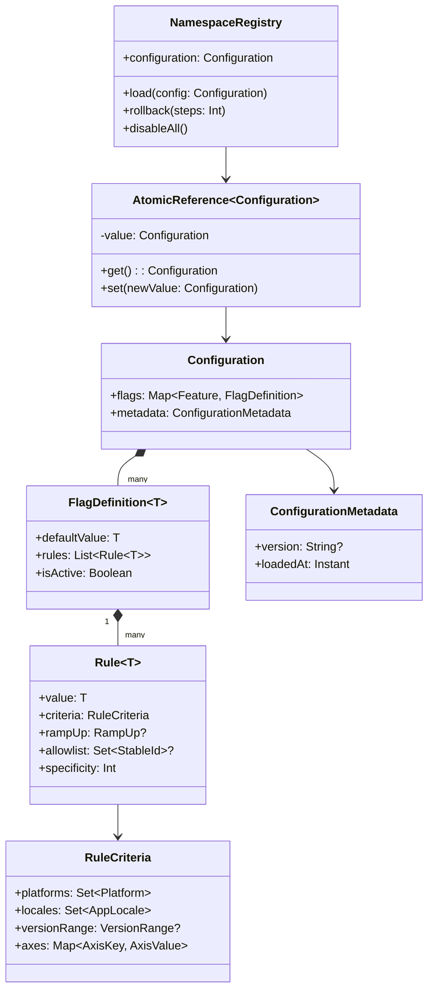
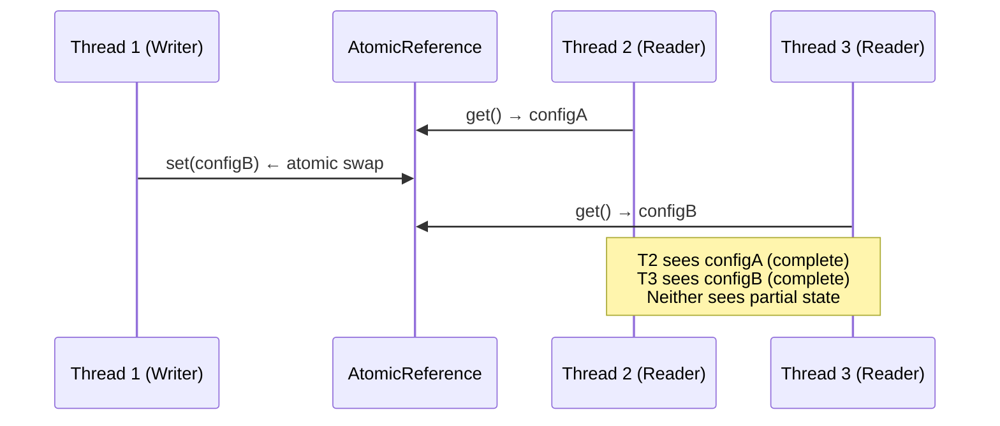

# Atomicity Guarantees

Why readers never see partial configuration updates, and how `AtomicReference` provides lock-free safety.

Cross-document synthesis: [Verified Design Synthesis](/theory/verified-synthesis).

---

## The Problem: Torn Reads

Without atomicity, readers can observe partial updates:

```kotlin
// ✗ Non-atomic update (simplified)
class Registry {
    var config: Configuration = initial  // Not thread-safe

    fun update(newConfig: Configuration) {
        config = newConfig  // Multiple threads may see inconsistent state
    }

    fun read(): Configuration {
        return config  // Might see partially-written value
    }
}
```

**Issues:**

- Thread A updates `config` while Thread B reads
- Thread B might see old config, new config, or garbage (torn read)
- No happens-before relationship between write and read

---

## Konditional's Solution: AtomicReference

```kotlin
// Simplified: the default in-memory NamespaceRegistry implementation.
private val current: AtomicReference<Configuration> = AtomicReference(initialConfiguration)

override fun load(config: Configuration) {
    current.set(config)  // Single atomic write
}

override val configuration: Configuration
    get() = current.get()  // Atomic read
```

**Guarantees:**

1. **Atomic swap** — `set(...)` is a single write operation; no partial updates
2. **Happens-before** — JVM memory model guarantees writes are visible to subsequent reads
3. **No torn reads** — Reference swap is atomic at the hardware level

---

## Snapshot Schema Overview



Readers hold a reference to one complete `Configuration`. A `load(...)` call atomically replaces that reference.
There is no moment where a `Configuration` is "half old, half new."

---

## How AtomicReference Works

### JVM Memory Model Guarantees

From the Java Language Specification (JLS §17.4.5):

> "A write to a volatile variable v happens-before all subsequent reads of v by any thread."

`AtomicReference` uses volatile semantics internally, providing:

- **Visibility** — Writes are immediately visible to other threads
- **Ordering** — No reordering of reads/writes across the volatile barrier

### Single Write Operation

```kotlin
current.set(newConfig)
```

This is **one atomic operation**:

- Old reference is replaced with new reference
- No intermediate state exists
- Readers see either old OR new — never partial

---

## Concurrent Update and Evaluation



**What happens:**

1. Thread 1 calls `current.set(newConfig)` — single atomic write
2. Thread 2 calls `current.get()` before the write — sees old config (complete)
3. Thread 3 calls `current.get()` after the write — sees new config (complete)
4. No thread sees partial config

---

## Proof: Readers See Consistent Snapshots

### Theorem

For any evaluation at time `t`, the returned value is computed using a `Configuration` that was
fully active at some time `t' ≤ t`.

### Proof

1. `AtomicReference.set(...)` is a single atomic write (JVM spec)
2. `AtomicReference.get(...)` returns the current reference atomically
3. No intermediate states exist between old and new reference
4. Therefore, readers see either the old snapshot or the new snapshot — both are complete `Configuration` instances
5. Both snapshots were valid when created (enforced at parse time)

**Corollary:** Readers never observe a configuration that was never active (no partial updates, no torn reads). □

---

## Lock-Free Reads

Evaluation reads the current snapshot without acquiring locks:

```kotlin
fun <T : Any, C : Context, M : Namespace> Feature<T, C, M>.evaluate(
    context: C,
    registry: NamespaceRegistry,
): T {
    val config = registry.configuration  // Lock-free atomic read
    // ... evaluate using config ...
}
```

**Benefits:**

- **No contention** — Multiple threads can read concurrently
- **No blocking** — Writers don't block readers; readers don't block writers
- **Predictable latency** — No lock acquisition overhead on the hot path

### Comparison: Lock-Based Approach

```kotlin
// ✗ Lock-based (slower, more complex)
class Registry {
    private val lock = ReentrantReadWriteLock()
    private var config: Configuration = initial

    fun update(newConfig: Configuration) {
        lock.writeLock().lock()
        try { config = newConfig }
        finally { lock.writeLock().unlock() }
    }

    fun read(): Configuration {
        lock.readLock().lock()
        try { return config }
        finally { lock.readLock().unlock() }
    }
}
```

The `AtomicReference` approach avoids all of this — reads are a single volatile load.

---

## Linearizability

`AtomicReference` provides **linearizability**: operations appear to execute atomically at a single point in time.

### Concurrent Updates

```kotlin
// Thread 1
AppFeatures.load(config1)

// Thread 2
AppFeatures.load(config2)

// Thread 3
val value = AppFeatures.darkMode.evaluate(context)
```

**Outcome:**

- Thread 3 sees **one** of: initial config, config1, or config2
- Thread 3 **never** sees a mix of config1 and config2
- Last write wins (config1 or config2, depending on scheduling)

**Guarantee:** All threads agree on the observed order of operations (linearizable history).

---

## Rollback

The runtime also supports rollback, which restores a prior complete snapshot atomically:

```kotlin
AppFeatures.rollback(steps = 1)  // Restores previous snapshot
```

Rollback is itself an atomic swap: the current reference is replaced with the prior snapshot reference. Readers see
either the post-rollback state or the pre-rollback state — never a mix.

---

## What Can Still Go Wrong (and What Can't)

### ✓ Safe: Concurrent Reads During Update

All concurrent readers see a complete snapshot — either old or new. This is guaranteed by `AtomicReference`.

### ✓ Safe: Multiple Concurrent Updates

Last write wins. Readers see one of the snapshots. History is maintained for rollback.

### ✗ Unsafe: Mutating Configuration After Load

```kotlin
// DON'T DO THIS
val config = AppFeatures.configuration
mutateSomehow(config)  // Breaks the snapshot mental model
```

`Configuration` is treated as immutable. Any mutation after `load(...)` bypasses the atomic swap guarantee and may
expose partial state to concurrent readers.

**Mitigation:** Treat snapshots as immutable values. To change configuration, parse a new snapshot and call `load(...)`.

### ✗ Unsafe: Bypassing `load(...)`

There is no supported public API for mutating a registry's internal state directly. Always update via `load(...)` or
`rollback(...)`, which swap the full snapshot atomically.

---

## Test Evidence

| Test | Evidence |
|---|---|
| `NamespaceLinearizabilityTest` | Load/read operations remain linearizable under concurrency. |
| `ConcurrencyAttacksTest` | Concurrent stress cases do not expose partial state to readers. |

---

## Next Steps

- [Theory: Determinism Proofs](/theory/determinism-proofs) — Determinism over atomic snapshots
- [Concept: Configuration Lifecycle](/concepts/configuration-lifecycle) — Practical implications
- [Guide: Remote Configuration](/guides/remote-configuration) — `load(...)` in production
