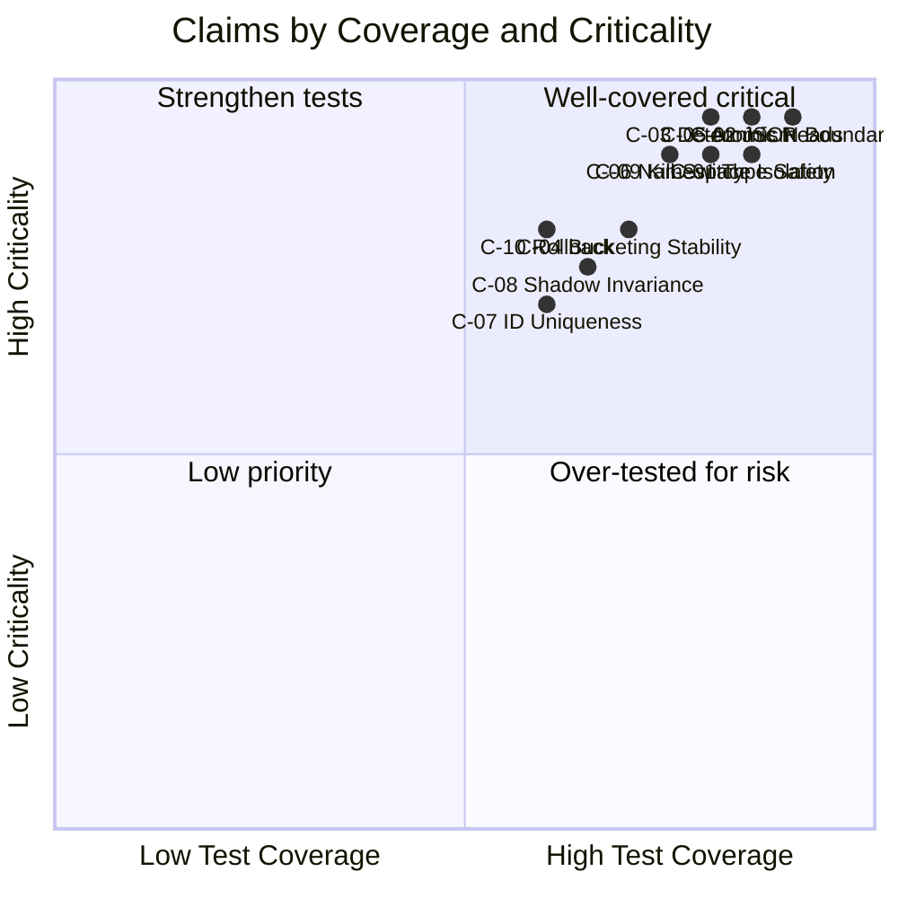

# Claims Registry

A canonical index of every design claim Konditional makes, which theory document backs it, and what test evidence
supports it.

Use this page to verify guarantees before relying on them in production, or to find the right theory page when
investigating an invariant. Every `**Guarantee**` statement elsewhere in these docs links to an entry here.

---

## How to Read This Registry

Each claim is in a collapsible block. Click to expand for full details:

- **Claim** — The invariant stated precisely
- **Scope** — Where the claim applies (and where it doesn't)
- **Theory** — Linked directly to the section containing the formal argument
- **Test evidence** — Test files you can open and run to see the claim hold
- **Conditions** — Preconditions or limits on the claim

A claim without test evidence is a **hypothesis**, not a guarantee.

---

## Claim Index

<strong>C-01: Evaluation Type Safety</strong> — <code>F.evaluate(context)</code> returns a value of the declared type T at compile time, without casts.

**Claim:** For any declared feature `F` with value type `T`, `F.evaluate(context)` returns a value of type `T` at
compile time, without runtime casts.

**Scope:** Statically-declared features in Kotlin source code.

**Theory:** [Type Safety Boundaries — Compile-Time Domain](/theory/type-safety-boundaries#compile-time-domain)

**Test evidence:**

| Test | What it proves | Source |
|---|---|---|
| `FlagEntryTypeSafetyTest` | Feature/value type combinations enforce compile-time shape. | [source](https://github.com/amichne/konditional/blob/main/konditional-core/src/test/kotlin/io/amichne/konditional/core/FlagEntryTypeSafetyTest.kt) |

**Conditions:** Only applies to features declared in Kotlin source. JSON-loaded overrides are parsed into the same
type model, but type alignment is enforced by the codec at boundary time, not at compile time.

---

<strong>C-02: JSON Boundary Rejection</strong> — Invalid JSON produces a typed <code>ParseResult.Failure</code> and does not enter runtime state.

**Claim:** Invalid JSON (malformed, missing fields, type mismatches, unknown keys in strict mode) produces a typed
`ParseResult.Failure` and does not enter runtime state.

**Scope:** `ConfigurationSnapshotCodec.decode(...)` and `NamespaceSnapshotLoader`.

**Theory:** [Parse Don't Validate — The Trust Boundary](/theory/parse-dont-validate#the-trust-boundary)

**Test evidence:**

| Test | What it proves | Source |
|---|---|---|
| `BoundaryFailureResultTest` | Parse failures are typed and carried through result channel. | [source](https://github.com/amichne/konditional/blob/main/konditional-core/src/test/kotlin/io/amichne/konditional/core/BoundaryFailureResultTest.kt) |
| `ConfigurationSnapshotCodecTest` | Snapshot decode enforces schema-aware trusted materialization. | [source](https://github.com/amichne/konditional/blob/main/konditional-serialization/src/test/kotlin/io/amichne/konditional/serialization/ConfigurationSnapshotCodecTest.kt) |

**Conditions:** Unknown-key behavior depends on `SnapshotLoadOptions`. In strict mode, unknown keys reject the
payload. In skip mode, they log a warning and proceed. Neither mode admits partial state.

---

<strong>C-03: Evaluation Determinism</strong> — Same feature, context, and snapshot always produces the same value.

**Claim:** Given the same feature declaration `F`, context `C`, and configuration snapshot `S`,
`evaluate(F, C, S)` returns the same value on every invocation.

**Scope:** Core evaluation engine.

**Theory:** [Determinism Proofs — Full Determinism Proof](/theory/determinism-proofs#putting-it-together-full-determinism-proof)

**Test evidence:**

| Test | What it proves | Source |
|---|---|---|
| `MissingStableIdBucketingTest` | Stable IDs and fallback behavior produce repeatable bucket outcomes. | [source](https://github.com/amichne/konditional/blob/main/konditional-core/src/test/kotlin/io/amichne/konditional/core/MissingStableIdBucketingTest.kt) |
| `ConditionEvaluationTest` | Rule matching and precedence remain deterministic for equivalent inputs. | [source](https://github.com/amichne/konditional/blob/main/konditional-core/src/test/kotlin/io/amichne/konditional/core/ConditionEvaluationTest.kt) |

**Conditions:** Determinism is scoped to a fixed `(context, snapshot)` pair. If the snapshot changes via
`load(...)`, subsequent evaluations may return different values — this is intentional.

---

<strong>C-04: Ramp-Up Bucketing Stability</strong> — Same <code>(salt, featureKey, stableId)</code> always yields the same bucket, across invocations and deployments.

**Claim:** For fixed `(salt, featureKey, stableId)`, bucket assignment is identical across invocations, JVM restarts,
and deployments.

**Scope:** `RampUp` bucketing in the evaluation engine.

**Theory:** [Determinism Proofs — Mechanism 1: SHA-256 Deterministic Hashing](/theory/determinism-proofs#mechanism-1-sha-256-deterministic-hashing)

**Test evidence:**

| Test | What it proves | Source |
|---|---|---|
| `MissingStableIdBucketingTest` | Fallback bucket (9999) is assigned deterministically for contexts without stableId. | [source](https://github.com/amichne/konditional/blob/main/konditional-core/src/test/kotlin/io/amichne/konditional/core/MissingStableIdBucketingTest.kt) |

**Conditions:** Changing the salt changes all bucket assignments for that feature. Salt changes should be treated as
breaking changes to rollout state.

---

<strong>C-05: Atomic Snapshot Reads</strong> — Readers never observe a partially-updated configuration.

**Claim:** Readers never observe a partially-updated configuration. Every evaluation reads either the old snapshot
or the new snapshot — never a mix.

**Scope:** `NamespaceRegistry` implementations backed by `AtomicReference`.

**Theory:** [Atomicity Guarantees — Proof: Readers See Consistent Snapshots](/theory/atomicity-guarantees#proof-readers-see-consistent-snapshots)

**Test evidence:**

| Test | What it proves | Source |
|---|---|---|
| `NamespaceLinearizabilityTest` | Load/read operations remain linearizable under concurrency. | [source](https://github.com/amichne/konditional/blob/main/konditional-runtime/src/test/kotlin/io/amichne/konditional/runtime/NamespaceLinearizabilityTest.kt) |
| `ConcurrencyAttacksTest` | Concurrent stress cases do not expose partial state to readers. | [source](https://github.com/amichne/konditional/blob/main/konditional-core/src/test/kotlin/io/amichne/konditional/adversarial/ConcurrencyAttacksTest.kt) |

**Conditions:** Applies to the default in-memory registry. Custom `NamespaceRegistry` implementations are
responsible for their own atomicity guarantees.

---

<strong>C-06: Namespace Isolation</strong> — Operations on namespace A do not affect the state of namespace B.

**Claim:** Operations on namespace `A` (load, rollback, disableAll) do not affect the state of namespace `B`.

**Scope:** All `NamespaceRegistry` operations.

**Theory:** [Namespace Isolation — Failure Isolation](/theory/namespace-isolation#failure-isolation)

**Test evidence:**

| Test | What it proves | Source |
|---|---|---|
| `NamespaceLinearizabilityTest` | Concurrent operations preserve per-namespace atomic state transitions. | [source](https://github.com/amichne/konditional/blob/main/konditional-runtime/src/test/kotlin/io/amichne/konditional/runtime/NamespaceLinearizabilityTest.kt) |
| `NamespaceFeatureDefinitionTest` | Feature declarations remain scoped to their owning namespace. | [source](https://github.com/amichne/konditional/blob/main/konditional-core/src/test/kotlin/io/amichne/konditional/core/NamespaceFeatureDefinitionTest.kt) |

**Conditions:** Applies to separate `Namespace` objects. If two `Namespace` instances are constructed with the same
identifier seed, they share the same feature ID space but still have independent registries.

---

<strong>C-07: Feature Identifier Uniqueness</strong> — Features in different namespaces with the same property name produce different IDs and do not collide.

**Claim:** Two features in different namespaces with the same Kotlin property name produce different `FeatureId`
values and do not collide at the JSON boundary.

**Scope:** `FeatureId` construction and serialization codec.

**Theory:** [Namespace Isolation — Mechanism 2: Stable, Namespaced FeatureId](/theory/namespace-isolation#mechanism-2-stable-namespaced-featureid)

**Proof sketch:** `FeatureId` is `feature::{namespaceIdentifierSeed}::{featureKey}`. Different namespaces have
different seeds, so the resulting IDs are structurally distinct.

---

<strong>C-08: Shadow Evaluation Baseline Invariance</strong> — <code>evaluateWithShadow(...)</code> always returns the baseline value; candidate is comparison-only.

**Claim:** `evaluateWithShadow(...)` always returns the baseline value. Candidate evaluation is read-only and never
affects the value returned to the caller.

**Scope:** `Feature.evaluateWithShadow(...)`.

**Theory:** [Migration and Shadowing — Mechanism: Dual Evaluation](/theory/migration-and-shadowing#mechanism-dual-evaluation)

**Test evidence:**

| Test | What it proves | Source |
|---|---|---|
| `KillSwitchTest` | Baseline safety controls remain authoritative during rollout/migration workflows. | [source](https://github.com/amichne/konditional/blob/main/konditional-runtime/src/test/kotlin/io/amichne/konditional/ops/KillSwitchTest.kt) |

**Conditions:** The `onMismatch` callback runs inline. If it throws, the exception propagates. Keep `onMismatch`
implementations lightweight and non-throwing.

---

<strong>C-09: Kill-Switch Safety</strong> — When <code>disableAll()</code> is active, all evaluations in that namespace return their declared default.

**Claim:** When `Namespace.disableAll()` is active, all feature evaluations in that namespace return their declared
default value, regardless of configuration snapshot or context.

**Scope:** All `Feature.evaluate(...)` calls within the namespace.

**Theory:** [Determinism Proofs — Proof, Case 1: Namespace Kill-Switch](/theory/determinism-proofs#proof)

**Test evidence:**

| Test | What it proves | Source |
|---|---|---|
| `KillSwitchTest` | Kill-switch overrides evaluation and forces all features to default. | [source](https://github.com/amichne/konditional/blob/main/konditional-runtime/src/test/kotlin/io/amichne/konditional/ops/KillSwitchTest.kt) |

---

<strong>C-10: Rollback Restores Complete Snapshots</strong> — Rollback atomically restores a prior complete snapshot.

**Claim:** `Namespace.rollback(steps = N)` restores the complete snapshot that was active `N` loads ago, atomically.
Readers observe either the current snapshot or the restored snapshot — never partial state.

**Scope:** `NamespaceRegistry.rollback(...)`.

**Theory:** [Atomicity Guarantees — Rollback](/theory/atomicity-guarantees#rollback)

**Conditions:** History depth is finite. Rolling back beyond the available history has no effect (no-op). The number
of available rollback steps depends on the registry implementation's history capacity.

---

## Claim Status Overview

---

## Adding a Claim

When adding a new invariant to Konditional:

1. State the claim precisely — avoid hedging language
2. Define the scope clearly — where does it apply, where doesn't it?
3. Identify any preconditions or conditions on the claim
4. Add a test that would fail if the claim were violated
5. Add a `
` entry here with the test reference and source link
6. Add a `→ [C-NN](/theory/claims-registry#c-nn)` inline reference at the relevant `**Guarantee**` site in the docs

A claim without a failing test is documentation, not a guarantee.

---

## Related

- [Theory: Type Safety Boundaries](/theory/type-safety-boundaries)
- [Theory: Determinism Proofs](/theory/determinism-proofs)
- [Theory: Atomicity Guarantees](/theory/atomicity-guarantees)
- [Theory: Namespace Isolation](/theory/namespace-isolation)
- [Theory: Parse Don't Validate](/theory/parse-dont-validate)
- [Theory: Migration and Shadowing](/theory/migration-and-shadowing)
- [Theory: Verified Design Synthesis](/theory/verified-synthesis)
