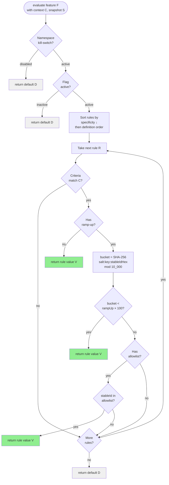

# Determinism Proofs

Why same inputs always produce same outputs: SHA-256 bucketing, stable rule ordering, and immutable snapshots.

Cross-document synthesis: [Verified Design Synthesis](/theory/verified-synthesis).

---

## The Determinism Guarantee

**Claim:** Given the same configuration snapshot and the same context, evaluation always produces the same value.

**Formally:**

```
∀ context C, configuration S:
  evaluate(feature, C, S) = v1 ∧ evaluate(feature, C, S) = v2 → v1 = v2
```

---

## Evaluation Decision Flow



Every branch terminates at a fixed value derived purely from `(F, C, S)`. No randomness. No ambient state.

---

## Mechanism 1: SHA-256 Deterministic Hashing

### Ramp-Up Bucketing

```kotlin
input = "$salt:$flagKey:${stableIdHex}"
hash = sha256(input)
bucket = uint32(hash[0..3]) % 10_000
```

**SHA-256 properties:**

1. **Deterministic** — Same input always produces the same hash
2. **Collision-resistant** — Different inputs produce different hashes (negligible collision probability)
3. **Uniform distribution** — Hash outputs are uniformly distributed, so bucket assignments are well-spread

### Proof of Determinism

**Lemma:** SHA-256 is a deterministic function.

**Proof:** SHA-256 is defined by FIPS 180-4. For any input `m`, `SHA256(m)` is computed via a fixed sequence of
operations (message padding, block processing, compression). The algorithm contains no randomness and no
nondeterministic steps. □

**Corollary:** For fixed `(salt, flagKey, stableIdHex)`, the bucket assignment is deterministic.

```
bucket(salt, flagKey, stableId) = uint32(SHA256("$salt:$flagKey:${stableId.hex}")[0..3]) % 10_000
```

Since SHA-256 is deterministic, `bucket(...)` is deterministic.

### Fallback Behavior

Contexts without a `StableIdContext` use fallback bucket `9999`. This means such contexts are only in a partial
rollout if the ramp-up is 100% or the context is explicitly allowlisted. This is deterministic (always bucket 9999)
but intentional — the design assumes partial rollout requires a stable identity.

---

## Mechanism 2: Stable Rule Ordering

### Specificity Calculation

```kotlin
specificity(rule) =
  (if platforms.nonEmpty then 1 else 0) +
  (if locales.nonEmpty then 1 else 0) +
  (if versionRange.hasBounds then 1 else 0) +
  axes.size +
  extensionSpecificity
```

**Property:** Specificity is a pure function of rule criteria — no side effects, no randomness.

### Rule Sorting

Rules are sorted by:

1. **Descending specificity** (higher specificity first)
2. **Definition order** (stable tie-breaker)

**Proof of Stability:**

```kotlin
val sortedRules = rules.sortedByDescending { it.specificity }
```

Kotlin's `sortedByDescending` is a **stable sort**: elements with equal specificity retain their original relative
order. Sorting is a pure function (same input → same output).

**Corollary:** Rule iteration order is deterministic for a fixed configuration.

---

## Mechanism 3: Immutable Configuration Snapshots

### Configuration Immutability

```kotlin
data class Configuration internal constructor(
    val flags: Map<Feature<*, *, *>, FlagDefinition<*, *, *>>,
    val metadata: ConfigurationMetadata = ConfigurationMetadata(),
)
```

`Configuration` is a `data class` with `val` properties:

- All fields are immutable references
- The public API exposes a read-only `Map` (snapshot is effectively immutable)
- No supported mutation methods

**Property:** Once created, a `Configuration` cannot change.

### Evaluation with Snapshot

```kotlin
fun <T : Any, C : Context, M : Namespace> Feature<T, C, M>.evaluate(
    context: C,
    registry: NamespaceRegistry,
): T {
    val config = registry.configuration  // Read current snapshot
    // ... evaluate using config ...
}
```

**Key insight:** Evaluation reads a **snapshot** of configuration at a single point in time. Even if the active
configuration changes during evaluation (via `load(...)`), the snapshot reference held within this evaluation remains
unchanged.

---

## Putting It Together: Full Determinism Proof

### Theorem

**Given:**

- A feature `f` with default `d` and rules `R = [r1, r2, ..., rn]`
- A context `C` with `(locale, platform, version, stableId)`
- A configuration snapshot `S` containing `f`'s definition

**Then:** `evaluate(f, C, S)` is deterministic.

### Proof

**Case 1: Namespace kill-switch active**

- `disableAll()` sets a boolean flag
- Evaluation returns `d` (default)
- **Result:** deterministic ✓

**Case 2: Flag inactive**

- `isActive` is a boolean in `FlagDefinition`
- Evaluation returns `d` (default)
- **Result:** deterministic ✓

**Case 3: Rules evaluated**

1. **Sort rules by specificity** — stable sort, deterministic
2. **Iterate rules in order:**
   - **Criteria matching** — pure functions of `C` (no side effects)
   - **Ramp-up check** — SHA-256 bucketing (deterministic, proven above)
   - **Allowlist check** — set membership (deterministic)
3. **First matching rule** — iteration order is deterministic, so first match is deterministic
4. **Return rule value or default** — both are constants from `S`

**Result:** All steps are deterministic → final value is deterministic. □

---

## What Could Break Determinism (and What Can't)

### ✓ Deterministic: Same Context, Same Snapshot

```kotlin
val ctx = Context(
    locale = AppLocale.UNITED_STATES,
    platform = Platform.IOS,
    appVersion = Version.of(2, 1, 0),
    stableId = StableId.of("user-123")
)

val v1 = AppFeatures.darkMode.evaluate(ctx)
val v2 = AppFeatures.darkMode.evaluate(ctx)
// v1 == v2 (guaranteed)
```

### ✓ Deterministic: Same StableId Across Different Context Fields

```kotlin
// Same stableId means same ramp-up bucket regardless of other fields
val ctx1 = Context(..., stableId = StableId.of("user-123"))
val ctx2 = Context(..., stableId = StableId.of("user-123"))
// If same rules match, ramp-up bucket is identical
```

### ✗ Intentionally Non-Deterministic: Different StableIds

```kotlin
val ctx1 = Context(..., stableId = StableId.of("user-123"))
val ctx2 = Context(..., stableId = StableId.of("user-456"))
// Different stableId → different bucket → possibly different value
```

This is intentional. Ramp-up bucketing is deterministic **per stable identity**, not across identities.

### ✗ Intentionally Non-Deterministic: Configuration Changes Between Evaluations

```kotlin
val v1 = AppFeatures.darkMode.evaluate(ctx)
AppFeatures.load(newConfig)  // snapshot changes
val v2 = AppFeatures.darkMode.evaluate(ctx)
// v1 might ≠ v2 — intentional, config changed
```

Determinism is scoped to a fixed `(context, snapshot)` pair.

### ✓ Deterministic: Concurrent Evaluations Over the Same Snapshot

```kotlin
// Thread 1 — reads snapshot at time t
val v1 = AppFeatures.darkMode.evaluate(ctx)

// Thread 2 — reads same snapshot (before any load)
val v2 = AppFeatures.darkMode.evaluate(ctx)

// v1 == v2 — both read the same atomic snapshot reference
```

---

## Testing Determinism

### Unit Test: Same Context → Same Value

```kotlin
@Test
fun `evaluation is deterministic`() {
    val ctx = Context(
        locale = AppLocale.UNITED_STATES,
        platform = Platform.IOS,
        appVersion = Version.of(2, 1, 0),
        stableId = StableId.of("user-123")
    )

    val results = (1..1000).map { AppFeatures.darkMode.evaluate(ctx) }

    assertEquals(1, results.distinct().size, "Non-deterministic evaluation!")
}
```

### Statistical Test: Ramp-Up Distribution

```kotlin
@Test
fun `50 percent ramp-up distributes evenly`() {
    val sampleSize = 10_000
    val enabled = (0 until sampleSize).count { i ->
        val ctx = Context(
            locale = AppLocale.UNITED_STATES,
            platform = Platform.IOS,
            appVersion = Version.of(2, 1, 0),
            stableId = StableId.of(i.toString().padStart(32, '0'))
        )
        AppFeatures.rampUpFlag.evaluate(ctx)
    }

    val percentage = (enabled.toDouble() / sampleSize) * 100
    assertTrue(percentage in 48.0..52.0, "Ramp-up distribution is skewed!")
}
```

---

## Formal Properties Summary

| Property | Mechanism | Guarantee |
|---|---|---|
| **Ramp-up determinism** | SHA-256 (FIPS 180-4) | Same `(stableId, flagKey, salt)` → same bucket |
| **Rule ordering** | Stable sort by specificity | Same rules → same iteration order |
| **Snapshot immutability** | Kotlin immutable data classes | Snapshot cannot change after creation |
| **Atomic reads** | `AtomicReference.get()` | Readers see consistent snapshot |
| **Overall determinism** | Composition of above | Same `(context, snapshot)` → same value |

---

## Test Evidence

| Test | Evidence |
|---|---|
| `MissingStableIdBucketingTest` | Stable IDs and fallback behavior produce repeatable bucket outcomes. |
| `ConditionEvaluationTest` | Rule matching and precedence remain deterministic for equivalent inputs. |

---

## Next Steps

- [Theory: Atomicity Guarantees](/theory/atomicity-guarantees) — Snapshot consistency
- [Concept: Evaluation Model](/concepts/evaluation-model) — Practical determinism
- [Quickstart: Add Deterministic Ramp-Up](/quickstart/add-deterministic-ramp-up) — Ramp-up in practice
