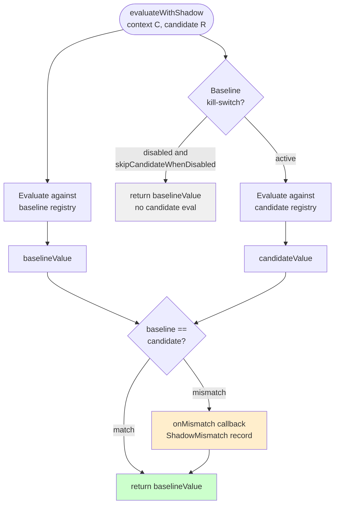
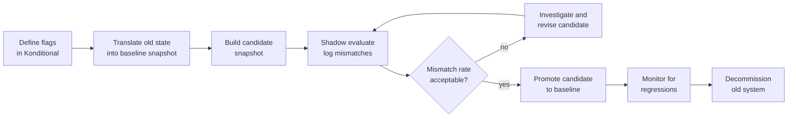

# Migration and Shadowing

How `evaluateWithShadow` enables safe comparisons between two Konditional configurations.

Cross-document synthesis: [Verified Design Synthesis](/theory/verified-synthesis).

---

## The Migration Problem

When updating configuration or migrating between flag systems, you need confidence that the new system produces the same
results as the old system.

**Traditional approach:**

1. Deploy new config
2. Hope it works
3. Monitor for issues
4. Rollback if problems detected

**Issues:**

- No advance warning of mismatches
- Production is the first real test
- Rollback is reactive — damage may already be done

---

## Shadow Evaluation

**Shadow evaluation** means: evaluate against two configurations (baseline + candidate) and compare results without
affecting production.

```kotlin
val baselineValue = feature.evaluate(context)          // Returned to caller
val candidateValue = feature.evaluate(context, candidateRegistry)  // For comparison only

if (baselineValue != candidateValue) {
    logMismatch(feature, context, baselineValue, candidateValue)
}

return baselineValue  // Production uses baseline
```

**Key insight:** Production behavior is unchanged (baseline value is returned), but mismatches are logged for analysis.

---

## Shadow Evaluation Flow



Baseline value is always returned to the caller. Candidate evaluation only feeds the mismatch signal.

---

## Konditional's Shadow API

### `evaluateWithShadow(context, candidateRegistry, ...): T`

```kotlin
val candidateConfig = ConfigurationSnapshotCodec.decode(candidateJson).getOrThrow()
val candidateRegistry = InMemoryNamespaceRegistry(namespaceId = AppFeatures.namespaceId).apply {
    load(candidateConfig)
}

val value = AppFeatures.darkMode.evaluateWithShadow(
    context = context,
    candidateRegistry = candidateRegistry,
    onMismatch = { mismatch ->
        logger.warn(
            "shadowMismatch key=${mismatch.featureKey} kinds=${mismatch.kinds} " +
            "baseline=${mismatch.baseline.value} candidate=${mismatch.candidate.value} " +
            "stableId=${context.stableId.id}",
        )
    },
)

// value is from the baseline registry — production unchanged
applyDarkMode(value)
```

**Behavior:**

1. Evaluate against baseline registry → `baselineValue` (returned)
2. Evaluate against candidate registry → `candidateValue` (comparison only)
3. If they differ, invoke the `onMismatch` callback
4. Return `baselineValue` (production unaffected)

---

## Use Case 1: Configuration Changes

You want to increase a ramp-up percentage. Before rolling out, validate the new config produces expected results.

**Current config:**

```kotlin
val newFeature by boolean<Context>(default = false) {
    rule(true) { rampUp { 10.0 } }  // 10% rollout
}
```

**Candidate config (JSON):**

```json
{
  "flags": [
    {
      "key": "feature::app::newFeature",
      "defaultValue": { "type": "BOOLEAN", "value": false },
      "rules": [
        { "value": { "type": "BOOLEAN", "value": true }, "rampUp": 25.0 }
      ]
    }
  ]
}
```

**Shadow evaluation:**

```kotlin
users.forEach { user ->
    AppFeatures.newFeature.evaluateWithShadow(
        context = buildContext(user),
        candidateRegistry = candidateRegistry,
        onMismatch = { mismatch ->
            logger.info(
                "User ${user.id}: baseline=${mismatch.baseline.value} " +
                "candidate=${mismatch.candidate.value} kinds=${mismatch.kinds}",
            )
        },
    )
}
```

Users with `baseline=false, candidate=true` will be newly enabled by the candidate. Verify this matches the expected
15% increase before promoting.

---

## Use Case 2: Migration Between Flag Systems

You're migrating from another flag system to Konditional. You want to verify Konditional produces the same results as
the old system.

### Migration Flow



```kotlin
val baselineRegistry = InMemoryNamespaceRegistry(namespaceId = AppFeatures.namespaceId).apply {
    load(ConfigurationSnapshotCodec.decode(baselineJson).getOrThrow())
}
val candidateRegistry = InMemoryNamespaceRegistry(namespaceId = AppFeatures.namespaceId).apply {
    load(ConfigurationSnapshotCodec.decode(candidateJson).getOrThrow())
}

val value = AppFeatures.darkMode.evaluateWithShadow(
    context = context,
    candidateRegistry = candidateRegistry,
    baselineRegistry = baselineRegistry,
    onMismatch = { m ->
        logger.error(
            "Migration mismatch baseline=${m.baseline.value} " +
            "candidate=${m.candidate.value} kinds=${m.kinds}",
        )
    },
)

applyDarkMode(value)
```

---

## Mechanism: Dual Evaluation

### Implementation (Simplified)

```kotlin
fun <T : Any, C : Context, M : Namespace> Feature<T, C, M>.evaluateWithShadow(
    context: C,
    candidateRegistry: NamespaceRegistry,
    baselineRegistry: NamespaceRegistry = namespace,
    options: ShadowOptions = ShadowOptions.defaults(),
    onMismatch: (ShadowMismatch<T>) -> Unit,
): T {
    val baseline = explain(context, baselineRegistry)  // EvaluationResult<T>

    if (baselineRegistry.isAllDisabled && !options.evaluateCandidateWhenBaselineDisabled) {
        return baseline.value
    }

    val candidate = explain(context, candidateRegistry)  // EvaluationResult<T>
    if (baseline.value != candidate.value) {
        onMismatch(
            ShadowMismatch(
                featureKey = key,
                baseline = baseline,
                candidate = candidate,
                kinds = setOf(ShadowMismatch.Kind.VALUE),
            ),
        )
    }

    return baseline.value
}
```

**Guarantees:**

1. Baseline value is always returned — production behavior unchanged
2. Candidate evaluation does not affect the returned result
3. Mismatch callback runs inline — keep it lightweight

---

## Mismatch Types

| Mismatch Kind | Description |
|---|---|
| `VALUE` | Baseline and candidate return different values |
| `DECISION` | Decision category differs (when decision mismatch reporting is enabled) |

Start with `VALUE` mismatch reporting only. Add `DECISION` once the value delta is resolved.

---

## Performance Considerations

Shadow evaluation is two evaluations plus mismatch object creation:

- Baseline: O(n) rules
- Candidate: O(n) rules
- Total: O(2n) + callback overhead

**Mitigations:**

1. **Sampling** — Only shadow-evaluate a percentage of requests
2. **Async logging** — `onMismatch` should be non-blocking
3. **Time-boxing** — Run shadow evaluation for a limited period (e.g., 24 hours)

```kotlin
val shouldShadow = Random.nextDouble() < 0.10  // 10% sampling

val value = if (shouldShadow) {
    AppFeatures.darkMode.evaluateWithShadow(
        context = context,
        candidateRegistry = candidateRegistry,
        onMismatch = { mismatch ->
            logger.warn(
                "shadowMismatch key=${mismatch.featureKey} kinds=${mismatch.kinds} " +
                "baseline=${mismatch.baseline.value} candidate=${mismatch.candidate.value}",
            )
        },
    )
} else {
    AppFeatures.darkMode.evaluate(context)
}
```

---

## Common Causes of Mismatches

| Cause | Description |
|---|---|
| Ramp-up percentage changed | Users move in/out of partial rollout |
| Targeting criteria changed | Rules match different users |
| Rule ordering changed | Different rule wins due to specificity |
| Salt changed | Bucket assignment redistributed |
| Configuration drift | Candidate config is stale or incomplete |

---

## Test Evidence

| Test | Evidence |
|---|---|
| `KillSwitchTest` | Baseline safety controls remain authoritative during rollout/migration workflows. |

---

## Next Steps

- [Guide: Migration from Legacy](/guides/migration-from-legacy) — Step-by-step migration patterns
- [Guide: Enterprise Adoption](/guides/enterprise-adoption) — Enterprise rollout strategy
- [Concept: Configuration Lifecycle](/concepts/configuration-lifecycle) — Lifecycle and rollback
