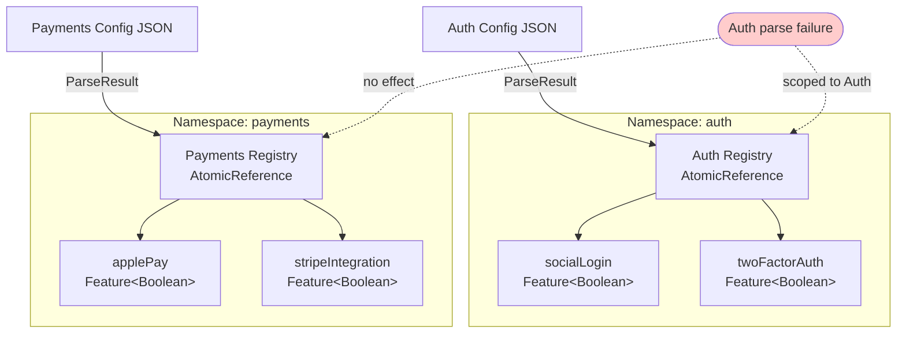

# Namespace Isolation

Why namespaces prevent collisions, how they enforce separation, and when to use multiple namespaces.

Cross-document synthesis: [Verified Design Synthesis](/theory/verified-synthesis).

---

## The Problem: Global Shared State

Without isolation, all flags share a single global registry:

```kotlin
// ✗ Global registry — all flags mixed together
object GlobalFlags {
    val darkMode = flag("dark_mode")
    val paymentProcessing = flag("payment_processing")
    val analyticsEnabled = flag("analytics_enabled")
}
```

**Issues:**

1. **Name collisions** — Two teams pick the same flag name
2. **Coupled lifecycle** — Updating one domain's config affects all others
3. **Blast radius** — A configuration error in one domain breaks everything
4. **No governance** — Can't enforce team boundaries or independent deployment

---

## Konditional's Solution: Namespace Isolation

Each namespace is a first-class isolation boundary: it owns its own registry, configuration lifecycle, and kill-switch.

```kotlin
object Auth : Namespace("auth") {
    val socialLogin by boolean<Context>(default = false)
    val twoFactorAuth by boolean<Context>(default = true)
}

object Payments : Namespace("payments") {
    val applePay by boolean<Context>(default = false)
    val stripeIntegration by boolean<Context>(default = true)
}
```

**Guarantees:**

1. **Separate registries** — `Auth` and `Payments` have independent `NamespaceRegistry` instances
2. **Independent lifecycle** — Load/rollback/disable operations are scoped to one namespace
3. **Failure isolation** — Parse error in `Auth` config doesn't affect `Payments`
4. **No name collisions** — `Auth.socialLogin` and `Payments.socialLogin` can coexist

---

## Isolation Boundary Diagram



An `Auth` parse failure has no path to the `Payments` registry. Isolation is enforced by construction.

---

## Mechanism 1: Per-Namespace Registry (No Global Singleton)

Each `Namespace` instance owns an internal registry and delegates the `NamespaceRegistry` API surface:

- `Auth.load(configuration)` only updates `Auth`
- `Payments.rollback(steps = 1)` only updates `Payments`
- `Auth.disableAll()` only affects `Auth` evaluations

This is why namespaces are operationally safe: isolation is enforced by construction, not convention.

---

## Mechanism 2: Stable, Namespaced FeatureId

Each feature has:

- `Feature.key: String` — the logical key (the Kotlin property name)
- `Feature.id: FeatureId` — the stable, serialized identifier used at the JSON boundary

`FeatureId` is encoded as:

```
feature::{namespaceIdentifierSeed}::{featureKey}
```

**Example:**

- `Auth.socialLogin.id` → `"feature::auth::socialLogin"`
- `Payments.socialLogin.id` → `"feature::payments::socialLogin"`

**Guarantee:** Features with the same `key` but different namespaces have different `id`s — no collisions.

---

## Mechanism 3: Type-Bound Features

The namespace type participates in the feature type:

```kotlin
sealed interface Feature<T : Any, C : Context, out M : Namespace>
```

**Example:**

```kotlin
object Auth : Namespace("auth") {
    val socialLogin: Feature<Boolean, Context, Auth> by boolean<Context>(default = false)
}

object Payments : Namespace("payments") {
    val socialLogin: Feature<Boolean, Context, Payments> by boolean<Context>(default = false)
}
```

`Auth.socialLogin` and `Payments.socialLogin` are different types at the Kotlin level. You can build strongly-typed
APIs that accept features only from a specific namespace.

---

## Independent Lifecycle Operations

### Load

```kotlin
val authConfig = ConfigurationSnapshotCodec.decode(authJson).getOrThrow()
val paymentConfig = ConfigurationSnapshotCodec.decode(paymentJson).getOrThrow()

Auth.load(authConfig)       // Only affects Auth registry
Payments.load(paymentConfig) // Only affects Payments registry
```

### Rollback

```kotlin
Auth.rollback(steps = 1)      // Only affects Auth
Payments.rollback(steps = 1)  // Only affects Payments
```

### Kill-Switch

```kotlin
Auth.disableAll()  // Only Auth evaluations return defaults
// Payments evaluations continue normally
```

---

## Failure Isolation

### Parse Error in One Namespace

```kotlin
val authJson = """{ "invalid": true }"""
val paymentJson = """{ "valid": "config" }"""

when (val result = NamespaceSnapshotLoader(Auth).load(authJson)) {
    is ParseResult.Failure -> {
        logger.error("Auth config parse failed: ${result.error}")
        // Auth uses last-known-good config
    }
}

when (val result = NamespaceSnapshotLoader(Payments).load(paymentJson)) {
    is ParseResult.Success -> {
        // Payments loaded successfully — unaffected by Auth parse failure
    }
}
```

**Guarantee:** Parse failures in one namespace don't affect other namespaces.

---

## When to Use Multiple Namespaces

### Use Case 1: Team Ownership

```kotlin
sealed class TeamDomain(id: String) : Namespace(id) {
    data object Recommendations : TeamDomain("recommendations") {
        val COLLABORATIVE_FILTERING by boolean<Context>(default = true)
        val CONTENT_BASED by boolean<Context>(default = false)
    }

    data object Search : TeamDomain("search") {
        val FUZZY_MATCHING by boolean<Context>(default = true)
        val AUTOCOMPLETE by boolean<Context>(default = true)
    }
}
```

Each team owns their namespace. Config updates don't require cross-team coordination.

### Use Case 2: Different Update Frequencies

```kotlin
object ExperimentFlags : Namespace("experiments") {
    // Updated frequently (daily experiments)
}

object InfrastructureFlags : Namespace("infrastructure") {
    // Updated rarely (circuit breakers, kill switches)
}
```

Experiment config changes don't risk infrastructure stability.

### Use Case 3: Failure Blast Radius

```kotlin
object CriticalPath : Namespace("critical") {
    val PAYMENT_ENABLED by boolean<Context>(default = true)
}

object Analytics : Namespace("analytics") {
    val TRACKING_ENABLED by boolean<Context>(default = false)
}
```

An analytics config error cannot affect payment processing.

---

## Anti-Pattern: Over-Segmentation

**Don't:**

```kotlin
object AuthSocialLogin : Namespace("auth-social-login")
object AuthTwoFactor : Namespace("auth-two-factor")
object AuthPasswordReset : Namespace("auth-password-reset")
```

**Issues:** Too many namespaces increase operational complexity with no isolation benefit — all are owned by the same
team and updated together.

**Better:**

```kotlin
object Auth : Namespace("auth") {
    val socialLogin by boolean<Context>(default = false)
    val twoFactorAuth by boolean<Context>(default = true)
    val passwordReset by boolean<Context>(default = true)
}
```

---

## Namespace Governance Patterns

### Pattern 1: Sealed Hierarchy

```kotlin
sealed class AppDomain(id: String) : Namespace(id) {
    data object Auth : AppDomain("auth")
    data object Payments : AppDomain("payments")
    data object Analytics : AppDomain("analytics")
}
```

All namespaces are discoverable (sealed = exhaustive). The compiler prevents unknown namespaces.

### Pattern 2: Package Structure

```
com.example.teams.auth.AuthFeatures : Namespace("auth")
com.example.teams.payments.PaymentFeatures : Namespace("payments")
com.example.teams.analytics.AnalyticsFeatures : Namespace("analytics")
```

Package structure mirrors team structure. Code ownership is enforced via CODEOWNERS.

---

## Formal Properties

| Property | Mechanism | Guarantee |
|---|---|---|
| **No identifier collisions** | `FeatureId` includes namespace seed | `Auth.socialLogin.id` ≠ `Payments.socialLogin.id` |
| **Separate state** | Different `NamespaceRegistry` instances | Updating Auth doesn't affect Payments |
| **Independent lifecycle** | Operations scoped to namespace | `Auth.load(...)` only affects Auth |
| **Failure isolation** | Parse errors scoped to namespace | Auth parse failure doesn't break Payments |
| **Type binding** | `Feature<*, *, M>` is namespace-bound | Lets you build APIs constrained to namespace `M` |

---

## Test Evidence

| Test | Evidence |
|---|---|
| `NamespaceLinearizabilityTest` | Concurrent operations preserve per-namespace atomic state transitions. |
| `NamespaceFeatureDefinitionTest` | Feature declarations remain scoped to their owning namespace. |

---

## Next Steps

- [Guide: Namespace per Team](/guides/namespace-per-team) — Team ownership patterns
- [Concept: Namespaces](/concepts/namespaces) — Core namespace primitive
- [Theory: Atomicity Guarantees](/theory/atomicity-guarantees) — Per-namespace atomic state
