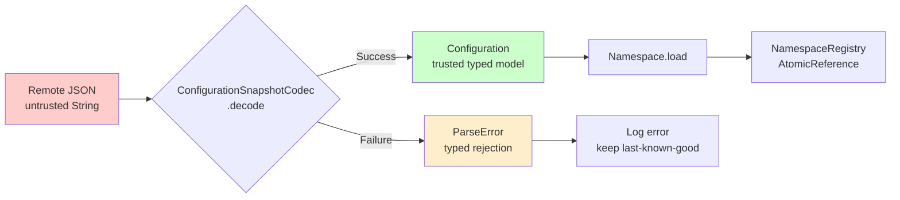
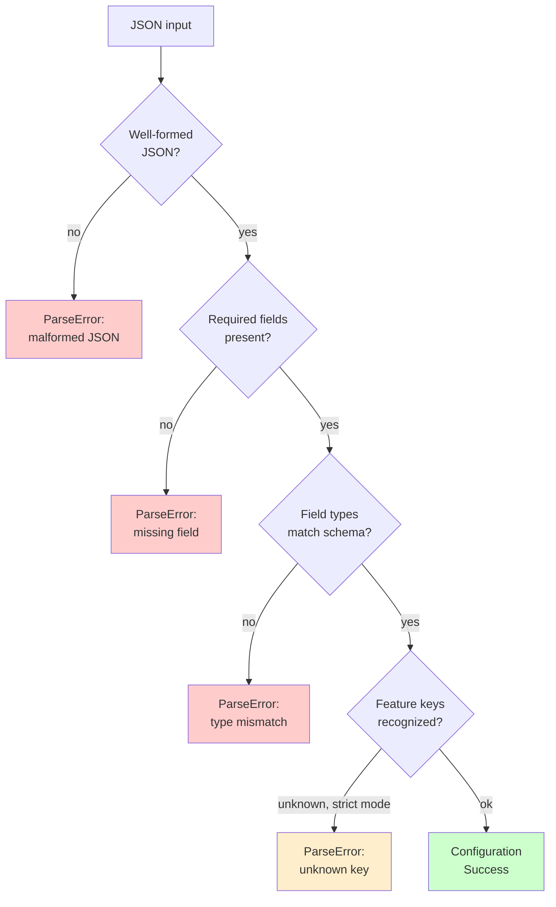

# Parse Don't Validate

Why `ParseResult` prevents invalid states from existing in the system.

Cross-document synthesis: [Verified Design Synthesis](/theory/verified-synthesis).

---

## The Problem with Validation

Traditional validation checks data and returns a boolean or throws an exception:

```kotlin
// ✗ Validation approach
fun validateConfig(json: String): Boolean {
    return json.contains("flags") && json.contains("key")
}

val json = fetchConfig()
if (validateConfig(json)) {
    // Still working with untyped String
    // No guarantee it's actually valid
    applyConfig(json)  // This might still crash
}
```

**Issues:**

1. Validated data remains in its original (untyped) form
2. No compile-time guarantee that validated data is used correctly
3. Validation checks can be bypassed or forgotten
4. Invalid states can still be constructed after validation passes

---

## Parse Don't Validate Principle

**Parse** means: transform untrusted input into a typed representation, failing early if impossible.

```kotlin
// ✓ Parse approach
sealed interface ParseResult<out T> {
    data class Success<T>(val value: T) : ParseResult<T>
    data class Failure(val error: ParseError) : ParseResult<Nothing>
}

fun parseConfig(json: String): ParseResult<Configuration> {
    // Either return Success(validConfig) or Failure(error)
    // No middle ground
}
```

**Benefits:**

1. **Type-states** — `Success` contains a valid `Configuration`; `Failure` contains a `ParseError`
2. **Exhaustive handling** — `when` expressions force you to handle both cases
3. **No invalid states** — If you have a `Configuration`, it's already been validated
4. **No silent failures** — Parse failures are explicit, not exceptions

---

## The Trust Boundary



JSON enters the system as an untrusted `String`. `ConfigurationSnapshotCodec.decode(...)` either produces a valid
`Configuration` (trusted) or a typed `ParseError` (rejected). Invalid state never enters the runtime.

---

## How Konditional Applies This

### The Boundary

```kotlin
val json: String = fetchRemoteConfig()  // Untrusted

when (val result = ConfigurationSnapshotCodec.decode(json)) {
    is ParseResult.Success -> {
        val config: Configuration = result.value  // Trusted
        AppFeatures.load(config)
    }
    is ParseResult.Failure -> {
        // Invalid JSON rejected — last-known-good remains active
        logError(result.error.message)
    }
}
```

**Key insight:** If you have a `Configuration` instance, it has already been parsed. You can't construct an invalid
`Configuration` from JSON — the codec is the only path.

---

## Mechanism: Sealed Interface Guarantees

`ParseResult` is a sealed interface with exactly two subtypes:

```kotlin
sealed interface ParseResult<out T> {
    data class Success<T>(val value: T) : ParseResult<T>
    data class Failure(val error: ParseError) : ParseResult<Nothing>
}
```

**Compiler enforcement:**

```kotlin
when (val result = ConfigurationSnapshotCodec.decode(json)) {
    is ParseResult.Success -> { /* handle success */ }
    is ParseResult.Failure -> { /* handle failure */ }
    // No other cases possible
    // when-expression is exhaustive (compiler-verified)
}
```

If you forget to handle a case, the code won't compile.

---

## No Exceptions Cross the Boundary

Traditional parsing throws exceptions:

```kotlin
// ✗ Exception-based parsing
try {
    val config = JSON.parse(json)  // Might throw
    applyConfig(config)
} catch (e: Exception) {
    // Easy to forget; exceptions are invisible in type signatures
    logError(e)
}
```

Konditional uses `ParseResult` instead:

```kotlin
// ✓ Explicit boundary
when (val result = ConfigurationSnapshotCodec.decode(json)) {
    is ParseResult.Success -> applyConfig(result.value)
    is ParseResult.Failure -> logError(result.error.message)
}
```

Parse failures are explicit in the return type. The compiler forces you to handle them. No hidden control flow.

---

## What the Codec Checks



---

## Comparison: Validation vs Parsing

### Validation (Traditional)

```kotlin
fun validateJson(json: String): Boolean {
    return json.contains("flags")
}

val json = fetchConfig()
if (validateJson(json)) {
    // json is still a String — no compile-time guarantee
    processConfig(json)
}
```

After validation, `json` is still an untyped `String`. The caller can bypass validation. Invalid states remain constructable.

### Parsing (Konditional)

```kotlin
fun parseJson(json: String): ParseResult<Configuration> {
    // Transform to typed representation, or fail
}

when (val result = parseJson(json)) {
    is ParseResult.Success -> processConfig(result.value)  // typed, valid
    is ParseResult.Failure -> { /* explicit */ }
}
```

`Configuration` is typed and guaranteed valid at the point you hold it. You can't get to `processConfig(...)` without
a successful parse.

---

## Why This Matters for Production Safety

### Traditional Approach: Silent Failures

```kotlin
val json = """{ "invalid": true }"""

if (validateJson(json)) {
    applyConfig(json)  // Might crash deep inside
}
// System continues with corrupt state
```

### Konditional Approach: Fail-Safe Boundary

```kotlin
val json = """{ "invalid": true }"""

when (val result = ConfigurationSnapshotCodec.decode(json)) {
    is ParseResult.Success -> { /* unreachable — JSON is invalid */ }
    is ParseResult.Failure -> {
        // Invalid JSON rejected
        // Last-known-good config remains active
        logError(result.error.message)
    }
}
```

**Operational guarantee:** Invalid JSON cannot become active configuration.

---

## The Guarantee

**If you have a `Configuration` instance produced by `decode(...)`, it is valid.**

No need to:

- Re-validate before using it
- Check for null or undefined fields
- Guard against type mismatches at evaluation time

The codec did all that work upfront, at the boundary.

---

## Test Evidence

| Test | Evidence |
|---|---|
| `BoundaryFailureResultTest` | Parse failures remain typed and inspectable through result channel. |
| `ConfigurationSnapshotCodecTest` | Snapshot decode enforces schema-aware trusted materialization. |

---

## Next Steps

- [Theory: Type Safety Boundaries](/theory/type-safety-boundaries) — Compile-time vs. runtime guarantees
- [Concept: Parse Boundary](/concepts/parse-boundary) — Boundary in practice
- [Reference: Snapshot Load Options](/reference/snapshot-load-options) — Strict vs. skip mode
