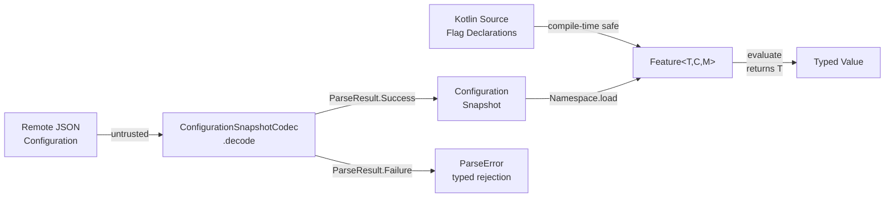

# Type Safety Boundaries

Where compile-time guarantees end and runtime validation begins.

Cross-document synthesis: [Verified Design Synthesis](/theory/verified-synthesis).

---

## The Core Claim

**Konditional's guarantee is qualified:**

> For **statically-defined** flags and rules, the compiler enforces type correctness and evaluation is non-null. When
> configuration crosses the JSON boundary,
> correctness is established via **parsing** and explicit error handling (`ParseResult`), not via compile-time
> guarantees.

---

## Compile-Time Domain

### What the Compiler Guarantees

When you write flags in Kotlin source code:

```kotlin
object AppFeatures : Namespace("app") {
    val darkMode by boolean<Context>(default = false) {
        rule(true) { platforms(Platform.IOS) }
    }
}
```

**Compile-time checks:**

1. **Property name = feature key**
   ```kotlin
   AppFeatures.darkMode.evaluate(context)  // OK — property exists
   // AppFeatures.darkMood.evaluate(context)  // ✗ Compile error
   ```

2. **Type propagation**
   ```kotlin
   val enabled: Boolean = AppFeatures.darkMode.evaluate(context)  // OK
   // val enabled: String = AppFeatures.darkMode.evaluate(context)  // ✗ Type mismatch
   ```

3. **Rule return types match feature type**
   ```kotlin
   val timeout by double<Context>(default = 30.0) {
       rule(45.0) { platforms(Platform.ANDROID) }  // OK
       // rule("invalid") { platforms(Platform.IOS) }  // ✗ Type mismatch
   }
   ```

4. **Required defaults**
   ```kotlin
   val feature by boolean<Context>(default = false)  // OK
   // val feature by boolean<Context>()  // ✗ Compile error: default required
   ```

5. **Context type constraints**
   ```kotlin
   val PREMIUM by boolean<EnterpriseContext>(default = false) {
       rule(true) { extension { subscriptionTier == SubscriptionTier.ENTERPRISE } }
   }

   val ctx: EnterpriseContext = buildContext()
   PREMIUM.evaluate(ctx)  // OK

   val basicCtx: Context = Context(...)
   // PREMIUM.evaluate(basicCtx)  // ✗ Compile error
   ```

### Mechanism: Property Delegation + Generics

```kotlin
// Simplified delegation mechanism
class BooleanFeatureDelegate<C : Context>(
    private val default: Boolean
) : ReadOnlyProperty<Namespace, Feature<Boolean, C, Namespace>> {
    override fun getValue(...): Feature<Boolean, C, Namespace> {
        // Return type is Feature<Boolean, C, Namespace>
        // Compiler knows: T = Boolean, C = Context
    }
}

fun <C : Context> Namespace.boolean(
    default: Boolean
): BooleanFeatureDelegate<C> = BooleanFeatureDelegate(default)
```

**Type flow:**

1. `boolean<Context>(default = false)` → `BooleanFeatureDelegate<Context>`
2. Delegate returns `Feature<Boolean, Context, Namespace>`
3. Property type is inferred: `Feature<Boolean, Context, Namespace>`
4. `feature.evaluate(context: Context)` returns `Boolean`

---

## Where the Boundary Is



**Left side (compile-time):** Flag declarations bind key, value type, and context type at compile time. Evaluation
returns `T` without casts.

**Right side (parse-time):** JSON is untrusted. `ConfigurationSnapshotCodec.decode(...)` either produces a valid
`Configuration` or a typed `ParseError`. No invalid state crosses this boundary.

---

## Runtime Domain: The JSON Trust Boundary

### What the JSON Boundary Does

```kotlin
val json: String = fetchRemoteConfig()  // Untrusted

when (val result = ConfigurationSnapshotCodec.decode(json)) {
    is ParseResult.Success -> {
        val config: Configuration = result.value  // Trusted typed model
        AppFeatures.load(config)
    }
    is ParseResult.Failure -> {
        // Invalid JSON rejected — last-known-good remains active
        logError(result.error.message)
    }
}
```

**After `decode` succeeds:**

- `config` is a typed `Configuration` — no raw strings, no unvalidated fields
- Evaluation of any flag against this config is type-safe

**If `decode` fails:**

- Returns `ParseResult.Failure` with a precise `ParseError`
- No partial state enters the runtime
- The previously active snapshot is unchanged

### What Remains Runtime-Only

These cannot be checked at compile time and are enforced by parsing:

| Concern | Mechanism |
|---|---|
| JSON field presence | `ParseResult.Failure` if required fields missing |
| Value type matching | Type-aware codec rejects mismatches |
| Schema version compatibility | Codec validates structure before loading |
| Rule value types | Decoded values checked against declared feature types |

---

## Type Safety Summary

```mermaid
block-beta
    columns 3

    block:compile["Compile-Time (Kotlin)"]
        ct1["Feature key = property name"]
        ct2["Return type T enforced"]
        ct3["Context type C enforced"]
        ct4["Rule value types enforced"]
        ct5["Default value required"]
    end

    block:boundary["JSON Boundary (ParseResult)"]
        b1["Field presence checked"]
        b2["Value types decoded"]
        b3["Schema validated"]
        b4["ParseError on failure"]
        b5["No partial state"]
    end

    block:runtime["Runtime (Post-Load)"]
        r1["Typed Configuration"]
        r2["Immutable snapshot"]
        r3["Atomic swap on update"]
        r4["Evaluation uses T"]
        r5["Defaults are typed"]
    end
```



---

## What Is Not Guaranteed

Even with full type safety, some things remain outside the guarantee boundary:

- **Business correctness of rule criteria** — a rule that targets `Platform.IOS` when you meant `Platform.ANDROID` compiles fine
- **Logical correctness of ramp-up percentages** — `rampUp { 110.0 }` is caught at construction; `rampUp { 5.0 }` when you meant `50.0` is not
- **Rule ordering intent** — specificity ordering is deterministic but whether you got the precedence you intended is your responsibility

These are not bugs in the safety model. They are the natural scope limit of static analysis.

---

## Test Evidence

| Test | Evidence |
|---|---|
| `FlagEntryTypeSafetyTest` | Declared feature/value type combinations enforce compile-time and runtime-safe shape. |
| `BoundaryFailureResultTest` | Boundary failures are typed and carried through `Result` failure channel. |

---

## Next Steps

- [Theory: Parse Don't Validate](/theory/parse-dont-validate) — Full boundary mechanics
- [Concept: Features and Types](/concepts/features-and-types) — Feature type system
- [Theory: Claims Registry](/theory/claims-registry) — All invariant claims in one place
