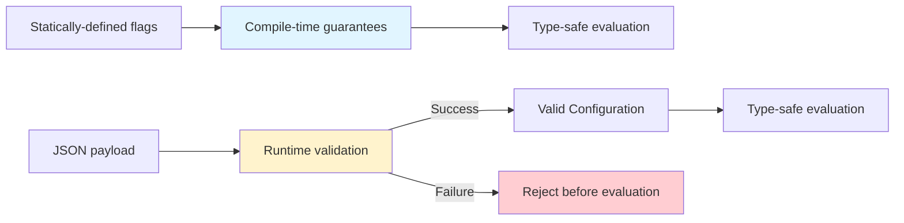

# Type Safety Boundaries
import GuaranteeBlock from '@site/src/components/GuaranteeBlock';


Where compile-time guarantees end and runtime validation begins.

---

## The Core Claim

**Konditional's guarantee is qualified:**

> For **statically-defined** flags and rules, the compiler enforces type correctness and evaluation is non-null. When
> configuration crosses the JSON boundary,
> correctness is established via **validation** and explicit error handling (`ParseResult`), not via compile-time
> guarantees.

---

## Compile-Time Domain

### What the Compiler Guarantees

When you write flags in Kotlin source code:

```kotlin
object AppFeatures : Namespace("app") {
    val darkMode by boolean<Context>(default = false) {
        rule(true) { platforms(Platform.IOS) }
    }
}
```

**Compile-time checks:**

1. **Property name = feature key**
   ```kotlin
   AppFeatures.darkMode.evaluate(context)  // OK Property exists
   // AppFeatures.darkMood.evaluate(context)  // X Compile error
   ```

2. **Type propagation**
   ```kotlin
   val enabled: Boolean = AppFeatures.darkMode.evaluate(context)  // OK
   // val enabled: String = AppFeatures.darkMode.evaluate(context)  // X Type mismatch
   ```

3. **Rule return types match feature type**
   ```kotlin
   val timeout by double<Context>(default = 30.0) {
       rule(45.0) { platforms(Platform.ANDROID) }  // OK
       // rule("invalid") { platforms(Platform.IOS) }  // X Type mismatch
   }
   ```

4. **Required defaults**
   ```kotlin
   val feature by boolean<Context>(default = false)  // OK
   // val feature by boolean<Context>()  // X Compile error: default required
   ```

5. **Context type constraints**
   ```kotlin
   val PREMIUM by boolean<EnterpriseContext>(default = false) {
       rule(true) { extension { subscriptionTier == SubscriptionTier.ENTERPRISE } }
   }

   val ctx: EnterpriseContext = buildContext()
   PREMIUM(ctx)  // OK

   val basicCtx: Context = Context(...)
   // PREMIUM(basicCtx)  // X Compile error
   ```

### Mechanism: Property Delegation + Generics

```kotlin
// Simplified delegation mechanism
class BooleanFeatureDelegate<C : Context>(
    private val default: Boolean
) : ReadOnlyProperty<Namespace, Feature<Boolean, C, Namespace>> {
    override fun getValue(...): Feature<Boolean, C, Namespace> {
        // Return type is Feature<Boolean, C, Namespace>
        // Compiler knows: T = Boolean, C = Context
    }
}

fun <C : Context> Namespace.boolean(
    default: Boolean
): BooleanFeatureDelegate<C> = BooleanFeatureDelegate(default)
```

**Type flow:**

1. `boolean<Context>(default = false)` -> `BooleanFeatureDelegate<Context>`
2. Delegate returns `Feature<Boolean, Context, Namespace>`
3. Property type is inferred: `Feature<Boolean, Context, Namespace>`
4. `feature(context: Context)` returns `Boolean`

**Compile-time safety:** The type parameter `T` flows from definition to usage without casts.

---

## Runtime Domain

### What the Compiler Cannot Guarantee

When configuration comes from JSON:

```json
{
  "flags": [
    {
      "key": "feature::app::darkMode",
      "defaultValue": { "type": "BOOLEAN", "value": false },
      "rules": [ ... ]
    }
  ]
}
```

**Compile-time limits:**

1. **JSON syntax** - Compiler can't validate JSON strings
2. **Schema correctness** - Compiler can't check JSON structure
3. **Type correctness** - Compiler can't verify JSON types match Kotlin types
4. **Feature existence** - Compiler can't verify referenced features are registered

### Mechanism: Runtime Validation via ParseResult

```kotlin
val _ = AppFeatures // ensure features are registered before parsing
when (val result = ConfigurationSnapshotCodec.decode(json)) {
    is ParseResult.Success -> {
        // JSON is valid, types match, features exist
        val config: Configuration = result.value
        AppFeatures.load(config)
    }
    is ParseResult.Failure -> {
        // Validation failed, specific error type
        when (val error = result.error) {
            is ParseError.InvalidJson -> logError("Malformed JSON")
            is ParseError.FeatureNotFound -> logError("Unknown feature: ${error.key}")
            is ParseError.InvalidSnapshot -> logError("Snapshot shape/type mismatch: ${error.reason}")
        }
    }
}
```

**Runtime checks:**

1. **JSON parsing** - Moshi parses JSON into the snapshot model
2. **Feature lookup** - Each `FeatureId` is resolved to a registered `Feature` (or fails with
   `ParseError.FeatureNotFound`)
3. **Type decoding** - Tagged values (`defaultValue` and rule `value`) are decoded into the declared Kotlin types (or
   fail with `ParseError.InvalidSnapshot`)
4. **Structured value validation** - For `Konstrained` values, fields are validated against the provided Kontracts
   schema at the boundary

- **Boundary**: Manually constructing `Configuration` bypasses these checks; treat it as trusted input.

- **Guarantee**: Application code does not construct JSON literals via a Konditional JSON value model.
- **Mechanism**: JSON is parsed into the snapshot model and decoded into Kotlin values; structured values validate
  against `ObjectSchema`.
- **Boundary**: This guarantee applies to Konditional's public API; `kontracts` may still expose a runtime JSON model
  for standalone use.

---

## The Cutover Point



**Key insight:** Once JSON passes runtime validation and becomes a `Configuration`, it re-enters the compile-time
domain (evaluation is type-safe).

---

## Why This Boundary Exists

### Fundamental Limitation: Rice's Theorem

Rice's Theorem states that all non-trivial semantic properties of programs are undecidable. In practical terms:

**The compiler cannot verify:**

- Whether a JSON string contains valid syntax (requires parsing)
- Whether a JSON object matches a schema (requires runtime checking)
- Whether referenced features exist (requires runtime registry lookup)

**Solution:** Move these checks to runtime with explicit error handling (`ParseResult`).

### Trade-Off: Flexibility vs Safety

**Option 1: No remote configuration (all compile-time)**

- OK Maximum safety
- X No dynamic updates (requires redeployment)

**Option 2: Untyped remote configuration**

- OK Maximum flexibility
- X No safety (runtime errors)

**Konditional's approach: Validated boundary**

- OK Type-safe static definitions
- OK Dynamic updates via JSON
- OK Explicit validation at boundary
- OK Invalid JSON rejected before affecting evaluation

---

## Comparison: Konditional vs Traditional Systems

### Traditional Stringly-Typed Flags

```kotlin
// X No compile-time checks
val enabled = flagClient.getBool("new_onboaring_flow", false)  // Typo ships to prod
val timeout = flagClient.getInt("timeout", 30)  // Type coercion can fail silently
```

**Issues:**

- Typos are runtime errors (or silent failures)
- Type mismatches are runtime errors
- No compile-time verification

### Konditional (Statically-Defined)

```kotlin
// OK Compile-time checks
val enabled = AppFeatures.newOnboardingFlow.evaluate(context)  // Typo is compile error
// AppFeatures.newOnboaringFlow  // X Compile error
```

### Konditional (JSON-Loaded)

```kotlin
// OK Runtime validation with explicit error handling
when (val result = ConfigurationSnapshotCodec.decode(json)) {
    is ParseResult.Success -> {
        // Type-safe from here on
        val enabled = AppFeatures.newOnboardingFlow.evaluate(context)
    }
    is ParseResult.Failure -> {
        // Invalid JSON rejected, last-known-good remains active
        logError(result.error.message)
    }
}
```

---

## The Contract

| Aspect                       | Compile-Time                              | Runtime                          |
|------------------------------|-------------------------------------------|----------------------------------|
| **Flag definitions**         | Type-checked                              | N/A (defined in code)            |
| **Rule return types**        | Type-checked                              | Validated at parse               |
| **Property access**          | Compile error on typo                     | N/A (properties defined in code) |
| **Context types**            | Compile-time constraint                   | N/A (types defined in code)      |
| **JSON syntax**              | N/A (compiler can't parse JSON strings)   | Validated at parse               |
| **JSON schema**              | N/A (compiler can't check JSON structure) | Validated at parse               |
| **Type correctness (JSON)**  | N/A                                       | Validated at parse               |
| **Feature existence (JSON)** | N/A                                       | Validated at parse               |

---

## Next Steps

- [Core Types](/core/types) - Compile-time surface area
- [Theory: Parse Don't Validate](/theory/parse-dont-validate) - Why ParseResult prevents invalid states
- [Serialization Reference](/serialization/reference) - ParseResult API
