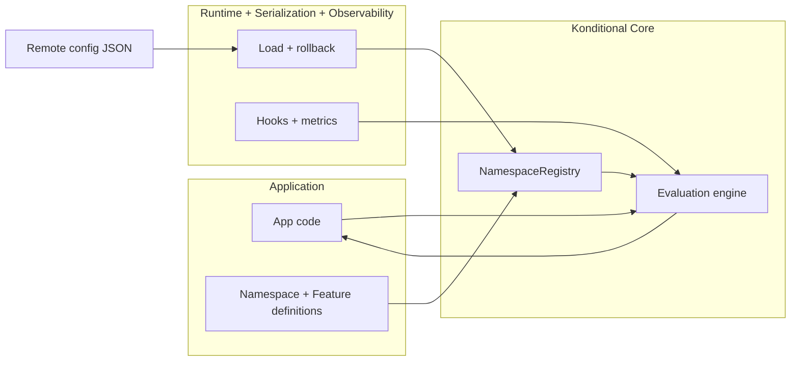
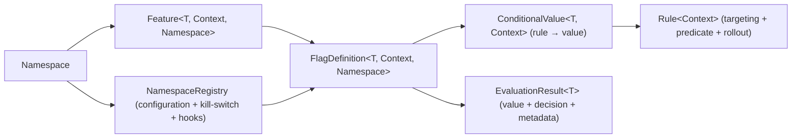
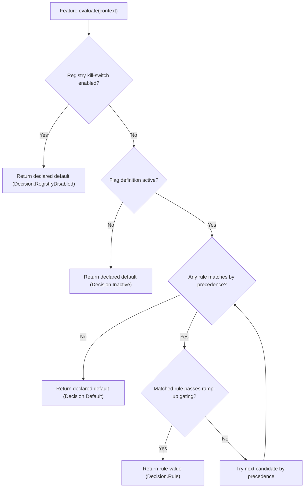
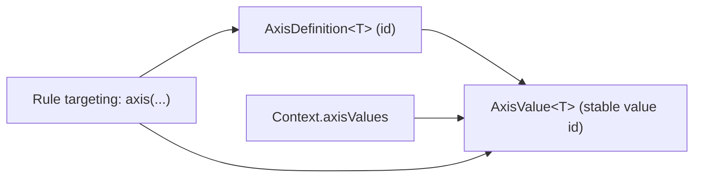
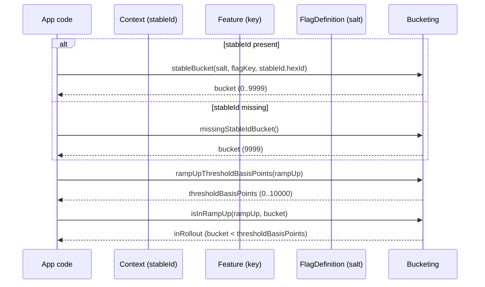
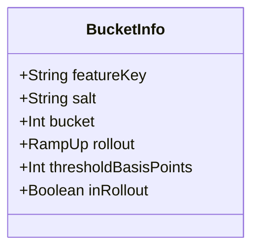
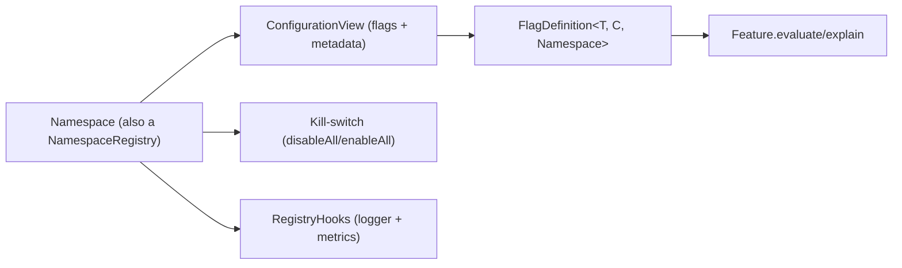
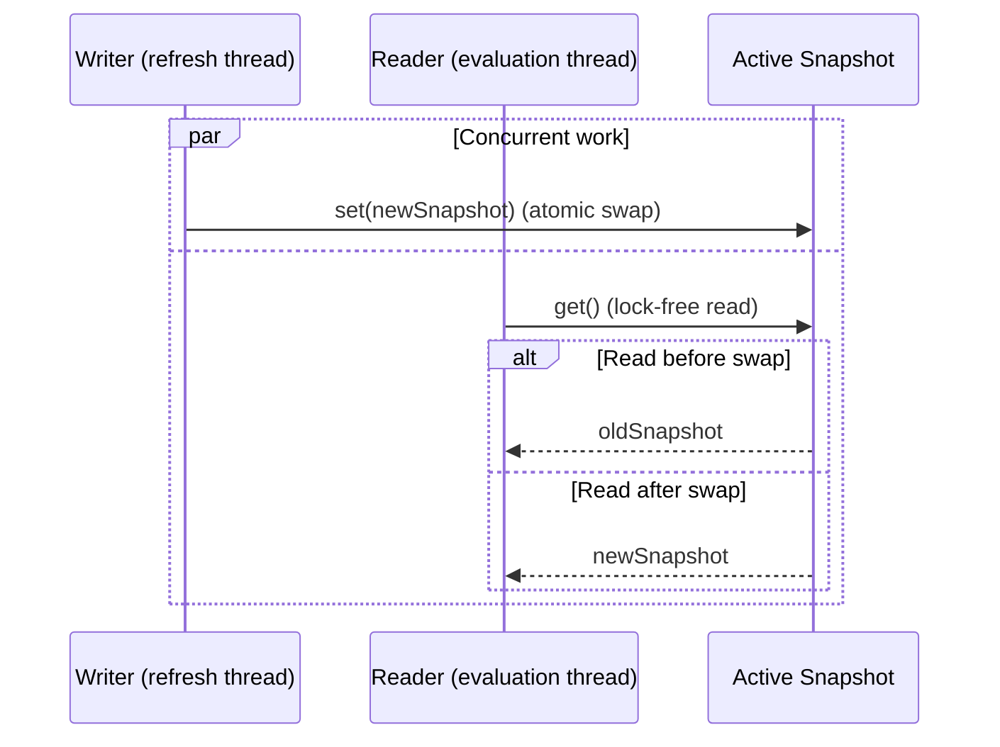
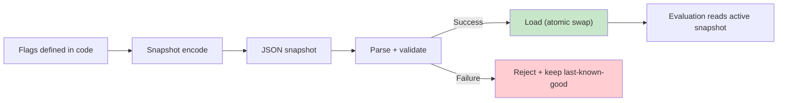

# Public API Surface Summary
# Extracted: 2026-02-05T10:49:11-05:00

## From docs/index.md

---
title: Konditional Core
---

# Konditional Core (The Deterministic, Type-Safe Engine)

Konditional is a Kotlin/JVM feature flag library designed to deliver two outcomes that matter in production:
**compile-time correctness** and **runtime determinism**. The `:konditional-core` module provides the type-safe DSL and
the evaluation engine that turns a `Context` into a value (plus an explanation of why).
The rest of the project exists to operate that core safely: `:konditional-runtime` handles loading and lifecycle,
`:konditional-serialization` owns boundary codecs, and `:konditional-observability` + `:opentelemetry` capture signals.

:::danger Key argument
If you cannot trust your configuration and experimentation engine with absolute certainty, you do not have real control
in production. That is not a tolerable risk.
:::

## The Problem (Why Flags Fail in Production)

### String-keyed systems fail silently

Somewhere in onboarding code:

```kotlin
val newFlow = flagClient.getBool("new_onboaring_flow", false)  // typo
```

Somewhere in config JSON:

```json
{ "new_onboarding_flow": true }  // correct spelling
```

The typo ships. The flag never activates. Your A/B test runs at 0% treatment. You find out in a post‑mortem.

### Boolean-only systems turn into boolean matrices

```kotlin
enum class Capability {
    NEW_CHECKOUT,
    NEW_CHECKOUT_V2,
    NEW_CHECKOUT_V3,
    CHECKOUT_FAST_PATH
}

if (isEnabled(NEW_CHECKOUT) && !isEnabled(NEW_CHECKOUT_V2)) {
    // original new checkout
} else if (isEnabled(NEW_CHECKOUT_V2) && !isEnabled(CHECKOUT_FAST_PATH)) {
    // v2 without fast path
}
```

Boolean-only systems force you to encode variants in control flow. Testing becomes exponential and undefined
combinations creep into production.

### Type safety disappears at the boundary

```kotlin
val maxRetries: Int = flagClient.getInt("max_retries", 3)
```

```json5
{ "max_retries": "5" }
```

```kotlin
maxRetries = 0  // or throws, or returns default (SDK-dependent)
```

Runtime configuration breaks compile-time contracts. This is a frequent production incident pattern.

---

## What Konditional Does

Konditional makes three structural commitments:

1. **Flags are properties, not strings** — keys bound at compile time.
2. **Types flow from definition to call site** — no runtime coercion.
3. **Single evaluation semantics** — deterministic and testable.

```kotlin
enum class CheckoutVariant { CLASSIC, OPTIMIZED, EXPERIMENTAL }

object AppFlags : Namespace("app") {
    val checkoutVariant by enum<CheckoutVariant, Context>(default = CheckoutVariant.CLASSIC) {
        rule(CheckoutVariant.OPTIMIZED) { platforms(Platform.IOS) }
        rule(CheckoutVariant.EXPERIMENTAL) { rampUp { 50.0 } }
    }

    val maxRetries by integer<Context>(default = 3) {
        rule(5) { platforms(Platform.ANDROID) }
    }
}

val variant: CheckoutVariant = AppFlags.checkoutVariant.evaluate(ctx)
val retries: Int = AppFlags.maxRetries.evaluate(ctx)
```

:::note Compile-time vs runtime
The compiler guarantees **property names**, **return types**, and **rule types**. Runtime configuration is validated
at the boundary and either fully accepted or rejected. See [Parsing & Errors](/parsing-and-errors).
:::

---

## Comparison to Alternatives

| Aspect             | String-keyed SDKs                 | Enum + boolean                   | Konditional                     |
|--------------------|-----------------------------------|----------------------------------|---------------------------------|
| **Typo safety**    | Runtime failure (silent or crash) | Compile-time                     | Compile-time                    |
| **Type safety**    | Runtime coercion (often unsafe)   | Boolean only                     | Compile-time types              |
| **Variants**       | Runtime-typed                     | Multiple booleans + control flow | First-class typed values        |
| **Ramp-up logic**  | SDK-dependent                     | Per-team reimplementation        | Centralized, deterministic      |
| **Evaluation**     | SDK-defined, opaque               | Ad-hoc per evaluator             | Single DSL with specificity     |
| **Invalid config** | Fails silently or crashes         | Depends on implementation        | Explicit `ParseResult` boundary |
| **Testing**        | Mock SDK or replay snapshots      | Mock evaluators                  | Typed contexts + deterministic  |

---

## Architecture at a Glance



---

## Why this is high‑ROI

- You ship changes behind flags without creating boolean explosion or conditional sprawl.
- Rollouts are deterministic: the same user stays in/out unless you intentionally change inputs (like `salt`).
- Targeting is type-safe: you cannot target a platform/version/axis that your context cannot provide.
- Configuration is a boundary: invalid remote config is rejected during parsing instead of “kind of working”.

## When Konditional Fits

**Choose Konditional when:**

- You want compile‑time correctness for definitions and call sites.
- You need typed values beyond booleans (variants, thresholds, structured config).
- You run experiments and need deterministic, reproducible ramp‑ups.
- You want explicit validation boundaries for remote configuration.

**Konditional might not fit if:**

- You need vendor-hosted dashboards more than compile‑time safety.
- Your flags are fully dynamic with zero static definitions.
- You are comfortable relying on process/tooling to prevent string key drift.

---

Your mental model is intentionally small:

> Namespace → Feature → FlagDefinition → Rule → EvaluationResult



Next:

- Start with [Quick Start](/quick-start).
- Then read [Core Concepts](/core-concepts) to understand what each type exists to prevent.

## From docs/quick-start.md

---
title: Quick Start (Minimal Example)
---

# Quick Start

This is the smallest end-to-end workflow:

1. Define a namespace.
2. Define a flag.
3. Evaluate it for a context.
4. Explain the decision when debugging.

:::tip Minimal on purpose
This is the shortest path from definition → evaluation → explanation.

It is intentionally small; you can add richer targeting and rollouts once the shape is familiar.
:::

```kotlin
object Payments : Namespace("payments") {
    val applePayEnabled by boolean<Context>(default = false) {
        rule(true) { platforms(Platform.IOS) }
    }
}

val context = object : Context, Context.LocaleContext, Context.PlatformContext, Context.VersionContext,
                       Context.StableIdContext {
    override val locale = AppLocale.UNITED_STATES
    override val platform = Platform.IOS
    override val appVersion = Version.of(2, 1, 0)
    override val stableId = StableId.of("user-123")
}

val enabled: Boolean = Payments.applePayEnabled.evaluate(context)
val explanation = Payments.applePayEnabled.explain(context)
```

**What is compile-time vs runtime here?**

**Compile-time**:
  - The flag is `Feature<Boolean, Context, Payments>` (typed value + typed context + namespace binding).
- **Runtime**: 
  - The concrete value is determiend at runtime,
  - Despite this, we can make a number of guarantees constraining it thanks to our compile-time checks

Next:

- [Core Concepts](/core-concepts)
- [Evaluation Flow](/evaluation-flow)

## From docs/core-concepts.md

---
title: Core Concepts (What Each Type Prevents)
---

# Core Concepts (Definitions + Why They Exist)

Konditional’s core types exist to eliminate entire classes of feature-flag failure modes by making misuse impossible (or
at least obvious) at compile time.

## Terms (Minimum Vocabulary)

- **Namespace**: A registry that owns a set of features and provides lifecycle operations.
- **Feature**: A typed configuration value with rules and a default.
- **Context**: Runtime inputs used for evaluation (locale, platform, version, stable ID, axes).
- **Rule**: Criteria → value mapping. All criteria must match for a rule to apply.
- **Specificity**: A numeric measure of how constrained a rule is. Higher specificity wins.
- **Bucketing**: Deterministic assignment of a stable ID to a ramp-up bucket.

## Namespace

**Definition:** A `Namespace` is the unit of **compile-time ownership** and **runtime isolation**.

**Why it exists:**

- Prevents cross-team collisions: a feature is bound to the namespace type.
- Creates an isolation boundary for configuration: each namespace has an isolated `NamespaceRegistry`.
- Enables “single object = registry handle” ergonomics: `Namespace` delegates `NamespaceRegistry`, so the namespace is
  also where you call registry operations (like kill-switching).

**Guarantee / Mechanism / Boundary**

- **Guarantee (compile-time):** Features are type-bound to the namespace they are defined in.
- **Mechanism:** `Feature<T, C, out M : Namespace>` carries the namespace in its type.
- **Boundary (runtime):** A namespace’s registry state (configuration + kill-switch + hooks) can change results.

:::caution Namespace is also the registry
`Namespace` delegates `NamespaceRegistry`, so lifecycle operations (load, kill-switch, hooks) are called directly on the
namespace object. This is deliberate: it keeps operational actions close to flag definitions.
:::

## Feature

**Definition:** A `Feature<T, C, M>` is the typed handle your application code evaluates at call sites.

**Why it exists:**

- Keeps call sites stable: app code depends on `Feature` APIs, not on config formats.
- Makes “value type” and “context type” explicit: you cannot evaluate a feature with an incompatible context type.

**Guarantee / Mechanism / Boundary**

- **Guarantee (compile-time):** The evaluated value is `T` (no “stringly typed” flag values).
- **Mechanism:** `Feature` is generic in `T` and `C`, and is created via namespace property delegation.
- **Boundary (runtime):** The effective value comes from a `FlagDefinition` stored in the registry configuration.

## FlagDefinition

**Definition:** A `FlagDefinition<T, C, M>` is the runtime shape of a feature: default value, active state, rule set,
rollout salt, and evaluation algorithm.

**Why it exists:**

- Separates “what the flag is” (feature identity) from “how it currently evaluates” (definition loaded into registry).
- Makes evaluation deterministic and explainable.

**Guarantee / Mechanism / Boundary**

- **Guarantee (runtime):** Given the same inputs, evaluation is deterministic.
- **Mechanism:** Rules are evaluated in a stable precedence order; bucketing uses stable identifiers + salt.
- **Boundary:** If configuration parsing rejects an update, the previously active definition remains effective.

## Compile-time vs runtime (boundary table)

| Aspect                     | Guarantee Level | Mechanism                                                  |
|----------------------------|-----------------|------------------------------------------------------------|
| Property access            | Compile-time    | Property delegation on `Namespace`                         |
| Return types               | Compile-time    | Generic type propagation (`Feature<T, C, M>`)              |
| Rule values                | Compile-time    | Typed DSL builders (`boolean`, `string`, `enum`, `custom`) |
| Non-null returns           | Compile-time    | Required defaults                                          |
| Rule matching              | Runtime         | Deterministic evaluation over `Context`                    |
| Business logic correctness | Not guaranteed  | Human responsibility                                       |

Next:

- [Evaluation Flow](/evaluation-flow)
- [Rules](/rules)

## From docs/evaluation-flow.md

---
title: Evaluation Flow (Deterministic by Construction)
---

# Evaluation Flow (Step-by-step)

Konditional provides two public entrypoints:

- `Feature.evaluate(context)`: returns the evaluated value (`T`) for hot-path usage.
- `Feature.explain(context)`: returns an `EvaluationResult<T>` with rule matches, bucket info, and decisions for debugging.

## `evaluate` vs `explain`

Both functions compute the same value. `explain` additionally returns:

- Which decision was taken (registry disabled / inactive / rule / default)
- Which rule matched (and which one was skipped by rollout, if any)
- Bucket computation details (feature key, salt, threshold, in/out)

`explain` is intended for debugging, logging, and tooling; treat it as more expensive than `evaluate`.

:::caution Explain is not free
`explain` includes extra rule/bucket metadata and can emit debug logging via hooks. Use it for debugging and tooling,
not for every hot-path evaluation.
:::

| API                | Returns                         | Typical use                         |
|--------------------|----------------------------------|-------------------------------------|
| `evaluate(context)`| `T`                              | Hot‑path feature evaluation         |
| `explain(context)` | `EvaluationResult<T>`            | Debugging, diagnostics, tooling     |

## Decision order (what happens first)

The top-level decision flow is:



Key points:

- **Kill-switch wins**: when `NamespaceRegistry.isAllDisabled` is true, evaluation returns the declared default.
- **Inactive wins**: an inactive flag definition returns the declared default (even if rules exist).
- **Rules are not declaration-ordered**: candidates are evaluated in **precedence order**.
- **Rollout can skip a matching rule**: a rule may match targeting but still be gated out by ramp-up bucketing.

## Total + deterministic evaluation

- **Total**: evaluation always returns a value (default if no rule matches).
- **Deterministic**: same inputs + same config yield the same output.

## Rule precedence (specificity)

Rules are evaluated in descending order of **specificity**, not by the order you wrote them in Kotlin.
This is why your DSL can stay composable: you can include rule sets without worrying about declaration order accidentally
becoming a “hidden policy”.

`explain(...)` includes specificity breakdowns so you can see *why* a rule won.

## Specificity system (how precedence is computed)

Specificity is the sum of constraints in the base targeting plus custom predicate specificity.

**Base targeting specificity:**

- `locales(...)` adds 1 if non-empty
- `platforms(...)` adds 1 if non-empty
- `versions { ... }` adds 1 if bounded
- `axis(...)` adds 1 per axis constraint

**Custom predicate specificity:**

- A custom predicate can define its own `specificity()`
- Default predicate specificity is 1

:::note Guarantee
More specific rules are evaluated before less specific rules. Ramp-up percentage does not affect specificity.
:::

Next:

- [Rules](/rules)
- [Context & Axes](/context-and-axes)

## From docs/rules.md

---
title: Rule Model (Targeting + Predicates)
---

# Rule Model (Targeting + Predicates)

Konditional models “if these conditions hold, yield this value” as a pairing:

- `Rule<C>`: targeting + an optional extension predicate (business logic)
- `ConditionalValue<T, C>`: the rule paired with a concrete value of type `T`

This separation keeps flags composable: you can build rule sets and include them in multiple flags without losing type
safety.

:::note Boundary reminder
Only base targeting is safe to configure remotely. Extension predicates are code and are not serialized.
:::

## What a rule can express

A rule has two conceptual layers:

1. **Base targeting** (serializable constraints): locale/platform/version/axis/stable-id constraints and rollout settings.
2. **Custom predicate** (non-serializable business logic): a strongly-typed predicate over your context type.

That’s why you’ll see DSL shapes like:

```kotlin
object Payments : Namespace("payments") {
    val applePayEnabled by boolean<Context>(default = false) {
        rule(true) { platforms(Platform.IOS) }
    }
}

data class EnterpriseContext(/* ... */) : Context /* + mixins */

object Premium : Namespace("premium") {
    val advancedAnalytics by boolean<EnterpriseContext>(default = false) {
        enable { extension { /* business logic */ } }
    }
}
```

**Guarantee / Mechanism / Boundary**

- **Guarantee (compile-time):** Rule values are the same type as the feature (`T`), and predicates receive the correct
  context type (`C`).
- **Mechanism:** `Feature<T, C, M>` binds the context type; `Rule<C>` and `ConditionalValue<T, C>` are generic in `C`.
- **Boundary:** Only the base targeting layer is safe to make remotely configurable; extension predicates are code.

## Targeting primitives (RuleScope)

Inside a rule block, you can express:

- `locales(...)` — locale targeting
- `platforms(...)` — platform targeting
- `versions { min(...); max(...) }` — version range targeting
- `axis(...)` — custom axis constraints
- `extension { ... }` — custom predicate over your context type
- `rampUp { ... }` — percentage rollout (deterministic)
- `allowlist(...)` — stable IDs that bypass ramp‑up
- `note("...")` — attach a human‑readable note
- `always()` / `matchAll()` — explicit catch‑all rule

:::tip Targeting stays type‑safe
Targeting operators are only available when the feature’s context type supports them.
If your context does not implement `Context.PlatformContext`, you can’t call `platforms(...)`.
:::

## Criteria‑first rules (`yields`)

For readability with complex values, you can declare criteria first and then yield a value:

```kotlin
val checkout by string<Context>(default = "v1") {
    rule {
        platforms(Platform.IOS)
        versions { min(3, 0, 0) }
        rampUp { 25.0 }
        note("iOS v2 rollout")
    } yields "v2"
}
```

- **Guarantee:** `rule { ... } yields value` is equivalent to `rule(value) { ... }`.
- **Boundary:** A criteria‑first `rule { ... }` must be completed with `yields(...)` (incomplete rules fail fast).

## Reusable rule sets (`RuleSet`)

Rule sets let you reuse a policy across multiple flags:

```kotlin
object AppFeatures : Namespace("app") {
    private val ruleTemplate by string<Context>(default = "v1")

    private val iosRollout = ruleTemplate.ruleSet {
        rule("v2") { platforms(Platform.IOS) }
    }

    val checkout by string<Context>(default = "v1") {
        include(iosRollout)
        rule("v3") { rampUp { 10.0 } }
    }
}
```

:::note Ordering policy
Rule sets are included left‑to‑right. When two rules are equally specific, earlier included rules win.
:::

## Ramp‑up allowlists

`allowlist(...)` bypasses ramp‑up after a rule matches by criteria.

:::caution Not a global bypass
Allowlists do not override rule criteria, `isActive`, or the namespace kill‑switch.
:::

## Specificity and precedence

Rules are sorted by a specificity score and evaluated from most-specific to least-specific. The intent is to make
“tighter targeting wins” a stable policy across the system.

When debugging, prefer `feature.explain(context)` so you can see:

- the matched rule (if any)
- specificity totals
- bucket info for rollout decisions

Next:

- [Context & Axes](/context-and-axes)
- [Rollouts & Bucketing](/rollouts-and-bucketing)

## From docs/context-and-axes.md

---
title: Context & Targeting Dimensions
---

# Context & Targeting Dimensions

Konditional evaluates features against a `Context` value. Instead of forcing you into a single monolithic “user object”,
`Context` is designed as a set of opt-in *capabilities*.

## Context mixins (capabilities)

Common targeting dimensions are exposed as nested interfaces, for example:

- `Context.LocaleContext`
- `Context.PlatformContext`
- `Context.VersionContext`
- `Context.StableIdContext`

**Compile-time guarantee:** a feature defined as `Feature<T, MyContext, *>` can only use targeting operators that are
valid for `MyContext`. If your context type does not implement `Context.PlatformContext`, a `platforms(...)` constraint
is not even expressible in the DSL for that feature.

## Axes (custom, type-safe dimensions)

Axes let you define custom targeting dimensions that are:

- type-safe in Kotlin (enums or sealed types)
- representable in configuration via stable string IDs

Mermaid view of how axes hang together:



Minimal axis example:

```kotlin
enum class Environment(override val id: String) : AxisValue<Environment> {
    DEV("dev"),
    PROD("prod"),
}

object Axes {
    val EnvironmentAxis = Axis.of<Environment>("environment")
}
```

Applying an axis in a rule:

```kotlin
object ReleaseFlags : Namespace("release") {
    val newUi by boolean<Context>(default = false) {
        enable { axis(Environment.PROD) }
    }
}
```

Providing axis values on a context:

```kotlin
val ctx =
    object : Context, Context.AxisContext {
        override val axisValues = axisValues { +Environment.PROD }
    }
```

:::danger Pitfall: Axis IDs must be stable
Axis value IDs are part of your configuration contract. If they change (including through obfuscation), existing
configuration can silently target the wrong segment.
:::

Next:

- [Rollouts & Bucketing](/rollouts-and-bucketing)

## From docs/rollouts-and-bucketing.md

---
title: Rollouts & Bucketing (Determinism You Can Debug)
---

# Rollouts & Bucketing (Determinism You Can Debug)

Konditional’s rollouts are deterministic: if the inputs don’t change, a user’s bucket doesn’t change.
This makes “10% ramp-up” an engineering tool you can reason about (and reproduce) rather than a probabilistic guess.

## RampUp

`RampUp` is a value class representing a percentage from 0.0 to 100.0.

- **Compile-time:** you pass a `RampUp` (not a raw `Double`) at the boundary where the system cares.
- **Runtime:** bucketing uses an integer bucket plus a threshold derived from `RampUp`.

## StableId and allowlists

For deterministic rollouts you provide a stable identifier, typically via `Context.StableIdContext`.

If a stable ID is missing, the system falls back to a deterministic “missing stable id bucket”. That keeps behavior
consistent, but you should not expect fair sampling without stable IDs.

You can also allowlist specific IDs (globally for a flag or per-rule) to force inclusion regardless of ramp-up.

## Salt

Salt is an explicit input to bucketing. Changing `salt` intentionally re-samples your population without changing the
feature key or the stable ID.

:::caution Salt changes distribution
Changing `salt` is a deliberate resample. This is useful when you want a fresh cohort, but it also means historical
analysis across salts is not directly comparable.
:::

## Deterministic bucketing (exact mechanics)

The bucket is computed from `(salt, featureKey, stableId)`:

1. Hash the UTF‑8 bytes of `"$salt:$featureKey:${stableId.hexId.id}"` with SHA‑256.
2. Convert the first 4 bytes to an unsigned 32‑bit integer.
3. Bucket = `hash % 10_000` (range `[0, 9999]`).
4. Threshold = `(rampUp.value * 100.0).roundToInt()` (basis points).
5. In ramp‑up if `bucket < threshold`.



## Bucketing introspection (debugging)

When you need to answer “why is this user in/out?”, use `RampUpBucketing`:

```kotlin
val info = RampUpBucketing.explain(
    stableId = StableId.of("user-123"),
    featureKey = "feature::checkout::newUi",
    salt = "v1",
    rampUp = RampUp.of(10.0),
)

val inRollout = info.inRollout
```

:::note Determinism guarantee
Given the same `(stableId, featureKey, salt)`, `RampUpBucketing` always returns the same bucket and decision.
:::

`RampUpBucketing.explain(...)` returns a `BucketInfo` with the computed decision inputs/outputs:



Next:

- [Registry & Configuration](/registry-and-configuration)
- [Recipes](/recipes) for copy/paste patterns (including “resettable salt”)

## From docs/registry-and-configuration.md

---
title: Configuration & Registry Surface
---

# Configuration & Registry Surface

Core separates two responsibilities:

- **Definition**: what your flags are (types, defaults, legal values).
- **Configuration**: what is currently loaded and operationally active.

The runtime surface you interact with is a `NamespaceRegistry`, which is reachable via the `Namespace` object itself.

:::note Boundary is explicit
Configuration parsing and validation live in `:konditional-serialization` and `:konditional-runtime`. Core assumes
configuration is already validated; invalid updates are rejected at the boundary and do not partially mutate state.
:::

## NamespaceRegistry

`NamespaceRegistry` exposes:

- `configuration`: a read-only `ConfigurationView` of currently loaded flag definitions
- `isAllDisabled`, `disableAll()`, `enableAll()`: an emergency kill-switch
- `hooks`: lightweight `RegistryHooks` for logging and metrics

Mermaid overview:



## Why “kill-switch returns defaults”

The kill-switch is designed to be safe under pressure:

- It does not mutate definitions.
- It does not depend on remote configuration.
- It makes all evaluations return the declared default values.

This gives you a single operational lever that cannot create “half disabled” states.

## Atomic snapshot refresh (runtime)

Namespace configuration updates are applied as **atomic snapshot swaps**. Readers see either the old snapshot or the new
snapshot — never a partial state.



:::danger Do not mutate snapshots
Configuration snapshots are intended to be immutable. Mutating a snapshot after load violates the atomicity model and
can lead to undefined evaluation behavior.
:::

## Configuration lifecycle (high level)



Next:

- [Observability & Debugging](/observability-and-debugging)

## From docs/dsl-authoring.md

---
title: DSL Surface (Authoring Rules)
---

# DSL Surface (Authoring Rules)

The core DSL is designed to make “the safe thing” the easiest thing:

- Values are always typed (`T`).
- Targeting is only expressible when the context supports it (`C`).
- Rollout is explicit (`RampUp`, salt, allowlists).

The two primary authoring scopes are:

- `FlagScope<T, C, M>`: defines rules, default behavior, activation, salt/allowlists, and composition.
- `RuleScope<C>`: defines targeting criteria and yields a value (`T`).

| Scope        | Responsibilities                                                                 | Compile-time guarantee |
|--------------|----------------------------------------------------------------------------------|------------------------|
| `FlagScope`  | Defaults, rules, activation, salt/allowlists, rule set composition                | `T`, `C`, `M` bound    |
| `RuleScope`  | Targeting criteria + optional custom predicate (business logic)                   | `C` enforced           |

:::note Guardrails are intentional
The DSL intentionally limits what you can express to avoid ambiguous or order-dependent behavior.
:::

## A minimal flag definition

```kotlin
object Payments : Namespace("payments") {
    val applePayEnabled by boolean<Context>(default = false) {
        // A rule is a (targeting + optional predicate) yielding a typed value.
        rule(true) { platforms(Platform.IOS) }
    }
}
```

## Flag-level controls

Typical `FlagScope` controls include:

- `rule(...) { ... }` — add a rule
- `include(ruleSet)` — include reusable rule sets
- `salt("v2")` — resample population deterministically
- `allowlist(...)` — stable IDs that bypass ramp‑up
- `active(false)` — temporarily deactivate a flag (returns default)

:::caution Activation vs kill‑switch
`active(false)` deactivates a single flag definition; the kill‑switch disables an entire namespace.
:::

## Composition (rule sets)

For larger organizations, the DSL is built to support reusing consistent targeting policies:

- a “tenant safety policy” applied to every flag
- a “platform support matrix” rule set
- a “country allowlist” rule set

The guiding principle is: composition should not force declaration ordering policy. Precedence is based on specificity.

Next:

- [Rules](/rules)
- [FAQ](/faq) for “why precedence isn’t declaration order”

## From docs/structured-values.md

---
title: Structured Values (Custom Types)
---

# Structured Values (Custom Types)

Booleans and enums cover many flags, but production systems often need structured configuration:

- retry policies
- thresholds and timeouts
- per-tenant limits

Konditional supports typed structured values via `custom<T>` where `T` implements `Konstrained<Schema>`.

## Example: schema‑backed value

```kotlin
data class RetryPolicy(
    val maxAttempts: Int = 3,
    val backoffMs: Double = 1000.0,
) : Konstrained<ObjectSchema> {
    override val schema = schemaRoot {
        ::maxAttempts of { minimum = 1 }
        ::backoffMs of { minimum = 0.0 }
    }
}

object PolicyFlags : Namespace("policy") {
    val retryPolicy by custom<RetryPolicy, Context>(default = RetryPolicy())
}
```

## Why schema-backed values

**Goal:** validation happens at the boundary (parsing/loading), not inside evaluation.

- Your app code gets a fully-typed value (`T`) with a stable default.
- Invalid remote values are rejected before they can influence runtime decisions.

## Boundary rule

Schema validation can prove structural correctness (types, ranges, required fields), but it cannot prove business
correctness (“is this backoff appropriate?”). Treat structured flags as configuration with guardrails.

:::warning Semantic correctness is on you
Schema validation prevents malformed input, not poor business decisions. Keep operational guardrails (limits, alerts,
dashboards) around structured flags that can materially impact users.
:::

Next:

- [Parsing & Errors](/parsing-and-errors)
- [Recipes](/recipes) for a full example

## From docs/parsing-and-errors.md

---
title: Parsing & Errors (Hard Boundaries)
---

# Parsing & Errors

Konditional treats configuration as a **hard boundary**:

- Parsing returns typed results.
- Invalid inputs produce typed failures.
- The active configuration is not partially mutated by a bad update.

:::danger Boundary discipline
If parsing fails, the update is rejected and the last-known-good configuration remains active.
:::

## ParseResult / ParseError philosophy

Parsing is modeled as a value:

- `ParseResult.Success(value)`
- `ParseResult.Failure(error)`

The goal is to keep evaluation and application logic free of “maybe it parsed” states.

```kotlin
when (val result = ConfigurationSnapshotCodec.decode(json)) {
    is ParseResult.Success -> AppFeatures.load(result.value)
    is ParseResult.Failure -> logger.error(result.error.message)
}
```

## Common error classes

While the exact error set depends on which codec you use at the boundary, common categories include:

- invalid ramp-up percentage
- invalid versions / version ranges
- unknown or malformed feature keys
- invalid axis IDs or axis values

## What is validated (and what is not)

**Validated at the boundary:**

- JSON syntax and shape
- Feature existence (keys must be registered)
- Type correctness (values match definitions)
- Ramp-up values and versions (where applicable)

**Not validated:**

- Semantic correctness (whether a value is “right” for the business)
- Business logic correctness (extension predicates are code)

## Comparison: boundary handling

| Situation                         | String‑keyed SDKs                  | Konditional boundary                          |
|----------------------------------|------------------------------------|-----------------------------------------------|
| Wrong type in JSON               | Coerce, default, or crash          | `ParseResult.Failure`, rejected update        |
| Unknown feature key              | Ignore silently                    | `ParseError.FeatureNotFound`                  |
| Invalid ramp‑up percentage       | Undefined behavior                 | Parse failure                                 |
| Partial update                   | SDK‑dependent                      | Atomic swap or reject, never partial          |

Next:

- [Registry & Configuration](/registry-and-configuration)
- [FAQ](/faq)

## From docs/observability-and-debugging.md

---
title: Observability & Debugging
---

# Observability & Debugging

Operationally, feature flags are only as safe as your ability to answer:

- “Why did user X see behavior Y?”
- “Which rule matched?”
- “Are we in/out of rollout?”
- “What did the registry configuration look like at the time?”

Konditional’s core supports this via:

- `Feature.explain(context)` returning `EvaluationResult<T>`
- `RegistryHooks` for lightweight logging and metrics

:::note Debugging toolkit
Use `explain` for one-off diagnostics, `RampUpBucketing` for deterministic bucketing checks, and registry configuration
inspection for “what is actually loaded?”
:::

## EvaluationResult anatomy

An `EvaluationResult<T>` includes:

- `value`: the evaluated value (`T`)
- `decision`: one of:
  - registry disabled (kill-switch)
  - inactive definition
  - matched rule (with optional “skipped by rollout” rule)
  - default (with optional “skipped by rollout” rule)
- `configVersion`: the version attached to the active configuration view
- `durationNanos`: measured duration for the evaluation

## Explain in practice

```kotlin
val result = AppFeatures.checkoutVariant.explain(context)
when (val decision = result.decision) {
    is EvaluationResult.Decision.Rule -> decision.matched
    is EvaluationResult.Decision.Default -> decision.skippedByRollout
    else -> null
}
```

:::tip When to use explain
Use it when a user reports unexpected behavior, when you need to verify rule precedence, or when you want to capture
bucket metadata in logs for a debugging session.
:::

## Bucketing checks

```kotlin
val info = RampUpBucketing.explain(
    stableId = StableId.of("user-123"),
    featureKey = AppFeatures.newCheckout.key,
    salt = "v1",
    rampUp = RampUp.of(10.0),
)
```

## Configuration inspection

```kotlin
val snapshot = AppFeatures.configuration
val definition = AppFeatures.flag(AppFeatures.newCheckout)
```

## Hot-path hooks

`NamespaceRegistry.hooks` exposes:

- `logger`: receives `explain` debug signals
- `metrics`: receives evaluation events (`NORMAL`, `EXPLAIN`, and internal modes like `SHADOW`)

:::caution Hot-path warning
Hooks execute on the evaluation hot path. Keep them non‑blocking and lightweight.
:::

## Shadow evaluation (observability module)

If you need to compare a candidate configuration against production behavior, use shadow evaluation from
`:konditional-observability`. It evaluates both registries but returns the baseline value.

```kotlin
val value = AppFeatures.darkMode.evaluateWithShadow(
    context = context,
    candidateRegistry = candidateRegistry,
    onMismatch = { mismatch ->
        logger.warn("shadowMismatch key=${mismatch.featureKey} kinds=${mismatch.kinds}")
    },
)
```

:::caution Sampling recommended
Shadow evaluation adds extra work on the hot path. Sample a percentage of requests for large traffic.
:::

Next:

- [Recipes](/recipes) for shadow evaluation and config lifecycle patterns

## From docs/recipes.md

---
toc_min_heading_level: 2
toc_max_heading_level: 5
---

<!--
Generated file: do not edit docs/recipes.md directly.
Source: docusaurus/docs-templates/recipes.template.md + konditional-observability/src/docsSamples/kotlin/io/amichne/konditional/docsamples/RecipesSamples.kt
-->

# Recipes: Best-Practice Patterns

Practical patterns for real-world feature control using only Konditional building blocks. Each recipe highlights a
supported solution area and makes the guarantee boundaries explicit.

:::note Generated from real samples
Recipes are compiled from Kotlin sources in `konditional-observability/src/docsSamples/kotlin`.
Edit those sources, then regenerate docs via `:konditional-observability:generateRecipesDocs`.
:::

Covered solution areas:

- Typed features (booleans, enums, structured values)
- Deterministic rollouts and salting
- Axes and custom context targeting
- Remote configuration (snapshot/patch boundary + rollback)
- Shadow evaluation for safe migrations
- Namespace isolation and kill-switch
- Observability hooks (logging + metrics)

---

## Typed Variants Instead of Boolean Explosion {#recipe-1-typed-variants-instead-of-boolean-explosion}

When you have multiple rollout variants, model them as a typed value (enum or string) rather than composing booleans.

```kotlin
enum class CheckoutVariant { CLASSIC, FAST_PATH, NEW_UI }

object CheckoutFlags : Namespace("checkout") {
    val variant by enum<CheckoutVariant, Context>(default = CheckoutVariant.CLASSIC) {
        rule(CheckoutVariant.FAST_PATH) { rampUp { 10.0 } }
        rule(CheckoutVariant.NEW_UI) { rampUp { 1.0 } }
    }
}

fun renderCheckout(context: Context) {
    when (CheckoutFlags.variant.evaluate(context)) {
        CheckoutVariant.CLASSIC -> renderClassic()
        CheckoutVariant.FAST_PATH -> renderFastPath()
        CheckoutVariant.NEW_UI -> renderNewUi()
    }
}
```

- **Guarantee**: Variant values are compile-time correct and exhaustively handled.
- **Mechanism**: Enum-typed feature delegates (`enum<...>`) and Kotlin `when` exhaustiveness.
- **Boundary**: Remote JSON can only select enum constants already compiled into the binary.

---

## Deterministic Ramp-Up with Resettable Salt {#recipe-2-deterministic-ramp-up-with-resettable-salt}

Gradually roll out a feature without reshuffling users; use `salt(...)` when you need a clean resample.

```kotlin
object RampUpFlags : Namespace("ramp-up") {
    val newCheckout by boolean<Context>(default = false) {
        salt("v1")
        enable { rampUp { 10.0 } }
    }
}

fun isCheckoutEnabled(context: Context): Boolean =
    RampUpFlags.newCheckout.evaluate(context)
```

To restart the experiment with a fresh sample:

```kotlin
object RampUpResetFlags : Namespace("ramp-up-reset") {
    val newCheckout by boolean<Context>(default = false) {
        salt("v2")
        enable { rampUp { 10.0 } }
    }
}
```

- **Guarantee**: Same `(stableId, flagKey, salt)` always yields the same bucket.
- **Mechanism**: SHA-256 deterministic bucketing in `RampUpBucketing`.
- **Boundary**: Changing `salt` intentionally redistributes buckets.

---

## Runtime-Configurable Segments via Axes {#recipe-3-runtime-configurable-segments-via-axes}

Use axes for segment targeting you want to update via JSON (without redeploying predicates).

```kotlin
enum class Segment(override val id: String) : AxisValue<Segment> {
    CONSUMER("consumer"),
    SMB("smb"),
    ENTERPRISE("enterprise"),
}

object Axes {
    val SegmentAxis = Axis.of<Segment>("segment")
}

object SegmentFlags : Namespace("segment") {
    @Suppress("UnusedPrivateProperty")
    private val segmentAxis = Axes.SegmentAxis

    val premiumUi by boolean<Context>(default = false) {
        enable { axis(Segment.ENTERPRISE) }
    }
}

fun isPremiumUiEnabled(): Boolean {
    val segmentContext =
        object :
            Context,
            Context.LocaleContext,
            Context.PlatformContext,
            Context.VersionContext,
            Context.StableIdContext {
            override val locale = AppLocale.UNITED_STATES
            override val platform = Platform.IOS
            override val appVersion = Version.of(2, 1, 0)
            override val stableId = StableId.of("user-123")
            override val axisValues = axisValues { +Segment.ENTERPRISE }
        }

    return SegmentFlags.premiumUi.evaluate(segmentContext)
}
```

- **Guarantee**: Segment targeting is type-safe and serializable.
- **Mechanism**: Axis IDs are stored in JSON; `axis(...)` evaluates against `Context.axisValues`.
- **Boundary**: Axis IDs must remain stable across builds and obfuscation.

---

## Business Logic Targeting with Custom Context + Extension {#recipe-4-business-logic-targeting-with-custom-context-extension}

Use strongly-typed extensions for domain logic that should not be remotely mutable.

```kotlin
data class EnterpriseContext(
    override val locale: AppLocale,
    override val platform: Platform,
    override val appVersion: Version,
    override val stableId: StableId,
    val subscriptionTier: SubscriptionTier,
    val employeeCount: Int,
) : Context, Context.LocaleContext, Context.PlatformContext, Context.VersionContext, Context.StableIdContext

enum class SubscriptionTier { FREE, PRO, ENTERPRISE }

object PremiumFeatures : Namespace("premium") {
    val advancedAnalytics by boolean<EnterpriseContext>(default = false) {
        enable {
            extension { subscriptionTier == SubscriptionTier.ENTERPRISE && employeeCount > 100 }
        }
    }
}
```

- **Guarantee**: Extension predicates are type-safe and enforced at compile time.
- **Mechanism**: `Feature<T, EnterpriseContext>` makes the extension receiver strongly typed.
- **Boundary**: Extension logic is not serialized; only its rule parameters (e.g., ramp-up) can be updated remotely.

---

## Structured Values with Schema Validation {#recipe-5-structured-values-with-schema-validation}

Use `custom<T>` for structured configuration that must be validated at the JSON boundary.

```kotlin
data class RetryPolicy(
    val maxAttempts: Int = 3,
    val backoffMs: Double = 1000.0,
    val enabled: Boolean = true,
) : Konstrained<ObjectSchema> {
    override val schema = schemaRoot {
        ::maxAttempts of { minimum = 1 }
        ::backoffMs of { minimum = 0.0 }
        ::enabled of { default = true }
    }
}

object PolicyFlags : Namespace("policy") {
    val retryPolicy by custom<RetryPolicy, Context>(default = RetryPolicy()) {
        rule(RetryPolicy(maxAttempts = 5, backoffMs = 2000.0)) { platforms(Platform.ANDROID) }
    }
}
```

- **Guarantee**: Invalid structured config is rejected before it reaches evaluation.
- **Mechanism**: Kontracts schema validation at `ConfigurationSnapshotCodec.decode(...)`.
- **Boundary**: Semantic correctness of field values (e.g., "appropriate backoff") remains a human responsibility.

---

## Safe Remote Config Loading + Rollback {#recipe-6-safe-remote-config-loading-rollback}

Use `ParseResult` to enforce a hard boundary at the JSON parse step, and roll back on bad updates.

```kotlin
fun loadRemoteConfig() {
    val json = fetchRemoteConfig()
    val features = AppFeatures

    when (val result = ConfigurationSnapshotCodec.decode(json)) {
        is ParseResult.Success -> features.load(result.value)
        is ParseResult.Failure -> RecipeLogger.error { "Config rejected: ${result.error.message}" }
    }
}
```

If a later update causes issues:

```kotlin
fun rollbackConfig() {
    val success = AppFeatures.rollback(steps = 1)
    if (!success) RecipeLogger.warn { "Rollback failed: insufficient history" }
}
```

- **Guarantee**: Invalid config never becomes active; swaps are atomic.
- **Mechanism**: `ParseResult` boundary + `Namespace.load(...)` atomic swap.
- **Boundary**: A valid config can still be logically wrong; rollback is the safe escape hatch.

---

## Controlled Migrations with Shadow Evaluation {#recipe-7-controlled-migrations-with-shadow-evaluation}

Compare a candidate configuration to baseline behavior without changing production outputs.

```kotlin
fun evaluateWithShadowedConfig(context: Context): Boolean {
    val candidateJson = fetchCandidateConfig()
    val candidateConfig = ConfigurationSnapshotCodec.decode(candidateJson).getOrThrow()
    val candidateRegistry =
        InMemoryNamespaceRegistry(namespaceId = AppFeatures.namespaceId).apply {
            load(candidateConfig)
        }

    val value =
        AppFeatures.darkMode.evaluateWithShadow(
            context = context,
            candidateRegistry = candidateRegistry,
            onMismatch = { mismatch ->
                RecipeLogger.warn {
                    "shadowMismatch key=${mismatch.featureKey} kinds=${mismatch.kinds} baseline=${mismatch.baseline.value} candidate=${mismatch.candidate.value}"
                }
            },
        )

    return applyDarkMode(value)
}
```

- **Guarantee**: Production behavior stays pinned to baseline while candidate is evaluated.
- **Mechanism**: `evaluateWithShadow(...)` evaluates baseline + candidate but returns baseline value.
- **Boundary**: Shadow evaluation is inline and adds extra work to the hot path; sample if needed.

---

## Namespace Isolation + Kill-Switch {#recipe-8-namespace-isolation-kill-switch}

Use separate namespaces for independent lifecycles, and a scoped kill-switch for emergencies.

```kotlin
sealed class AppDomain(id: String) : Namespace(id) {
    data object Payments : AppDomain("payments") {
        val applePay by boolean<Context>(default = false)
    }

    data object Search : AppDomain("search") {
        val reranker by boolean<Context>(default = false)
    }
}

fun disablePayments() {
    AppDomain.Payments.disableAll()
}
```

- **Guarantee**: Disabling a namespace only affects that namespace.
- **Mechanism**: Each `Namespace` has an isolated registry and kill-switch.
- **Boundary**: `disableAll()` returns defaults; it does not modify feature definitions or remote config state.

---

## Lightweight Observability Hooks {#recipe-9-lightweight-observability-hooks}

Attach logging and metrics without depending on a specific vendor SDK.

```kotlin
fun attachHooks() {
    val hooks =
        RegistryHooks.of(
            logger =
                object : KonditionalLogger {
                    override fun warn(message: () -> String, throwable: Throwable?) {
                        AppLogger.warn(message(), throwable)
                    }
                },
            metrics =
                object : MetricsCollector {
                    override fun recordEvaluation(event: Metrics.Evaluation) {
                        AppMetrics.increment("konditional.eval", tags = mapOf("feature" to event.featureKey))
                    }
                },
        )

    AppFeatures.setHooks(hooks)
}
```

- **Guarantee**: Hooks receive evaluation and lifecycle signals with consistent payloads.
- **Mechanism**: `RegistryHooks` are invoked inside the runtime's evaluation and load paths.
- **Boundary**: Hooks run on the hot path; keep them non-blocking.

---

## Next Steps

- [Rule Model](/rules)
- [Rollouts & Bucketing](/rollouts-and-bucketing)
- [Registry & Configuration](/registry-and-configuration)
- [Observability & Debugging](/observability-and-debugging)

## From docs/reference-index.md

---
title: Reference Index (Code Pointers)
---

# Reference Index (Direct File Pointers)

This section is intentionally “boring”: it is a set of stable pointers you can use to validate behavior claims and
answer “what actually happens?” by reading the source.

Core types:

- `konditional-core/src/main/kotlin/io/amichne/konditional/core/Namespace.kt` — namespace definition + property delegates
- `konditional-core/src/main/kotlin/io/amichne/konditional/core/features/Feature.kt` — `Feature<T, C, M>` typed handle
- `konditional-core/src/main/kotlin/io/amichne/konditional/core/FlagDefinition.kt` — evaluation algorithm + ramp-up gating

Evaluation & results:

- `konditional-core/src/main/kotlin/io/amichne/konditional/api/FeatureEvaluation.kt` — `evaluate` / `explain` decision flow
- `konditional-core/src/main/kotlin/io/amichne/konditional/api/EvaluationResult.kt` — `EvaluationResult<T>` shape (decision types)
- `konditional-core/src/main/kotlin/io/amichne/konditional/api/RampUpBucketing.kt` — deterministic bucketing helpers

Rules:

- `konditional-core/src/main/kotlin/io/amichne/konditional/rules/Rule.kt` — rule model + base targeting
- `konditional-core/src/main/kotlin/io/amichne/konditional/rules/ConditionalValue.kt` — `rule → value` pairing

Context & targeting:

- `konditional-core/src/main/kotlin/io/amichne/konditional/context/Context.kt` — context capabilities (mixins)
- `konditional-core/src/main/kotlin/io/amichne/konditional/context/axis/Axis.kt` — axis definition + helpers
- `konditional-core/src/main/kotlin/io/amichne/konditional/context/axis/AxisValue.kt` — stable axis value contract
- `konditional-core/src/main/kotlin/io/amichne/konditional/context/RampUp.kt` — typed ramp-up percentage
- `konditional-core/src/main/kotlin/io/amichne/konditional/core/id/StableId.kt` — stable identity (hex-backed)
- `konditional-core/src/main/kotlin/io/amichne/konditional/core/id/HexId.kt` — hex identity type

DSL:

- `konditional-core/src/main/kotlin/io/amichne/konditional/core/dsl/FlagScope.kt` — flag authoring DSL surface
- `konditional-core/src/main/kotlin/io/amichne/konditional/core/dsl/RuleScope.kt` — rule authoring DSL surface
- `konditional-core/src/main/kotlin/io/amichne/konditional/core/dsl/RuleSet.kt` — composition primitives

Registry:

- `konditional-core/src/main/kotlin/io/amichne/konditional/core/registry/NamespaceRegistry.kt` — consumer-safe registry surface
- `konditional-core/src/main/kotlin/io/amichne/konditional/core/instance/ConfigurationView.kt` — flags + metadata view
- `konditional-core/src/main/kotlin/io/amichne/konditional/core/ops/RegistryHooks.kt` — logging + metrics hooks

Structured values & parsing:

- `konditional-core/src/main/kotlin/io/amichne/konditional/core/types/Konstrained.kt` — schema-backed value contract
- `konditional-core/src/main/kotlin/io/amichne/konditional/core/result/ParseResult.kt` — result type for parsing boundaries
- `konditional-core/src/main/kotlin/io/amichne/konditional/core/result/ParseError.kt` — typed parse failure model

## From docs/faq.md

---
title: FAQ / Pitfalls
---

# FAQ / Pitfalls

## Why is rule order based on specificity, not declaration order?

Because declaration order becomes an implicit policy that breaks composition.
Specificity-based precedence lets you reuse rule sets and include shared policies without “who included what first?”
becoming a production incident.

## Why must axis IDs be stable?

Axis IDs (and axis value IDs) are part of the configuration contract.
If an ID changes (including via obfuscation), existing configuration may no longer target what you think it targets.

## How does salt affect rollout distribution?

Salt is an explicit input to bucketing. Changing it intentionally re-samples the population for the same feature key and
stable ID.

## Why is `explain` more expensive than `evaluate`?

`explain` returns additional data (decision kind, matched rule, bucket info) and may emit debug logging signals via
registry hooks. Use it for debugging and tooling, not for every evaluation on a hot path.

## Why is evaluation always total (never null)?

Defaults are required at definition time, so evaluation always returns a value. This prevents null propagation and
runtime exceptions in feature‑gated code.

## Can I mutate configuration after load?

No. Configuration snapshots are intended to be immutable. Mutating a snapshot breaks the atomic swap model and can
produce inconsistent evaluations.

## Why are configuration updates atomic?

Atomic snapshot replacement ensures readers see either the old or the new config — never a partial update. This keeps
evaluation deterministic under concurrent refresh.

## From docs/next-steps.md

---
title: Next Steps / Deep Dives
---

# Next Steps / Deep Dives

This documentation set focuses on `:konditional-core`: the DSL + evaluation engine.

When you’re ready to operate Konditional in a real system, the next modules to understand are:

- `:konditional-runtime` — configuration lifecycle (loading, rollback, and operational surfaces)
- `:konditional-serialization` — boundary codecs (snapshots/patches) and their typed failure models
- `:konditional-observability` — higher‑level observability patterns (including shadow evaluation)
- `:opentelemetry` — vendor integration (standardized telemetry pipelines)

| Module                         | When to use it                                   |
|-------------------------------|--------------------------------------------------|
| `konditional-runtime`         | You load/refresh configuration in production     |
| `konditional-serialization`   | You store/transport configs as JSON snapshots    |
| `konditional-observability`   | You need shadow evaluation and mismatch tracing  |
| `opentelemetry`               | You want vendor‑neutral telemetry export         |

If you want copy/paste patterns before deep dives, start with [Recipes](/recipes).

