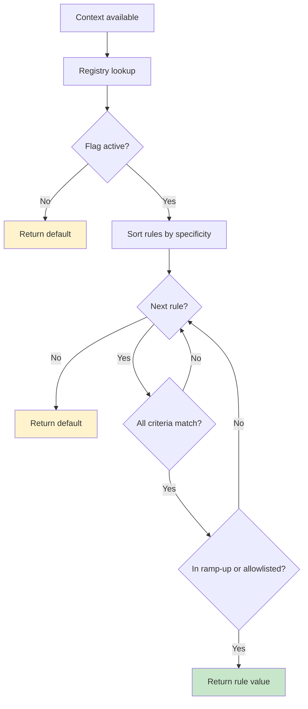
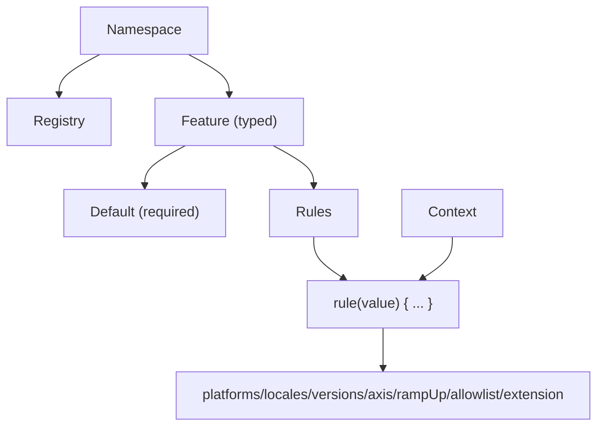
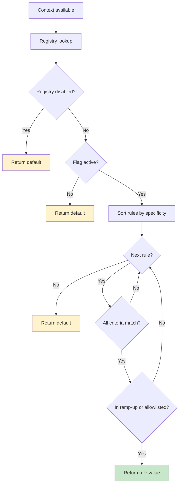

# Public API Surface Summary
# Extracted: 2026-01-05T21:49:13-05:00

## From docusaurus/docs/index.md

---
slug: /
---

# Konditional

**Type-safe feature flags for Kotlin that won't break in production.**

Konditional prevents the entire class of runtime errors that come from stringly-typed feature flag systems: typos that
ship to production, type coercion failures, inconsistent ramp-up logic, and configuration drift.

```kotlin
object AppFlags : Namespace("app") {
    val checkoutVersion by string<Context>(default = "classic") {
        rule("optimized") { platforms(Platform.IOS, Platform.ANDROID) }
        rule("experimental") { rampUp { 50.0 } }
    }
}

// Typos don't compile. Types are guaranteed. Ramp-ups are deterministic.
val version: String = AppFlags.checkoutVersion.evaluate(ctx)
```

---

## Why Konditional?

Traditional feature flag SDKs use string keys:

```kotlin
val enabled = flagClient.getBool("new_onboaring_flow", false)  // typo ships to production
```

This compiles. It deploys. Your experiment silently fails. You discover it weeks later.

**Konditional makes flags compile-time correct:**

```kotlin
val version = AppFlags.checkoutVersion.evaluate(ctx)  // property access is compile-time checked
// AppFlags.checkotuVersion.evaluate(ctx)              // doesn't compile (typo)
```

Beyond typo safety, Konditional gives you:

- **Typed values** — not just booleans, but strings, ints, doubles, enums, and custom types
- **Deterministic ramp-ups** — SHA-256 bucketing ensures same user → same bucket, always
- **Unified evaluation** — one rule DSL across your entire codebase, not per-domain evaluators
- **Explicit boundaries** — parse JSON configuration with validation; reject invalid updates before they affect
  production

Read the full argument: [Why Konditional Exists](why-konditional)

---

## Installation

```kotlin
dependencies {
    implementation("io.amichne:konditional:0.0.1")
}
```

---

## Quick Start

### Define flags as properties

```kotlin
import io.amichne.konditional.core.dsl.enable

object AppFeatures : Namespace("app") {
    val darkMode by boolean<Context>(default = false) {
        enable { ios() }
        enable { rampUp { 50.0 } }
    }

    val apiEndpoint by string<Context>(default = "https://api.example.com") {
        rule("https://api-android.example.com") { android() }
    }

    val maxRetries by integer<Context>(default = 3) {
        rule(5) { versions { min(2, 0, 0) } }
    }
}
```

### Evaluate with context

```kotlin
val ctx = Context(
    locale = AppLocale.UNITED_STATES,
    platform = Platform.IOS,
    appVersion = Version.of(2, 1, 0),
    stableId = StableId.of("user-123")
)

val enabled: Boolean = AppFeatures.darkMode.evaluate(ctx)
val endpoint: String = AppFeatures.apiEndpoint.evaluate(ctx)
val retries: Int = AppFeatures.maxRetries.evaluate(ctx)
```

**Evaluation is total:** if no rule matches, the default is returned. No nulls, no exceptions.

---

## Beyond Booleans: Typed Values

### Stop encoding variants as multiple booleans

**Before (boolean explosion):**

```kotlin
if (isEnabled(CHECKOUT_V1) && !isEnabled(CHECKOUT_V2)) {
    // v1 logic
} else if (isEnabled(CHECKOUT_V2) && !isEnabled(CHECKOUT_FAST_PATH)) {
    // v2 without fast path
} else if (isEnabled(CHECKOUT_V3) || isEnabled(CHECKOUT_FAST_PATH)) {
    // which logic wins?
}
```

**After (typed values):**

```kotlin
object CheckoutFlags : Namespace("checkout") {
    val checkoutVersion by string<Context>(default = "v1") {
        rule("v2") { rampUp { 33.0 } }
        rule("v3") { rampUp { 66.0 } }
    }
}

when (CheckoutFlags.checkoutVersion.evaluate(ctx)) {
    "v1" -> v1Checkout()
    "v2" -> v2Checkout()
    "v3" -> v3Checkout()
}
```

### Enums

```kotlin
enum class Theme { LIGHT, DARK, AUTO }

object ThemeFlags : Namespace("theme") {
    val theme by enum<Theme, Context>(default = Theme.LIGHT) {
        rule(Theme.DARK) { platforms(Platform.IOS) }
    }
}
```

### Custom structured values

```kotlin
data class RetryPolicy(
    val maxAttempts: Int = 3,
    val backoffMs: Double = 1000.0,
    val enabled: Boolean = true
) : Konstrained<ObjectSchema> {
    override val schema = schemaRoot {
        ::maxAttempts of { minimum = 1 }
        ::backoffMs of { minimum = 0.0 }
        ::enabled of { default = true }
    }
}

object PolicyFlags : Namespace("policy") {
    val retryPolicy by custom<RetryPolicy, Context>(default = RetryPolicy()) {
        rule(RetryPolicy(maxAttempts = 5, backoffMs = 2000.0)) { android() }
    }
}
```

Note: custom structured values are decoded via reflection at the JSON boundary; keep constructor parameter names stable
and provide defaults for optional fields. If you use code shrinking/obfuscation, keep constructor parameter names and
ensure Kotlin reflection is available at runtime.

---

## Deterministic Ramp-ups

Ramp-ups use SHA-256 bucketing for consistent, reproducible results:

```kotlin
object RampUpFlags : Namespace("ramp-up") {
    val newFeature by boolean<Context>(default = false) {
        enable { rampUp { 25.0 } }
    }
}
```

**Guarantees:**

- Same user + same flag + same percentage → same bucket
- Increasing 10% → 20% only adds users (no reshuffle) for the same `(stableId, flagKey, salt)`
- Ramp-up decisions are reproducible (`stableId` + flag key + salt → deterministic bucket)
- Changing `salt(...)` intentionally redistributes buckets (useful when re-running experiments)

No random number generators. No modulo edge cases. No per-team ramp-up implementations with subtle differences.

---

## Remote Configuration

### Load configuration from JSON

```kotlin
val json = fetchRemoteConfig()

// Important: deserialization requires that your Namespace objects have been initialized
// (so features are registered) before calling ConfigurationSnapshotCodec.decode(...).
// See: /fundamentals/definition-vs-initialization

when (val result = ConfigurationSnapshotCodec.decode(json)) {
    is ParseResult.Success -> AppFlags.load(result.value)
    is ParseResult.Failure -> {
        // Invalid JSON rejected, last-known-good remains active
        logError("Config parse failed: ${result.error.message}")
    }
}
```

**The boundary is explicit:** Parse failures don't crash your app or silently corrupt evaluation. Bad config is
rejected; the previous working config stays active.

### Serialize current configuration

```kotlin
val snapshot = ConfigurationSnapshotCodec.encode(AppFlags.configuration)
persistToStorage(snapshot)
```

### Incremental updates (patches)

```kotlin
val patchJson = fetchPatch()
val currentConfig = AppFlags.configuration

when (val result = ConfigurationSnapshotCodec.applyPatchJson(currentConfig, patchJson)) {
    is ParseResult.Success -> AppFlags.load(result.value)
    is ParseResult.Failure -> logError("Patch failed: ${result.error.message}")
}
```

See [Loading from JSON](/getting-started/loading-from-json) and [Persistence Format](/persistence-format) for details.

---

## Thread Safety

- **Atomic updates:** `Namespace.load()` swaps configuration atomically
- **Lock-free reads:** Evaluation reads a snapshot without blocking writers
- **No races:** Multiple threads can evaluate flags concurrently while configuration updates happen in the background

---

## Namespaces (Optional Isolation)

If you need isolated registries (e.g., per-team, per-domain), define multiple namespaces:

```kotlin
sealed class AppDomain(id: String) : Namespace(id) {
    data object Account : AppDomain("account") {
        val creditCheck by boolean<Context>(default = false)
    }

    data object Payments : AppDomain("payments") {
        val stripeEnabled by boolean<Context>(default = true)
    }
}
```

Each namespace has independent configuration lifecycle, registry, and serialization.

---

## Core Concepts

- **Namespace:** Isolation boundary with its own registry and configuration lifecycle
- **Flags:** Delegated properties defined on a namespace
- **Context:** Runtime inputs for evaluation (`locale`, `platform`, `appVersion`, `stableId`)
- **Rules:** Typed criteria-to-value mappings (`platforms/locales/versions/rampUp/extension`)
- **Snapshot/Patch:** JSON formats for persistence and incremental updates
- **Total evaluation:** No nulls—every flag returns its default if no rule matches

---

## Documentation

**Getting started:**

- [Quick Start Guide](/getting-started/installation)
- [Core Concepts](/fundamentals/core-primitives)

**Features:**

- [Targeting & Ramp-ups](/rules-and-targeting/rollout-strategies)
- [Evaluation Semantics](/fundamentals/evaluation-semantics)
- [Loading from JSON](/getting-started/loading-from-json)
- [Persistence Format](/persistence-format)

**Why Konditional:**

- [Why Konditional Exists](why-konditional) — The compelling argument

---

## What Konditional Prevents

**Typos that ship to production:**

```kotlin
flagClient.getBool("new_onboaring_flow", false)  // compiles, deploys, fails silently
AppFlags.newOnboaringFlow                        // compile error
```

**Type coercion incidents:**

```kotlin
// JSON: {"max_retries": "disabled"}
flagClient.getInt("max_retries", 3)  // returns 0, service fails immediately
AppFlags.maxRetries                  // parse fails at boundary, last-known-good stays active
```

**Boolean explosion:**

```kotlin
// Before: 5 boolean flags → 2^5 = 32 test cases, most undefined
// After: 1 typed enum flag → 5 explicit variants, all defined
```

**Inconsistent ramp-up logic:**

```kotlin
// Before: Account team uses modulo, Payments team uses random(), different bucketing
// After: All flags use SHA-256 bucketing, same user → same bucket across all flags
```

Read more: [Real Problems Konditional Prevents](why-konditional#real-problems-konditional-prevents)

---

## When to Use Konditional

**Choose Konditional when:**

* You want compile-time correctness for flag definitions and callsites
* You need typed values beyond booleans (variants, thresholds, structured config)
* You run experiments and need deterministic, reproducible ramp-ups
* You value consistency over bespoke per-domain solutions
* You have remote configuration and want explicit validation boundaries

**Konditional might not fit if:**

* You need vendor-hosted dashboards more than compile-time safety

* Your flags are fully dynamic with zero static definitions

* You're okay with process/tooling to prevent string key drift

---

## License

MIT. See [LICENSE](https://github.com/amichne/konditional/blob/main/LICENSE).

## From docusaurus/docs/getting-started/installation.md

# Installation

Add Konditional to your Kotlin project via Gradle or Maven.

## Gradle (Kotlin DSL)

```kotlin
// build.gradle.kts
dependencies {
    implementation("io.amichne:konditional:0.0.1")
}
```

## Gradle (Groovy DSL)

```groovy
// build.gradle
dependencies {
    implementation 'io.amichne:konditional:0.0.1'
}
```

## Maven

```xml
<dependency>
    <groupId>io.amichne</groupId>
    <artifactId>konditional</artifactId>
    <version>0.0.1</version>
</dependency>
```

---

## Requirements

- **Kotlin 2.2+**
- **JVM 21+**
- **Kotlin reflection** — Konditional depends on `kotlin-reflect` for custom structured value decoding at the JSON boundary

---

## Next Steps

- [Your First Flag](/getting-started/your-first-flag) — Define and evaluate your first feature flag
- [Loading from JSON](/getting-started/loading-from-json) — Add runtime configuration

## From docusaurus/docs/getting-started/your-first-flag.md

# Your First Flag

Define flags as delegated properties on a `Namespace`. The compiler enforces type safety, and evaluation is total (always returns a value, never null).

---

## Define a Namespace with Flags

```kotlin
import io.amichne.konditional.api.evaluate
import io.amichne.konditional.core.Namespace
import io.amichne.konditional.context.*
import io.amichne.konditional.core.dsl.enable
import io.amichne.konditional.core.id.StableId

object AppFeatures : Namespace("app") {
    val darkMode by boolean<Context>(default = false) {
        enable {
            platforms(Platform.IOS)
            rampUp { 50.0 }
        }
    }

    val apiEndpoint by string<Context>(default = "https://api.example.com") {
        rule("https://api-ios.example.com") { platforms(Platform.IOS) }
        rule("https://api-android.example.com") { platforms(Platform.ANDROID) }
    }

    val maxRetries by integer<Context>(default = 3)
}
```

**What this does:**

- `boolean`, `string`, `integer` are type-safe delegates that create `Feature<Boolean>`, `Feature<String>`, `Feature<Int>`
- Property names become feature keys (no string keys at call sites)
- `default` is required — evaluation never returns null
- `rule(value) { ... }` (or `rule { ... } yields value`) defines conditional targeting

---

## Create an Evaluation Context

Context provides runtime inputs: locale, platform, version, and a stable user identifier.

```kotlin
val context = Context(
    locale = AppLocale.UNITED_STATES,
    platform = Platform.IOS,
    appVersion = Version.of(2, 1, 0),
    stableId = StableId.of("user-123"),
)
```

**Key fields:**

- `locale` — Geographic/language targeting (implements `LocaleTag`)
- `platform` — iOS, Android, Web, etc. (implements `PlatformTag`)
- `appVersion` — Semantic versioning for version-based rollouts
- `stableId` — Deterministic identifier for ramp-up bucketing

---

## Evaluate Flags

```kotlin
val enabled: Boolean = AppFeatures.darkMode.evaluate(context)
val endpoint: String = AppFeatures.apiEndpoint.evaluate(context)
val retries: Int = AppFeatures.maxRetries.evaluate(context)
```

**Guarantees:**

- Type safety: The return type matches the declared type (no casts)
- Non-null: Evaluation always returns a value (rule value or default)
- Deterministic: Same inputs → same outputs

---

## How Evaluation Works



1. **Specificity ordering** — Rules are sorted by targeting criteria count (most specific first)
2. **AND semantics** — All criteria in a rule must match for the rule to match
3. **First match wins** — The first matching rule (that passes ramp-up check) determines the value
4. **Default fallback** — If no rules match, the required default is returned

---

## Supported Value Types

| Type       | Namespace method | Kotlin type                          | Example default       |
|------------|------------------|--------------------------------------|-----------------------|
| Boolean    | `boolean(...)`   | `Boolean`                            | `false`               |
| String     | `string(...)`    | `String`                             | `"production"`        |
| Integer    | `integer(...)`   | `Int`                                | `42`                  |
| Decimal    | `double(...)`    | `Double`                             | `3.14`                |
| Enum       | `enum(...)`      | `E : Enum<E>`                        | `LogLevel.INFO`       |
| Data class | `custom(...)`    | `T : Konstrained<ObjectSchema>` | `MyConfig()`          |

---

## Common Patterns

### Gradual Ramp-Up

```kotlin
val newCheckout by boolean<Context>(default = false) {
    rule(true) {
        platforms(Platform.ANDROID)
        rampUp { 10.0 }  // 10% of users
    }
}
```

Ramp-ups are deterministic: the same `(stableId, flagKey, salt)` yields the same bucket assignment.

### Platform-Specific Configuration

```kotlin
val apiEndpoint by string<Context>(default = "https://api.example.com") {
    rule("https://api-ios.example.com") { ios() }
    rule("https://api-android.example.com") { android() }
}
```

### Variants via Enums (Not Strings)

```kotlin
enum class Theme { LIGHT, DARK, AUTO }

val theme by enum<Theme, Context>(default = Theme.LIGHT) {
    rule(Theme.DARK) { platforms(Platform.IOS) }
}
```

Because variants are enum values, invalid variants cannot compile.

---

## Next Steps

- [Loading from JSON](/getting-started/loading-from-json) — Add runtime configuration
- [Fundamentals: Core Primitives](/fundamentals/core-primitives) — Deep dive into Features, Context, and Namespaces
- [Rules & Targeting](/rules-and-targeting/rule-composition) — Master rollout strategies

## From docusaurus/docs/fundamentals/core-primitives.md

# Core Primitives

Konditional's public surface is intentionally small. Understanding three primitives—**Features**, **Context**, and **Namespaces**—is enough to reason about correctness, organization, and runtime behavior.



---

## Feature

A **Feature** is a typed configuration value with an optional rule set. You define features as delegated properties on a `Namespace`:

```kotlin
import io.amichne.konditional.api.evaluate
import io.amichne.konditional.context.Context

object AppFeatures : Namespace("app") {
    val darkMode by boolean<Context>(default = false)
    val apiEndpoint by string<Context>(default = "https://api.example.com")
    val maxRetries by integer<Context>(default = 3)
    val timeoutSeconds by double<Context>(default = 30.0)
}

val enabled: Boolean = AppFeatures.darkMode.evaluate(context)
val endpoint: String = AppFeatures.apiEndpoint.evaluate(context)
```

**What property delegation buys you:**

- **Property name becomes the key** — No string keys at call sites (typos become compile errors)
- **Type flows from the delegate** — `boolean` → `Boolean`, `string` → `String`, etc.
- **Non-null evaluation** — `default` is required, so evaluation always returns a value

### Supported Types

| Type       | Namespace method | Kotlin type                          | Example default       |
|------------|------------------|--------------------------------------|-----------------------|
| Boolean    | `boolean(...)`   | `Boolean`                            | `false`               |
| String     | `string(...)`    | `String`                             | `"production"`        |
| Integer    | `integer(...)`   | `Int`                                | `42`                  |
| Decimal    | `double(...)`    | `Double`                             | `3.14`                |
| Enum       | `enum(...)`      | `E : Enum<E>`                        | `LogLevel.INFO`       |
| Data class | `custom(...)`    | `T : Konstrained<ObjectSchema>` | `MyConfig()`          |

Custom data classes are decoded via Kotlin reflection at the JSON boundary. Ensure Kotlin reflection is available at runtime (Konditional bundles it), and keep constructor parameter names stable when using obfuscation.

### Enums Instead of Strings

```kotlin
enum class LogLevel { DEBUG, INFO, WARN, ERROR }
enum class Theme { LIGHT, DARK, AUTO }

object AppConfig : Namespace("app-config") {
    val LOG_LEVEL by enum<LogLevel, Context>(default = LogLevel.INFO)
    val THEME by enum<Theme, Context>(default = Theme.LIGHT)
}

val level: LogLevel = AppConfig.LOG_LEVEL.evaluate(context)
```

Because variants are enum values, invalid variants cannot compile.

---

## Context

**Context** provides evaluation inputs: it tells Konditional who is asking and where they are.

Standard fields (the minimum required by the rule DSL):

```kotlin
val context = Context(
    locale = AppLocale.UNITED_STATES,
    platform = Platform.IOS,
    appVersion = Version.of(2, 1, 0),
    stableId = StableId.of("user-123"),
)
```

### Key Fields

- **`locale`** — Geographic/language targeting (implements `LocaleTag`)
- **`platform`** — iOS, Android, Web, etc. (implements `PlatformTag`)
- **`appVersion`** — Semantic versioning for version-based rollouts
- **`stableId`** — Deterministic identifier for ramp-up bucketing

### StableId (Deterministic Ramp-Ups)

`stableId` is a stable identifier used for deterministic bucketing. `StableId.of(...)` accepts any non-blank string and normalizes it to a hex representation used for bucketing.

```kotlin
val id = StableId.of("user-123")
```

If you need cross-platform consistency, ensure all platforms pass the same canonical stable identifier string into `StableId.of(...)` (it lowercases using `Locale.ROOT`). Use `StableId.fromHex(...)` when you already have a canonical hex identifier.

### Custom Context Types

To keep business targeting logic typed (not string-based), define a custom `Context`:

```kotlin
data class EnterpriseContext(
    override val locale: AppLocale,
    override val platform: Platform,
    override val appVersion: Version,
    override val stableId: StableId,
    val subscriptionTier: SubscriptionTier,
    val employeeCount: Int
) : Context

enum class SubscriptionTier { FREE, PRO, ENTERPRISE }

object PremiumFeatures : Namespace("premium") {
    val ADVANCED_ANALYTICS by boolean<EnterpriseContext>(default = false) {
        rule(true) {
            extension { subscriptionTier == SubscriptionTier.ENTERPRISE && employeeCount > 100 }
        }
    }
}
```

Because the feature is parameterized with `EnterpriseContext`, the receiver inside `extension { ... }` is strongly typed.

---

## Namespace

**Namespaces** are isolation boundaries: each namespace has its own registry and independent configuration lifecycle.

Define multiple namespaces when you need isolated registries (per-team, per-domain):

```kotlin
sealed class AppDomain(id: String) : Namespace(id) {
    data object Auth : AppDomain("auth") {
        val socialLogin by boolean<Context>(default = false)
        val twoFactorAuth by boolean<Context>(default = true)
    }

    data object Payments : AppDomain("payments") {
        val applePay by boolean<Context>(default = false)
        val stripeIntegration by boolean<Context>(default = true)
    }
}

AppDomain.Auth.load(authConfig)
AppDomain.Payments.load(paymentConfig)
```

**What namespace isolation provides:**

- Separate `NamespaceRegistry` instances (no shared state)
- Independent configuration lifecycle (load/rollback separately)
- Namespace kill-switch (`disableAll()`) scoped to that namespace only

---

## Type Safety in Action (What Becomes Impossible)

### Wrong Value Type at Call Site

```kotlin
object Config : Namespace("config") {
    val maxRetries by integer<Context>(default = 3)
}

val retries: Int = Config.maxRetries.evaluate(context)
// val retries: String = Config.maxRetries.evaluate(context)  // Compile error
```

### Wrong Context Type for a Feature

```kotlin
val basicContext: Context = Context(...)
// This will error
// PremiumFeatures.ADVANCED_ANALYTICS.evaluate(basicContext)  // Compile error (requires EnterpriseContext)
```

---

## Next Steps

- [Trust Boundaries](/fundamentals/trust-boundaries) — Where compile-time ends and runtime begins
- [Definition vs Initialization](/fundamentals/definition-vs-initialization) — The two-phase lifecycle
- [Evaluation Semantics](/fundamentals/evaluation-semantics) — Total, deterministic, non-null

## From docusaurus/docs/fundamentals/evaluation-semantics.md

# Evaluation Semantics

Konditional evaluation is designed to be **total**, **deterministic**, and **atomic**. Same inputs always produce the same outputs, and evaluation always returns a value.

---

## Three Core Guarantees

### 1. Total (Always Returns a Value)

Evaluation never returns `null` or throws:

```kotlin
val enabled: Boolean = AppFeatures.darkMode.evaluate(context)
```

**Why:** Every feature requires a `default`, so there's always a fallback value when no rules match.

### 2. Deterministic (Same Inputs → Same Outputs)

The same context always produces the same result:

```kotlin
val ctx = Context(
    locale = AppLocale.UNITED_STATES,
    platform = Platform.IOS,
    appVersion = Version.of(2, 1, 0),
    stableId = StableId.of("user-123"),
)

val result1 = AppFeatures.darkMode.evaluate(ctx)
val result2 = AppFeatures.darkMode.evaluate(ctx)
// result1 == result2  (guaranteed)
```

**How:** Ramp-up bucketing is based on SHA-256 hashing (deterministic), and rule ordering is stable (by specificity, then definition order).

### 3. Atomic (Readers See Consistent Snapshots)

Configuration updates are atomic; readers never see partial updates:

```kotlin
// Thread 1: Update configuration
AppFeatures.load(newConfig)

// Thread 2: Concurrent evaluation
val value = AppFeatures.darkMode.evaluate(context)  // Sees old OR new, never mixed
```

**How:** Registry stores configuration in an `AtomicReference`; `load(...)` performs a single atomic swap.

---

## Evaluation Flow



1. **Registry lookup** — O(1) lookup by feature key
2. **Kill-switch check** — If namespace is disabled via `disableAll()`, return default
3. **Active check** — If flag is inactive, return default
4. **Sort rules** — Rules are pre-sorted by specificity (highest first)
5. **Iterate rules** — For each rule (in order):
   - Check if all criteria match (AND semantics)
   - If match, check ramp-up bucket (or allowlist bypass)
   - If in ramp-up, return rule value
6. **Default fallback** — If no rules match, return default

---

## AND Semantics (Within a Rule)

All criteria in a rule must match:

```kotlin
val premiumFeature by boolean<Context>(default = false) {
    rule(true) {
        platforms(Platform.IOS, Platform.ANDROID)
        locales(AppLocale.UNITED_STATES)
        versions { min(2, 0, 0) }
        rampUp { 50.0 }
    }
}
```

For this rule to apply:
- Platform must be iOS **OR** Android
- **AND** locale must be UNITED_STATES
- **AND** version must be >= 2.0.0
- **AND** user must be in the 50% ramp-up bucket

---

## Specificity Ordering (Across Rules)

Rules are sorted by **specificity** (count of targeting criteria):

```
specificity(rule):
  +1 if platforms is set
  +1 if locales is set
  +1 if versions has bounds
  +N for axis constraints (one per axis)
  +extensionSpecificity (defaults to 1 when `extension { ... }` is used)
```

Most-specific rule wins. If multiple rules have the same specificity, definition order is used as tie-breaker.

```kotlin
val apiEndpoint by string<Context>(default = "https://api.example.com") {
    rule("https://api-ios-us.example.com") {  // specificity = 2 (platform + locale)
        platforms(Platform.IOS)
        locales(AppLocale.UNITED_STATES)
    }
    rule("https://api-ios.example.com") {  // specificity = 1 (platform only)
        platforms(Platform.IOS)
    }
}

// iOS + US users → first rule (more specific)
// iOS + other locales → second rule
// Other platforms → default
```

See [Rules & Targeting: Specificity System](/rules-and-targeting/specificity-system) for details.

---

## Deterministic Ramp-Up Bucketing

Ramp-ups use SHA-256 bucketing for deterministic, reproducible results:

```
input = "$salt:$flagKey:${stableIdHex}"
hash = sha256(input)
bucket = uint32(hash[0..3]) % 10_000  // [0, 10_000)
thresholdBasisPoints = round(rampUpPercent * 100)
inRampUp = bucket < thresholdBasisPoints
```

**Properties:**

- Same `(stableId, flagKey, salt)` → same bucket
- Increasing ramp-up percentage only adds users (no reshuffle)
- Changing `salt` redistributes buckets (useful for re-running experiments)

See [Rules & Targeting: Rollout Strategies](/rules-and-targeting/rollout-strategies) for details.

---

## Evaluation API

### `evaluate(context): T`

Concise evaluation with an explicit context:

```kotlin
val darkMode = AppFeatures.darkMode.evaluate(context)
```

Use when defaults are meaningful and you want minimal call-site surface.

### `explain(context): EvaluationResult<T>`

Explainable evaluation for debugging:

```kotlin
val result = AppFeatures.darkMode.explain(context)
println(result.decision)  // Why this value was chosen
```

`EvaluationResult` includes:
- Decision kind (rule/default/inactive/disabled)
- Matched rule constraints + specificity
- Deterministic ramp-up bucket information

---

## Performance Model

**Time complexity:**

- **Registry lookup:** O(1)
- **Rule iteration:** O(n) where n = rules per flag (typically small, fewer than 10)
- **Ramp-up bucketing:** 0 or 1 SHA-256 hash per evaluation (only when a rule matches by criteria)

**Space:**

- Evaluation allocates a small trace object internally
- Rule structures are pre-built and reused across evaluations

---

## Concurrency Model

Evaluation is designed for concurrent reads:

- **Lock-free reads** — No synchronization required for evaluation
- **Atomic updates** — `Namespace.load(...)` swaps configuration atomically

```kotlin
// Thread 1
AppFeatures.load(newConfig)

// Thread 2 (during update)
val value = AppFeatures.darkMode.evaluate(context)  // Sees old OR new, never mixed
```

See [Refresh Safety](/fundamentals/refresh-safety) for details.

---

## Emergency Kill-Switch

Disable all evaluations in a namespace (return defaults):

```kotlin
AppFeatures.disableAll()
// ... all evaluations return declared defaults ...
AppFeatures.enableAll()
```

This affects only the specific namespace (other namespaces are unaffected).

---

## Next Steps

- [Refresh Safety](/fundamentals/refresh-safety) — Why atomic updates are safe
- [Rules & Targeting: Specificity System](/rules-and-targeting/specificity-system) — Rule ordering details
- [Rules & Targeting: Rollout Strategies](/rules-and-targeting/rollout-strategies) — Bucketing mechanics
- [Theory: Determinism Proofs](/theory/determinism-proofs) — SHA-256 bucketing guarantees

## From docusaurus/docs/api-reference/core-types.md

# Core Types

Reference for fundamental types used throughout the Konditional runtime API.

---

## `Feature<T, C, M>`

A typed feature definition created via namespace property delegation.

```kotlin
sealed interface Feature<T : Any, C : Context, out M : Namespace> : Identifiable {
    val key: String
    val namespace: M
    override val id: FeatureId
}
```

### Notes

- `key` is the in-code key (typically the Kotlin property name).
- `id` is the stable serialized identifier used in snapshots/patches (see `FeatureId` below).
- Consumers do not implement `Feature`; features are created when you declare `val foo by boolean<Context>(...) { ... }`.

See [Feature Operations](/api-reference/feature-operations) for evaluation APIs.

---

## `FeatureId`

Stable serialized identifier for a feature.

```kotlin
@JvmInline
value class FeatureId private constructor(val plainId: String) {
    companion object {
        fun create(namespaceSeed: String, key: String): FeatureId
        fun parse(plainId: String): FeatureId
    }
}
```

Canonical format:

```
feature::${namespaceSeed}::${key}
```

`namespaceSeed` defaults to the namespace `id`, but test-only namespaces use a unique seed to avoid collisions.

---

## `Context`

Runtime inputs for evaluation.

```kotlin
interface Context {
    val locale: LocaleTag
    val platform: PlatformTag
    val appVersion: Version
    val stableId: StableId

    val axisValues: AxisValues get() = AxisValues.EMPTY

    data class Core(
        override val locale: LocaleTag,
        override val platform: PlatformTag,
        override val appVersion: Version,
        override val stableId: StableId,
    ) : Context

    companion object {
        operator fun invoke(
            locale: LocaleTag,
            platform: PlatformTag,
            appVersion: Version,
            stableId: StableId,
        ): Core
    }
}
```

### Extending Context

```kotlin
data class EnterpriseContext(
    override val locale: AppLocale,
    override val platform: Platform,
    override val appVersion: Version,
    override val stableId: StableId,
    val subscriptionTier: SubscriptionTier,
    val employeeCount: Int,
) : Context
```

---

## `Namespace`

Isolation boundary for features and configuration.

```kotlin
open class Namespace(val id: String) : NamespaceRegistry
```

`Namespace` implements `NamespaceRegistry`, so lifecycle operations are available directly on the namespace:
`load(...)`, `rollback(...)`, `disableAll()`, `setHooks(...)`, and so on.

Example:

```kotlin
object AppFeatures : Namespace("app") {
    val darkMode by boolean<Context>(default = false)
}

sealed class TeamDomain(id: String) : Namespace(id) {
    data object Analytics : TeamDomain("analytics")
    data object Payments : TeamDomain("payments")
}
```

---

## `Configuration`

Immutable snapshot of a namespace’s flag state.

```kotlin
data class Configuration internal constructor(
    val flags: Map<Feature<*, *, *>, FlagDefinition<*, *, *>>,
    val metadata: ConfigurationMetadata = ConfigurationMetadata(),
)
```

Notes:

- `Configuration` is produced at the JSON boundary (`ConfigurationSnapshotCodec.decode(...)`) or read from a namespace via
  `Namespace.configuration`.
- `flags` is keyed by `Feature` instances (not strings); lookups are done via `Namespace.flag(feature)`.

---

## `ConfigurationMetadata`

Operational metadata attached to configuration snapshots.

```kotlin
data class ConfigurationMetadata internal constructor(
    val version: String? = null,
    val generatedAtEpochMillis: Long? = null,
    val source: String? = null,
) {
    companion object {
        fun of(
            version: String? = null,
            generatedAtEpochMillis: Long? = null,
            source: String? = null,
        ): ConfigurationMetadata
    }
}
```

---

## `FlagDefinition<T, C, M>`

Effective definition of a single feature in a loaded configuration.

Consumers typically use this only for introspection/tooling via `Namespace.flag(feature)`.

```kotlin
data class FlagDefinition<T : Any, C : Context, M : Namespace> internal constructor(
    val defaultValue: T,
    val feature: Feature<T, C, M>,
    val isActive: Boolean = true,
    val salt: String = "v1",
)
```

---

## `StableId`

Stable identifier for deterministic bucketing.

```kotlin
sealed interface StableId {
    val id: String      // canonical hex string
    val hexId: HexId

    companion object {
        fun of(input: String): StableId
        fun fromHex(hexId: String): StableId
    }
}
```

Example:

```kotlin
val id1 = StableId.of("user-123")
val id2 = StableId.fromHex(id1.id)
```

---

## `Version`

Semantic version used for version targeting.

```kotlin
@JsonClass(generateAdapter = true)
data class Version(
    val major: Int,
    val minor: Int,
    val patch: Int,
) : Comparable<Version> {
    companion object {
        fun of(major: Int, minor: Int, patch: Int): Version
        fun parse(raw: String): ParseResult<Version>
        val default: Version
    }
}
```

---

## `LocaleTag` / `PlatformTag`

Stable identifiers for locale and platform targeting.

```kotlin
interface LocaleTag { val id: String }
interface PlatformTag { val id: String }
```

The built-in `AppLocale` and `Platform` enums use their enum names as stable ids.

---

## `AxisValue<T>` / `Axis<T>`

Custom targeting dimensions.

```kotlin
interface AxisValue<T> where T : Enum<T> {
    val id: String
}

abstract class Axis<T>(
    val id: String,
    val valueClass: KClass<T>,
) where T : AxisValue<T>, T : Enum<T>
```

Axes auto-register on initialization so rules can infer axes from value types.

---

## `RampUp`

Percentage rollout configuration.

```kotlin
@JvmInline
value class RampUp private constructor(val value: Double) : Comparable<Number> {
    companion object {
        fun of(value: Double): RampUp
        val default: RampUp
    }
}
```

---

## `ParseResult<T>` / `ParseError`

Explicit success/failure boundary (used primarily at the JSON boundary).

```kotlin
sealed interface ParseResult<out T> {
    data class Success<T>(val value: T) : ParseResult<T>
    data class Failure(val error: ParseError) : ParseResult<Nothing>
}
```

See [Serialization](/api-reference/serialization) for parsing/validation behavior and error types.

---

## Next Steps

- [Feature Operations](/api-reference/feature-operations) — Evaluation API
- [Namespace Operations](/api-reference/namespace-operations) — Lifecycle operations
- [Serialization](/api-reference/serialization) — JSON snapshot/patch operations
- [Fundamentals: Core Primitives](/fundamentals/core-primitives) — Conceptual overview

## From docusaurus/docs/api-reference/feature-operations.md

# Feature Operations

API reference for evaluating features and retrieving evaluation metadata.

---

## `Feature.evaluate(context, registry): T`

Standard evaluation API.

```kotlin
fun <T : Any, C : Context, M : Namespace> Feature<T, C, M>.evaluate(
    context: C,
    registry: NamespaceRegistry = namespace,
): T
```

### Parameters

- `context` — Runtime context providing locale, platform, version, stableId
- `registry` — Registry to evaluate against (defaults to the feature's namespace)

### Returns

The feature's typed value (rule value or default). Never returns `null`.

### Throws

- `IllegalStateException` if the feature is not present in the provided registry (typically caused by evaluating
  before a namespace is initialized/registered, or evaluating against the wrong registry instance).

### Example

```kotlin
val enabled: Boolean = AppFeatures.darkMode.evaluate(context)
val endpoint: String = AppFeatures.apiEndpoint.evaluate(context)
```

### Behavior

1. Lookup the feature’s effective `FlagDefinition` in the registry.
2. If the registry kill-switch is enabled (`disableAll()`), return the declared default.
3. If the flag is inactive (`isActive=false` in configuration), return the declared default.
4. Iterate configured rules by descending specificity (stable sort).
5. For the first rule whose criteria match:
   - Compute a deterministic rollout bucket from `(stableId, feature.key, salt)`.
   - If allowlisted or in ramp-up, return the rule’s value.
   - Otherwise, continue to the next rule.
6. If no rule produces a value, return the declared default.

---

## `Feature.explain(context, registry): EvaluationResult<T>`

Explainable evaluation for debugging and observability.

```kotlin
fun <T : Any, C : Context, M : Namespace> Feature<T, C, M>.explain(
    context: C,
    registry: NamespaceRegistry = namespace,
): EvaluationResult<T>
```

### Parameters

- `context` — Runtime context
- `registry` — Registry to explain against (defaults to the feature’s namespace)

### Returns

`EvaluationResult<T>` capturing the returned value plus an explainable decision trace.

### Example

```kotlin
val result = AppFeatures.darkMode.explain(context)

when (val decision = result.decision) {
    EvaluationResult.Decision.RegistryDisabled -> println("Registry disabled via kill-switch")
    EvaluationResult.Decision.Inactive -> println("Flag is inactive")
    is EvaluationResult.Decision.Rule -> {
        println("Rule matched: ${decision.matched.rule.note}")
        println("Bucket: ${decision.matched.bucket.bucket}")
        decision.skippedByRollout?.let { skipped ->
            println("More specific rule matched by criteria but skipped by ramp-up: ${skipped.rule.note}")
        }
    }
    is EvaluationResult.Decision.Default -> {
        println("No rule produced a value, using declared default")
        decision.skippedByRollout?.let { skipped ->
            println("Most specific matching-by-criteria rule skipped by ramp-up: ${skipped.rule.note}")
        }
    }
}
```

### Use Cases

- Debugging user-specific outcomes
- Logging/metrics for observability
- Testing rule matching logic

---

## Shadow Evaluation

Shadow evaluation compares a baseline registry (returned value) and a candidate registry (comparison only).

---

## `Feature.evaluateWithShadow(context, candidateRegistry, ...): T`

A/B test two configurations (baseline + candidate) and log mismatches.

```kotlin
fun <T : Any, C : Context, M : Namespace> Feature<T, C, M>.evaluateWithShadow(
    context: C,
    candidateRegistry: NamespaceRegistry,
    baselineRegistry: NamespaceRegistry = namespace,
    options: ShadowOptions = ShadowOptions.defaults(),
    onMismatch: (ShadowMismatch<T>) -> Unit = {}
): T
```

### Parameters

- `context` — Runtime context
- `candidateRegistry` — Registry evaluated for comparison only
- `baselineRegistry` — Registry whose value is returned (defaults to the feature’s namespace)
- `options` — Shadow evaluation options (see `ShadowOptions`)
- `onMismatch` — Callback invoked when baseline and candidate differ

### Returns

The **baseline** value (candidate is only evaluated for comparison).

### Behavior

1. Evaluate baseline registry (returned value)
2. Optionally skip candidate evaluation if baseline registry kill-switch is enabled (default behavior)
3. Evaluate candidate registry for comparison
4. If baseline and candidate differ, invoke `onMismatch` and emit a warning via `baselineRegistry` hooks
5. Return the baseline value

### Example

```kotlin
val _ = AppFeatures // ensure features are registered before parsing
val candidateConfig = ConfigurationSnapshotCodec.decode(candidateJson).getOrThrow()
val candidateRegistry = NamespaceRegistry(configuration = candidateConfig, namespaceId = AppFeatures.id)

val value = AppFeatures.darkMode.evaluateWithShadow(
    context = context,
    candidateRegistry = candidateRegistry,
    onMismatch = { mismatch ->
        logger.warn(
            "Shadow mismatch key=${mismatch.featureKey} kinds=${mismatch.kinds} baseline=${mismatch.baseline.value} candidate=${mismatch.candidate.value}",
        )
    },
)
```

### Use Cases

- Validating configuration changes before rollout
- Canary testing new config logic
- Migration from one flag system to another

See [Advanced: Shadow Evaluation](/advanced/shadow-evaluation) for details.

---

## `Feature.evaluateShadow(context, candidateRegistry, ...): Unit`

Detect config drift between baseline and candidate without affecting production.

```kotlin
fun <T : Any, C : Context, M : Namespace> Feature<T, C, M>.evaluateShadow(
    context: C,
    candidateRegistry: NamespaceRegistry,
    baselineRegistry: NamespaceRegistry = namespace,
    options: ShadowOptions = ShadowOptions.defaults(),
    onMismatch: (ShadowMismatch<T>) -> Unit = {}
)
```

### Parameters

- `context` — Runtime context
- `candidateRegistry` — Registry evaluated for comparison only
- `baselineRegistry` — Registry treated as baseline (defaults to the feature’s namespace)
- `options` — Shadow evaluation options
- `onMismatch` — Callback invoked when baseline and candidate differ

### Example

```kotlin
AppFeatures.darkMode.evaluateShadow(
    context = context,
    candidateRegistry = candidateRegistry,
    onMismatch = { mismatch ->
        logger.error(
            "Config drift detected key=${mismatch.featureKey} kinds=${mismatch.kinds} baseline=${mismatch.baseline.value} candidate=${mismatch.candidate.value}",
        )
    },
)
```

---

## Next Steps

- [Namespace Operations](/api-reference/namespace-operations) — Load, rollback, kill-switch
- [Serialization](/api-reference/serialization) — JSON snapshot/patch operations
- [Observability](/api-reference/observability) — Hooks and explainability

## From docusaurus/docs/api-reference/namespace-operations.md

# Namespace Operations

API reference for managing namespace configuration lifecycle: loading, rollback, and kill-switch operations.

---

## `Namespace.load(configuration)`

Atomically replace the active configuration snapshot.

```kotlin
fun Namespace.load(configuration: Configuration)
```

### Parameters

- `configuration` — New configuration snapshot (typically from `ConfigurationSnapshotCodec.decode(...)`)

### Behavior

- Performs atomic swap via `AtomicReference.set(...)`
- Readers see either old OR new snapshot (never mixed)
- Adds current config to rollback history (bounded)

### Example

```kotlin
val _ = AppFeatures // ensure features are registered before parsing
when (val result = ConfigurationSnapshotCodec.decode(json)) {
    is ParseResult.Success -> AppFeatures.load(result.value)
    is ParseResult.Failure -> logError(result.error.message)
}
```

### Thread Safety

- **Lock-free reads** — Concurrent evaluations don't block
- **Atomic writes** — Last write wins (linearizable)

See [Fundamentals: Refresh Safety](/fundamentals/refresh-safety) for details.

---

## `NamespaceSnapshotLoader.load(json): ParseResult<Configuration>`

Parse and load JSON configuration into a namespace.

```kotlin
fun NamespaceSnapshotLoader(namespace: Namespace).load(json: String): ParseResult<Configuration>
```

### Parameters

- `json` — JSON snapshot payload

### Returns

- `ParseResult.Success(configuration)` if JSON is valid and loaded
- `ParseResult.Failure` if parse fails (last-known-good remains active)

### Example

```kotlin
val json = File("flags.json").readText()

when (val result = NamespaceSnapshotLoader(AppFeatures).load(json)) {
    is ParseResult.Success -> logger.info("Config loaded: version=${result.value.metadata.version}")
    is ParseResult.Failure -> logger.error("Parse failed: ${result.error}")
}
```

### Precondition

Features must be registered before calling `load(...)`. See [Fundamentals: Definition vs Initialization](/fundamentals/definition-vs-initialization).

---

## `ConfigurationSnapshotCodec.encode(configuration): String`

Export the current configuration snapshot to JSON.

```kotlin
fun ConfigurationSnapshotCodec.encode(configuration: Configuration): String
```

### Returns

JSON string representing the current namespace configuration.

### Example

```kotlin
val json = ConfigurationSnapshotCodec.encode(AppFeatures.configuration)
File("flags.json").writeText(json)
```

### Use Cases

- Externalize current config for storage
- Generate baseline config for remote distribution
- Audit current state

---

## `Namespace.configuration: Configuration`

Get the current active configuration snapshot.

```kotlin
val Namespace.configuration: Configuration
```

### Returns

The active `Configuration` snapshot.

### Example

```kotlin
val currentConfig = AppFeatures.configuration
val metadata = currentConfig.metadata
println("Version: ${metadata.version}")
```

---

## `Namespace.rollback(steps): Boolean`

Revert to a prior configuration from rollback history.

```kotlin
fun Namespace.rollback(steps: Int = 1): Boolean
```

### Parameters

- `steps` — Number of configurations to roll back (default: 1)

### Returns

- `true` if rollback succeeded
- `false` if not enough history available

### Example

```kotlin
val success = AppFeatures.rollback(steps = 1)
if (success) {
    logger.info("Rolled back to previous config")
} else {
    logger.warn("Rollback failed: insufficient history")
}
```

### Behavior

- Registry maintains a bounded history (configurable, default: 10)
- Rollback atomically swaps to the prior snapshot
- Does not affect feature definitions in code

---

## `Namespace.historyMetadata: List<ConfigurationMetadata>`

Get metadata for all configurations in rollback history.

```kotlin
val Namespace.historyMetadata: List<ConfigurationMetadata>
```

### Returns

List of `ConfigurationMetadata` (version, timestamp, source) for each snapshot in history.

### Example

```kotlin
val history = AppFeatures.historyMetadata
history.forEach { meta ->
    println("Version: ${meta.version}, Loaded at: ${meta.generatedAtEpochMillis}")
}
```

---

## `Namespace.disableAll()`

Emergency kill-switch: disable all evaluations in this namespace (return defaults).

```kotlin
fun Namespace.disableAll()
```

### Behavior

- All evaluations return declared defaults
- Does not change feature definitions
- Scoped to this namespace only (other namespaces unaffected)

### Example

```kotlin
AppFeatures.disableAll()

val enabled = AppFeatures.darkMode.evaluate(context)  // Returns default (false)
```

### Use Cases

- Emergency rollback when config is suspect
- Incident response (kill all experiments)
- Testing default-only behavior

---

## `Namespace.enableAll()`

Re-enable all evaluations after `disableAll()`.

```kotlin
fun Namespace.enableAll()
```

### Example

```kotlin
AppFeatures.enableAll()

val enabled = AppFeatures.darkMode.evaluate(context)  // Normal evaluation resumes
```

---

## `Namespace.setHooks(hooks)`

Attach dependency-free logging/metrics hooks to a namespace registry.

```kotlin
fun Namespace.setHooks(hooks: RegistryHooks)
```

This controls:

- Evaluation logging (explain and shadow mismatch warnings)
- Evaluation metrics (`MetricsCollector.recordEvaluation`)
- Config load/rollback metrics (`MetricsCollector.recordConfigLoad` / `recordConfigRollback`)

## Next Steps

- [Feature Operations](/api-reference/feature-operations) — Evaluation API
- [Serialization](/api-reference/serialization) — JSON snapshot/patch operations
- [Fundamentals: Configuration Lifecycle](/fundamentals/configuration-lifecycle) — Lifecycle details
- [Fundamentals: Refresh Safety](/fundamentals/refresh-safety) — Atomic update guarantees

## From docusaurus/docs/api-reference/serialization.md

# Serialization

API reference for JSON snapshot/patch operations: parsing, serialization, and incremental updates.

---

## `ConfigurationSnapshotCodec.encode(configuration): String`

Serialize a `Configuration` to JSON.

```kotlin
object ConfigurationSnapshotCodec {
    fun encode(configuration: Configuration): String
}
```

### Example

```kotlin
val snapshotJson = ConfigurationSnapshotCodec.encode(AppFeatures.configuration)
persistToStorage(snapshotJson)
```

---

## `ConfigurationSnapshotCodec.decode(json, options): ParseResult<Configuration>`

Parse a snapshot JSON payload into a validated `Configuration`.

```kotlin
object ConfigurationSnapshotCodec {
    fun decode(json: String): ParseResult<Configuration>

    fun decode(json: String, options: SnapshotLoadOptions): ParseResult<Configuration>
}
```

### Precondition

Features must be registered before parsing. In practice: ensure your `Namespace` objects (and their delegated feature
properties) have been initialized before calling `decode(...)`.

See [Fundamentals: Definition vs Initialization](/fundamentals/definition-vs-initialization).

### Example

```kotlin
when (val result = ConfigurationSnapshotCodec.decode(json)) {
    is ParseResult.Success -> AppFeatures.load(result.value)
    is ParseResult.Failure -> logger.error { "Parse failed: ${result.error.message}" }
}
```

---

## `ConfigurationSnapshotCodec.applyPatchJson(configuration, patchJson, options): ParseResult<Configuration>`

Apply an incremental patch to an existing configuration snapshot.

```kotlin
object ConfigurationSnapshotCodec {
    fun applyPatchJson(
        currentConfiguration: Configuration,
        patchJson: String,
    ): ParseResult<Configuration>

    fun applyPatchJson(
        currentConfiguration: Configuration,
        patchJson: String,
        options: SnapshotLoadOptions,
    ): ParseResult<Configuration>
}
```

### Example

```kotlin
val currentConfig = AppFeatures.configuration
when (val result = ConfigurationSnapshotCodec.applyPatchJson(currentConfig, patchJson)) {
    is ParseResult.Success -> AppFeatures.load(result.value)
    is ParseResult.Failure -> logger.error { "Patch failed: ${result.error.message}" }
}
```

Patch JSON shape is documented in [Persistence & Storage Format](/persistence-format).

---

## `NamespaceSnapshotLoader<M>`

Namespace-scoped JSON loader.

On success, `load(...)` loads the new configuration into the namespace.

```kotlin
class NamespaceSnapshotLoader<M : Namespace>(namespace: M) {
    fun load(json: String): ParseResult<Configuration>
    fun load(json: String, options: SnapshotLoadOptions): ParseResult<Configuration>
}
```

Encoding a namespace snapshot remains explicit and side-effect free:

```kotlin
val json = ConfigurationSnapshotCodec.encode(AppFeatures.configuration)
```

---

## `SnapshotLoadOptions`

Controls how unknown feature keys are handled during snapshot/patch loads.

```kotlin
data class SnapshotLoadOptions(
    val unknownFeatureKeyStrategy: UnknownFeatureKeyStrategy = UnknownFeatureKeyStrategy.Fail,
    val onWarning: (SnapshotWarning) -> Unit = {},
) {
    companion object {
        fun strict(): SnapshotLoadOptions
        fun skipUnknownKeys(onWarning: (SnapshotWarning) -> Unit = {}): SnapshotLoadOptions
    }
}
```

### `UnknownFeatureKeyStrategy`

```kotlin
sealed interface UnknownFeatureKeyStrategy {
    data object Fail : UnknownFeatureKeyStrategy
    data object Skip : UnknownFeatureKeyStrategy
}
```

### `SnapshotWarning`

```kotlin
data class SnapshotWarning(
    val kind: Kind,
    val message: String,
    val key: FeatureId? = null,
) {
    enum class Kind { UNKNOWN_FEATURE_KEY }
}
```

### Example: forward-compatible loads

```kotlin
val options = SnapshotLoadOptions.skipUnknownKeys { warning ->
    logger.warn { warning.message }
}

when (val result = ConfigurationSnapshotCodec.decode(json, options)) {
    is ParseResult.Success -> AppFeatures.load(result.value)
    is ParseResult.Failure -> logger.error { result.error.message }
}
```

---

## `ParseError`

Error types returned via `ParseResult.Failure`.

```kotlin
sealed interface ParseError {
    val message: String

    data class InvalidJson(val reason: String) : ParseError
    data class InvalidSnapshot(val reason: String) : ParseError

    data class FeatureNotFound(val key: FeatureId) : ParseError
    data class FlagNotFound(val key: FeatureId) : ParseError

    data class InvalidHexId(val input: String, val message: String) : ParseError
    data class InvalidRollout(val value: Double, val message: String) : ParseError
    data class InvalidVersion(val input: String, val message: String) : ParseError
}
```

---

## Next Steps

- [Namespace Operations](/api-reference/namespace-operations) — Load/rollback/kill-switch
- [Feature Operations](/api-reference/feature-operations) — Evaluate/explain/shadow
- [Persistence & Storage Format](/persistence-format) — Snapshot/patch JSON shapes

## From docusaurus/docs/api-reference/observability.md

# Observability

API reference for logging, metrics, and explainability: registry hooks, evaluation results, and deterministic bucketing utilities.

---

## `RegistryHooks`

Dependency-free hooks for logging and metrics adapters.

```kotlin
data class RegistryHooks(
    val logger: KonditionalLogger = KonditionalLogger.NoOp,
    val metrics: MetricsCollector = MetricsCollector.NoOp,
) {
    companion object {
        val None: RegistryHooks
        fun of(
            logger: KonditionalLogger = KonditionalLogger.NoOp,
            metrics: MetricsCollector = MetricsCollector.NoOp,
        ): RegistryHooks
    }
}
```

Attach hooks to a namespace (or any `NamespaceRegistry`) via `setHooks(...)`:

```kotlin
AppFeatures.setHooks(
    RegistryHooks.of(
        logger = myLogger,
        metrics = myMetrics,
    ),
)
```

Notes:

- Hooks run on the hot path; keep them lightweight and avoid blocking I/O.
- The core runtime does not expose a global “parse failure hook”; JSON parsing returns `ParseResult`, and you decide how to log/metric failures.

---

## `KonditionalLogger`

Minimal logging interface used by the core runtime.

```kotlin
interface KonditionalLogger {
    fun debug(message: () -> String) {}
    fun info(message: () -> String) {}
    fun warn(message: () -> String, throwable: Throwable? = null) {}
    fun error(message: () -> String, throwable: Throwable? = null) {}
}
```

Used by the runtime for:

- `Feature.explain(...)` debug lines (`konditional.explain ...`)
- shadow mismatch warnings emitted by `Feature.evaluateWithShadow(...)` (`konditional.shadowMismatch ...`)

---

## `MetricsCollector`

Minimal metrics interface used by the core runtime.

```kotlin
interface MetricsCollector {
    fun recordEvaluation(event: Metrics.Evaluation) {}
    fun recordConfigLoad(event: Metrics.ConfigLoadMetric) {}
    fun recordConfigRollback(event: Metrics.ConfigRollbackMetric) {}
}
```

### Metric payloads

```kotlin
object Metrics {
    data class Evaluation(
        val namespaceId: String,
        val featureKey: String,
        val mode: EvaluationMode,               // NORMAL | EXPLAIN | SHADOW
        val durationNanos: Long,
        val decision: DecisionKind,             // DEFAULT | RULE | INACTIVE | REGISTRY_DISABLED
        val configVersion: String? = null,
        val bucket: Int? = null,
        val matchedRuleSpecificity: Int? = null,
    )

    data class ConfigLoadMetric(
        val namespaceId: String,
        val featureCount: Int,
        val version: String? = null,
    )

    data class ConfigRollbackMetric(
        val namespaceId: String,
        val steps: Int,
        val success: Boolean,
        val version: String? = null,
    )
}
```

---

## `EvaluationResult<T>`

Returned by `Feature.explain(...)`.

```kotlin
data class EvaluationResult<T : Any>(
    val namespaceId: String,
    val featureKey: String,
    val configVersion: String?,
    val mode: Metrics.Evaluation.EvaluationMode,
    val durationNanos: Long,
    val value: T,
    val decision: Decision,
)
```

### Decision model

`decision` is a sealed hierarchy:

- `RegistryDisabled` — registry kill-switch enabled (`disableAll()`)
- `Inactive` — flag inactive (`isActive=false` in config)
- `Rule(matched, skippedByRollout?)` — a rule produced the value
- `Default(skippedByRollout?)` — no rule produced a value; returned the declared default

### Example: inspect a rule match

```kotlin
val result = AppFeatures.darkMode.explain(context)

when (val decision = result.decision) {
    EvaluationResult.Decision.RegistryDisabled -> logger.warn { "Registry disabled for ${result.featureKey}" }
    EvaluationResult.Decision.Inactive -> logger.warn { "Inactive flag ${result.featureKey}" }
    is EvaluationResult.Decision.Rule -> {
        val matchedRule = decision.matched.rule
        val bucket = decision.matched.bucket

        logger.info {
            "Matched rule key=${result.featureKey} note=${matchedRule.note} specificity=${matchedRule.totalSpecificity} bucket=${bucket.bucket}"
        }
    }
    is EvaluationResult.Decision.Default -> logger.info { "Default returned for ${result.featureKey}" }
}
```

---

## `BucketInfo`

Bucket assignment details (used in `EvaluationResult` and `RampUpBucketing`).

```kotlin
data class BucketInfo(
    val featureKey: String,
    val salt: String,
    val bucket: Int,                    // [0, 10_000)
    val rollout: RampUp,
    val thresholdBasisPoints: Int,
    val inRollout: Boolean,
)
```

---

## `RampUpBucketing`

Deterministic ramp-up bucketing utilities (guaranteed to match runtime evaluation behavior).

```kotlin
object RampUpBucketing {
    fun bucket(
        stableId: StableId,
        featureKey: String,
        salt: String,
    ): Int

    fun explain(
        stableId: StableId,
        featureKey: String,
        salt: String,
        rampUp: RampUp,
    ): BucketInfo
}
```

`RolloutBucketing` exists as a deprecated alias.

---

## `ShadowMismatch<T>`

Result type passed to shadow mismatch callbacks.

```kotlin
data class ShadowMismatch<T : Any>(
    val featureKey: String,
    val baseline: EvaluationResult<T>,
    val candidate: EvaluationResult<T>,
    val kinds: Set<Kind>,
) {
    enum class Kind { VALUE, DECISION }
}
```

Notes:

- The callback runs inline on the evaluation thread; keep it cheap or offload.
- If you need to associate mismatches with a user, capture `context.stableId` from the call site (it’s not embedded in the mismatch object).

---

## Next Steps

- [Feature Operations](/api-reference/feature-operations) — Evaluation and shadow APIs
- [Namespace Operations](/api-reference/namespace-operations) — Registry lifecycle operations
- [Advanced: Shadow Evaluation](/advanced/shadow-evaluation) — Migration patterns

